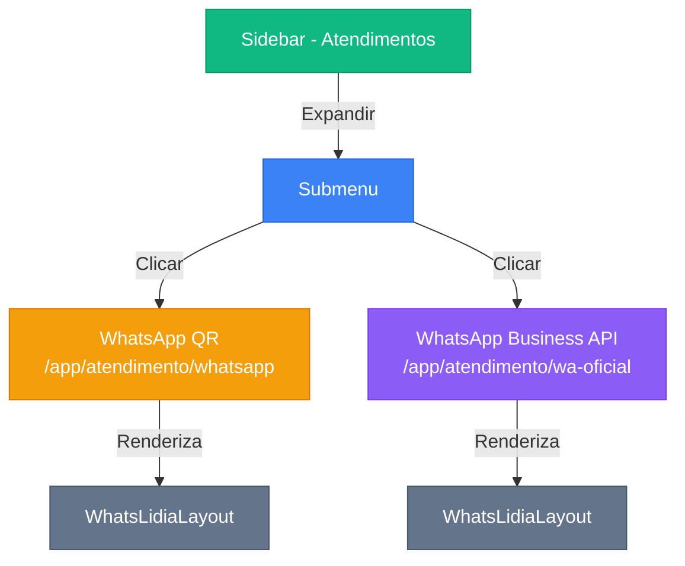

# Plano de Implementação - Submenu Atendimentos (WhatsApp)

## Resumo
Transformar o menu "Atendimentos" na sidebar em um menu expansível com submenu contendo duas interfaces de chat WhatsApp distintas, ambas usando o componente `WhatsLidiaLayout`.

## Página a Ser Duplicada

A página atual é [`/app/attendances/page.tsx`](src/app/(dashboard)/app/attendances/page.tsx:1) que utiliza o componente `WhatsLidiaLayout`:

```typescript
"use client";

import { WhatsLidiaLayout } from "@/components/whatslidia";

export default function AttendancesPage() {
  return <WhatsLidiaLayout />;
}
```

## Estrutura do Submenu

```
Atendimentos (menu principal)
├── 📱 WhatsApp QR → /app/atendimento/whatsapp
└── ✅ WhatsApp Business API → /app/atendimento/wa-oficial
```

## Alterações Necessárias

### 1. Sidebar (`src/components/sidebar.tsx`)

**Mudança no item "Atendimentos":**
- Remover `href` direto
- Adicionar propriedade `children` com array de subitens
- Ícones: `MessageSquare` (pai), `QrCode` (WhatsApp), `BadgeCheck` (WA Oficial)

```typescript
{
  label: "Atendimentos",
  icon: MessageSquare,
  permission: "canViewAttendances",
  children: [
    { href: "/app/atendimento/whatsapp", label: "WhatsApp QR", icon: QrCode },
    { href: "/app/atendimento/wa-oficial", label: "WhatsApp Business API", icon: BadgeCheck }
  ]
}
```

### 2. Nova Página: WhatsApp QR

**Caminho:** `src/app/(dashboard)/app/atendimento/whatsapp/page.tsx`

**Código:**
```typescript
"use client";

import { WhatsLidiaLayout } from "@/components/whatslidia";

export default function WhatsAppQRPage() {
  return <WhatsLidiaLayout />;
}
```

**Título na interface:** "WhatsApp QR" (será configurado no componente ou via props futuramente)

### 3. Nova Página: WhatsApp Business API

**Caminho:** `src/app/(dashboard)/app/atendimento/wa-oficial/page.tsx`

**Código:**
```typescript
"use client";

import { WhatsLidiaLayout } from "@/components/whatslidia";

export default function WhatsAppOficialPage() {
  return <WhatsLidiaLayout />;
}
```

**Título na interface:** "WhatsApp Business API" (será configurado no componente ou via props futuramente)

### 4. Página Atual

A página `/app/attendances` existente será mantida sem alterações.

## Diagrama de Navegação



## Estrutura de Arquivos

```
src/app/(dashboard)/app/atendimento/
├── layout.tsx (existente)
├── loading.tsx (existente)
├── components/ (existente)
├── avaliacoes/
├── funil/
├── notas/
├── protocolos/
├── whatsapp/
│   └── page.tsx (NOVO)
└── wa-oficial/
    └── page.tsx (NOVO)
```

## Permissões

Ambas as páginas usarão a permissão existente `canViewAttendances`.

## Diferenciação Visual

Para diferenciar as duas páginas no `WhatsLidiaLayout`, você pode:
1. Passar uma prop `title` para o componente
2. Usar um contexto ou hook para identificar a rota atual
3. Modificar o componente `WhatsLidiaLayout` para aceitar configurações

**Nota:** A diferenciação visual no título pode ser implementada na próxima fase, pois requer modificações no componente `WhatsLidiaLayout`.

## Próximos Passos

1. Aprovar este plano
2. Mudar para modo Code para implementação
3. Testar navegação e responsividade
4. Verificar permissões de acesso

---

**Nota:** Este plano está alinhado com a arquitetura existente e reutiliza o componente `WhatsLidiaLayout` já desenvolvido.
