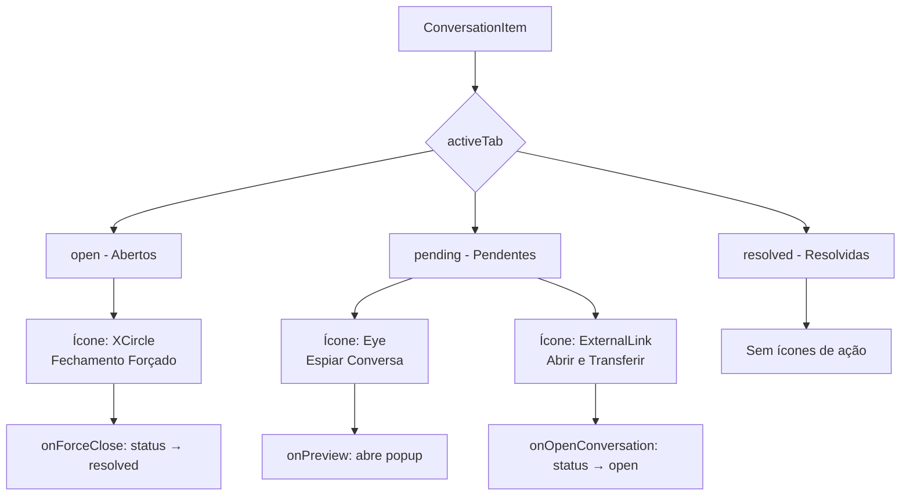

# Plano: Correção de Tema e Ícones na Página de Atendimentos

## Visão Geral

Este plano detalha as correções necessárias para:
1. **Corrigir o modo claro/escuro** em todos os componentes da página de atendimentos
2. **Adicionar ícones de ação** nas conversas (fechamento forçado, espiar, abrir)
3. **Criar popup de preview** para espiar conversa sem visualizar

---

## 1. Análise do Problema de Tema

### Situação Atual

Os componentes **ConversationList** e **ConversationItem** já possuem suporte ao tema através da prop `isDarkMode`. No entanto, os seguintes componentes estão com cores hardcoded para modo escuro:

| Componente | Situação |
|------------|----------|
| [`ChatWindow.tsx`](src/components/whatslidia/ChatWindow.tsx) | Cores hardcoded (bg-[#0b141a], bg-[#1f2c33]) |
| [`ChatHeader.tsx`](src/components/whatslidia/ChatHeader.tsx) | Cores hardcoded (bg-[#1f2c33], text-[#e9edef]) |
| [`MessageBubble.tsx`](src/components/whatslidia/MessageBubble.tsx) | Cores hardcoded (bg-[#005c4b], bg-[#202c33]) |
| [`MessageInput.tsx`](src/components/whatslidia/MessageInput.tsx) | Cores hardcoded (bg-[#1f2c33], bg-[#2a3942]) |

### Solução

Adicionar a prop `isDarkMode` em todos os componentes e usar a função `cn()` para alternar entre classes de cor baseado no tema.

---

## 2. Arquitetura dos Ícones de Ação

### Fluxo de Decisão por Aba



### Estado Atual dos Ícones

Os ícones JÁ ESTÃO IMPLEMENTADOS em [`ConversationItem.tsx`](src/components/whatslidia/ConversationItem.tsx:168-214). O que precisa ser feito:

1. **Criar o popup de preview** para o ícone "Espiar"
2. **Garantir que o tema funcione** em todos os componentes

---

## 3. Alterações por Arquivo

### 3.1 ChatWindow.tsx

**Alterações necessárias:**

```typescript
// Adicionar prop isDarkMode
interface ChatWindowProps {
  conversation: Conversation | null;
  onBack?: () => void;
  showBackButton?: boolean;
  isDarkMode?: boolean;  // NOVO
}

// Aplicar cores condicionais
<div className={cn(
  "flex-1 h-full flex flex-col",
  isDarkMode ? "bg-[#0b141a]" : "bg-gray-50"
)}>
```

**Linhas a alterar:**
- Linha 92: bg-[#0b141a] → condicional
- Linha 128: bg-[#0b141a] → condicional
- Linha 146: bg-[#1f2c33]/90 → condicional
- Linha 156: bg-[#1f2c33]/90 → condicional
- Linha 188: bg-[#1f2c33] → condicional

### 3.2 ChatHeader.tsx

**Alterações necessárias:**

```typescript
interface ChatHeaderProps {
  conversation: Conversation | null;
  onBack?: () => void;
  showBackButton?: boolean;
  isDarkMode?: boolean;  // NOVO
}

// Aplicar cores condicionais
<div className={cn(
  "h-16 px-4 flex items-center justify-between border-b",
  isDarkMode 
    ? "bg-[#1f2c33] border-[#2a2a2a]" 
    : "bg-white border-gray-200"
)}>
```

**Linhas a alterar:**
- Linha 32: bg-[#1f2c33] → condicional
- Linha 60: bg-[#1f2c33] → condicional
- Linhas 67, 98, 127, 136, 147: cores de texto → condicionais

### 3.3 MessageBubble.tsx

**Alterações necessárias:**

```typescript
interface MessageBubbleProps {
  message: Message;
  isFirstInGroup?: boolean;
  isLastInGroup?: boolean;
  isDarkMode?: boolean;  // NOVO
}

// Balões de mensagem
<div className={cn(
  "max-w-[75%] min-w-[80px] relative",
  message.isFromMe
    ? isDarkMode 
      ? "bg-[#005c4b] rounded-l-2xl rounded-tr-2xl rounded-br-md"
      : "bg-emerald-100 rounded-l-2xl rounded-tr-2xl rounded-br-md"
    : isDarkMode
      ? "bg-[#202c33] rounded-r-2xl rounded-tl-2xl rounded-bl-md"
      : "bg-white rounded-r-2xl rounded-tl-2xl rounded-bl-md shadow-sm"
)}>
```

### 3.4 MessageInput.tsx

**Alterações necessárias:**

```typescript
interface MessageInputProps {
  onSend: (message: string) => void;
  disabled?: boolean;
  isWithin24Hours?: boolean;
  isDarkMode?: boolean;  // NOVO
}

// Container principal
<div className={cn(
  "border-t",
  isDarkMode 
    ? "bg-[#1f2c33] border-[#2a2a2a]" 
    : "bg-white border-gray-200"
)}>
```

### 3.5 PreviewConversationModal.tsx (NOVO)

**Criar novo componente para popup de preview:**

```typescript
interface PreviewConversationModalProps {
  isOpen: boolean;
  onClose: () => void;
  conversation: Conversation | null;
  isDarkMode: boolean;
}

// Funcionalidades:
// - Exibe mensagens em modo somente leitura
// - Não marca mensagens como lidas
// - Botão para fechar e abrir a conversa normalmente
// - Indicador visual de "Modo Preview"
```

### 3.6 WhatsLidiaLayout.tsx

**Alterações necessárias:**

```typescript
// Passar isDarkMode para ChatWindow
<ChatWindow
  conversation={selectedConversation}
  onBack={handleBackToList}
  showBackButton={true}
  isDarkMode={isDarkMode}  // NOVO
/>

// Adicionar estado para modal de preview
const [isPreviewModalOpen, setIsPreviewModalOpen] = useState(false);
const [previewConversationId, setPreviewConversationId] = useState<string | null>(null);

// Modificar handlePreview para abrir modal
const handlePreview = (id: string) => {
  setPreviewConversationId(id);
  setIsPreviewModalOpen(true);
};
```

---

## 4. Mapeamento de Cores

### Modo Escuro → Modo Claro

| Elemento | Escuro | Claro |
|----------|--------|-------|
| Background principal | #0b141a | #f8fafc |
| Background secundário | #1f2c33 | #ffffff |
| Background terciário | #202c33 | #f1f5f9 |
| Background input | #2a3942 | #e2e8f0 |
| Texto principal | #e9edef | #0f172a |
| Texto secundário | #8696a0 | #64748b |
| Balão enviado | #005c4b | #dcfce7 |
| Balão recebido | #202c33 | #ffffff |
| Borda | #2a2a2a | #e2e8f0 |

---

## 5. Resumo das Alterações

| Arquivo | Tipo | Alterações |
|---------|------|------------|
| `ChatWindow.tsx` | Modificar | Adicionar prop isDarkMode, aplicar cores condicionais |
| `ChatHeader.tsx` | Modificar | Adicionar prop isDarkMode, aplicar cores condicionais |
| `MessageBubble.tsx` | Modificar | Adicionar prop isDarkMode, aplicar cores condicionais |
| `MessageInput.tsx` | Modificar | Adicionar prop isDarkMode, aplicar cores condicionais |
| `PreviewConversationModal.tsx` | Criar | Novo componente de popup para espiar conversa |
| `WhatsLidiaLayout.tsx` | Modificar | Passar isDarkMode para componentes, integrar modal |

---

## 6. Comportamento Esperado

### Aba "Abertos"
- Cada conversa mostra ícone **XCircle** no hover
- Clique move a conversa para "Resolvidas"
- Tooltip: "Fechar conversa"

### Aba "Pendentes"
- Cada conversa mostra dois ícones no hover:
  - **Eye**: Abre popup de preview (não marca como lida)
  - **ExternalLink**: Move para "Abertos" e marca como lida

### Popup de Preview
- Abre em modal sobreposto
- Mostra "Modo Preview - Visualização sem marcar como lido"
- Botões: "Fechar" e "Abrir Conversa"

### Tema Claro/Escuro
- Toggle no footer da lista de conversas
- Todos os componentes respondem ao tema
- Transições suaves entre temas
