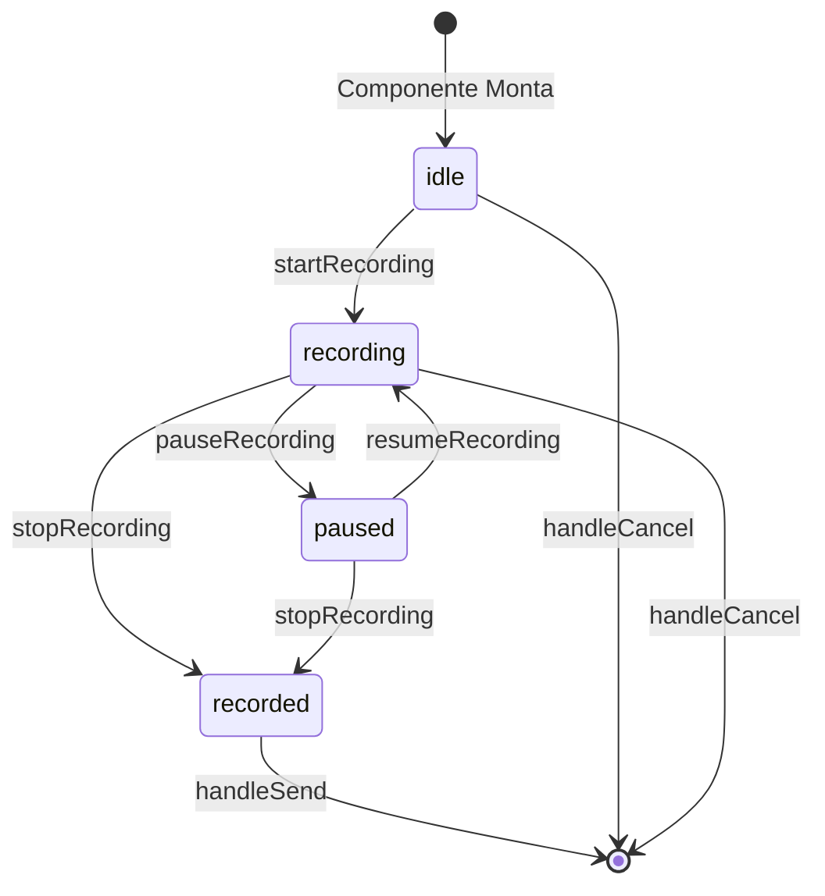

# Plano de Correção: AudioRecorder

## Problemas Críticos Identificados

### 1. Dependências Circulares no useEffect Principal
**Arquivo:** `src/components/whatslidia/AudioRecorder.tsx:230`

O useEffect depende de funções memoizadas que são recriadas:
- `cleanup` - depende de `stopAnalyzer`
- `initAnalyzer` - função do hook
- `getWaveformSnapshot` - função do hook
- `compileWaveformHistory` - função memoizada

**Solução:** Usar refs para armazenar callbacks e remover dependências desnecessárias.

### 2. Hook useAudioAnalyzer Recria Config
**Arquivo:** `src/hooks/useAudioAnalyzer.ts:47`

```typescript
const config = { ...DEFAULT_CONFIG, ...userConfig };
```

Isso faz `config` ser um novo objeto a cada render, invalidando todos os `useCallback`.

**Solução:** Usar `useMemo` para memoizar `config`.

### 3. Loop de Análise Não Inicia Confiavelmente
**Arquivo:** `src/hooks/useAudioAnalyzer.ts:274`

```typescript
analyze(); // Chamado antes de analyzeRef.current estar definido
```

**Solução:** Iniciar o loop diretamente, não via ref.

### 4. Timer com Closure Problemático
**Arquivo:** `src/components/whatslidia/AudioRecorder.tsx:201-215`

O timer usa `isMounted` dentro de um closure async.

**Solução:** Usar ref para controlar mount state.

### 5. Estado Inicial Incorreto
**Arquivo:** `src/components/whatslidia/AudioRecorder.tsx:29`

```typescript
const [state, setState] = useState<RecordingState>("recording");
```

O estado já é "recording" antes da gravação começar.

**Solução:** Adicionar estado "idle" e transições corretas.

## Arquitetura Corrigida



## Mudanças Necessárias

### 1. Corrigir useAudioAnalyzer.ts

```typescript
// Memoizar config
const config = useMemo(() => ({ ...DEFAULT_CONFIG, ...userConfig }), [userConfig]);

// Iniciar loop diretamente, não via ref
const startAnalysis = useCallback(() => {
  const loop = () => {
    if (!analyserRef.current) return;
    // ... análise ...
    animationFrameRef.current = requestAnimationFrame(loop);
  };
  loop();
}, [...]);
```

### 2. Corrigir AudioRecorder.tsx

```typescript
// Adicionar estado idle
type RecordingState = "idle" | "recording" | "paused" | "recorded";

// Usar ref para mount state
const isMountedRef = useRef(false);

// useEffect com dependências estáveis
useEffect(() => {
  isMountedRef.current = true;
  startRecording();
  return () => {
    isMountedRef.current = false;
    cleanup();
  };
}, []); // Sem dependências!
```

### 3. Timer Corrigido

```typescript
// Usar ref para duration
const durationRef = useRef(0);

// Timer simples
timerRef.current = setInterval(() => {
  if (!isMountedRef.current) return;
  durationRef.current++;
  setDuration(durationRef.current);
}, 1000);
```

## Arquivos a Modificar

1. `src/hooks/useAudioAnalyzer.ts` - Corrigir memoização e loop
2. `src/components/whatslidia/AudioRecorder.tsx` - Reescrever com arquitetura correta

## Logs de Debug Necessários

```typescript
console.log("[AudioRecorder] State:", state);
console.log("[AudioRecorder] Duration:", duration);
console.log("[AudioRecorder] MediaRecorder state:", mediaRecorderRef.current?.state);
console.log("[AudioRecorder] Audio chunks:", audioChunksRef.current.length);
console.log("[AudioRecorder] Blob size:", audioBlob?.size);
console.log("[AudioAnalyzer] Initialized:", isInitialized);
console.log("[AudioAnalyzer] Waveform data length:", waveformData.length);
```

## Testes a Realizar

1. [ ] Abrir gravador - deve iniciar gravação automaticamente
2. [ ] Verificar contador de segundos incrementando
3. [ ] Verificar waveform animando com voz
4. [ ] Clicar em pausar - contador deve parar
5. [ ] Clicar em continuar - contador deve retomar
6. [ ] Clicar em parar - deve gerar blob
7. [ ] Verificar botão de enviar habilitado
8. [ ] Clicar em enviar - deve chamar onSend com blob válido
