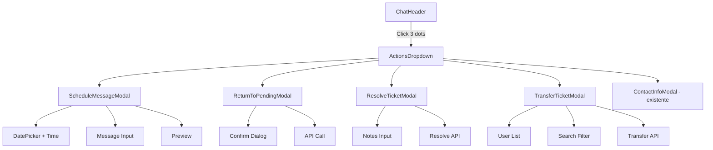

# Plano: Menu de Ações Expandido no ChatHeader

## Visão Geral
Expansão do menu de ações do cabeçalho da conversa com 4 novas funcionalidades estratégicas de gerenciamento de atendimento, mantendo 100% das funcionalidades existentes.

## Arquitetura



## Novos Componentes

### 1. ScheduleMessageModal
**Funcionalidade:** Agendar mensagem para envio futuro

**Props:**
```typescript
interface ScheduleMessageModalProps {
  isOpen: boolean;
  onClose: () => void;
  conversationId: string;
  isDarkMode: boolean;
  onSchedule: (data: ScheduleData) => Promise<void>;
}

interface ScheduleData {
  date: Date;
  message: string;
}
```

**Features:**
- DatePicker nativo HTML5 (datetime-local)
- Campo textarea para mensagem
- Preview do agendamento
- Validação de data futura
- Estados de loading
- Toast confirmation

**Ícones:** Calendar, Clock

---

### 2. ReturnToPendingModal
**Funcionalidade:** Retornar ticket da fila atual para pendentes

**Props:**
```typescript
interface ReturnToPendingModalProps {
  isOpen: boolean;
  onClose: () => void;
  conversationId: string;
  isDarkMode: boolean;
  onReturn: () => Promise<void>;
}
```

**Features:**
- Dialog de confirmação simples
- Ícone de pausa/retorno
- API call assíncrona
- Loading state
- Success/Error toast

**Ícones:** RotateCcw, Pause

---

### 3. ResolveTicketModal
**Funcionalidade:** Marcar ticket como resolvido com notas opcionais

**Props:**
```typescript
interface ResolveTicketModalProps {
  isOpen: boolean;
  onClose: () => void;
  conversationId: string;
  isDarkMode: boolean;
  onResolve: (notes?: string) => Promise<void>;
}
```

**Features:**
- Campo opcional para notas de resolução
- Checkbox "Adicionar notas"
- Preview da resolução
- Timestamp automático
- API call com persistência

**Ícones:** CheckCircle, BadgeCheck

---

### 4. TransferTicketModal
**Funcionalidade:** Transferir atendimento para outro funcionário

**Props:**
```typescript
interface TransferTicketModalProps {
  isOpen: boolean;
  onClose: () => void;
  conversationId: string;
  isDarkMode: boolean;
  currentUserId: string;
  companyId: string;
  onTransfer: (userId: string) => Promise<void>;
}
```

**Features:**
- Lista scrollável de funcionários
- Campo de busca em tempo real
- Exibição de avatares
- Status online/offline
- Indicador de role (Agente, Gerente, etc.)
- Confirmação antes de transferir

**Ícones:** UserPlus, ArrowLeftRight, Users

---

## Atualizações no ChatHeader

### Estados Adicionais
```typescript
const [isScheduleOpen, setIsScheduleOpen] = useState(false);
const [isReturnPendingOpen, setIsReturnPendingOpen] = useState(false);
const [isResolveOpen, setIsResolveOpen] = useState(false);
const [isTransferOpen, setIsTransferOpen] = useState(false);
const [isActionLoading, setIsActionLoading] = useState(false);
```

### Menu Expandido
```typescript
const menuOptions = [
  // LEGADO (existente)
  { label: "Informações do contato", icon: Info, onClick: () => setIsContactInfoOpen(true), separator: false },
  { label: "Marcar como não lido", icon: Circle, separator: false },
  { label: "Limpar conversa", icon: Trash2, separator: true },
  
  // NOVAS FUNCIONALIDADES
  { label: "Agendar mensagem", icon: CalendarClock, onClick: () => setIsScheduleOpen(true), color: "default" },
  { label: "Retornar para pendentes", icon: RotateCcw, onClick: () => setIsReturnPendingOpen(true), color: "warning" },
  { label: "Resolver ticket", icon: CheckCircle, onClick: () => setIsResolveOpen(true), color: "success" },
  { label: "Transferir atendimento", icon: UserPlus, onClick: () => setIsTransferOpen(true), color: "default" },
  
  // LEGADO (existente)
  { label: "Bloquear contato", icon: Ban, separator: true, color: "danger" },
  { label: "Fechar conversa", icon: X, color: "danger" },
];
```

## Design System

### Cores por Ação
```css
/* Success - Resolver */
--action-success: #00a884;
--action-success-bg: rgba(0, 168, 132, 0.1);

/* Warning - Retornar */
--action-warning: #f59e0b;
--action-warning-bg: rgba(245, 158, 11, 0.1);

/* Danger - Bloquear/Fechar */
--action-danger: #ef4444;
--action-danger-bg: rgba(239, 68, 68, 0.1);

/* Default - Outros */
--action-default: #aebac1;
--action-default-bg: rgba(174, 186, 193, 0.1);
```

### Animações
- Dropdown: `scale(0.95) opacity(0)` → `scale(1) opacity(1)`
- Duração: 150ms ease-out
- Backdrop: blur(8px) + fade in

## API Integration (Mock)

### Endpoints Simulados
```typescript
// Retornar para pendentes
POST /api/tickets/{id}/return-to-pending
Response: { success: boolean, ticket: Ticket }

// Resolver ticket
POST /api/tickets/{id}/resolve
Body: { notes?: string }
Response: { success: boolean, ticket: Ticket }

// Transferir ticket
POST /api/tickets/{id}/transfer
Body: { userId: string }
Response: { success: boolean, ticket: Ticket }

// Agendar mensagem
POST /api/messages/schedule
Body: { conversationId, date, message }
Response: { success: boolean, scheduledMessage: ScheduledMessage }
```

## Implementação Passo a Passo

1. **Criar 4 novos modais** em `modals/` com tipagem TypeScript
2. **Atualizar exports** em `modals/index.ts`
3. **Expandir ChatHeader.tsx**:
   - Adicionar imports dos novos modais
   - Adicionar estados para controle
   - Expandir menuOptions com novas ações
   - Adicionar handlers com try-catch e loading states
   - Renderizar todos os modais no final
4. **Adicionar estilos CSS** para cores de ação e animações
5. **Testar fluxos completos**

## Estrutura de Arquivos

```
src/components/whatslidia/modals/
├── ContactInfoModal.tsx        # (existente)
├── ScheduleMessageModal.tsx    # NOVO
├── ReturnToPendingModal.tsx    # NOVO
├── ResolveTicketModal.tsx      # NOVO
├── TransferTicketModal.tsx     # NOVO
└── index.ts                    # (atualizar)

src/components/whatslidia/
├── ChatHeader.tsx              # (expandir)
└── styles.css                  # (adicionar estilos)
```

## Responsividade

### Desktop
- Dropdown: 240px width, posicionado abaixo do botão
- Modais: max-width 480px, centralizados

### Mobile
- Dropdown: 280px width, alinhado à direita
- Modais: fullscreen ou 95% width

## Acessibilidade

- ARIA labels em todos os botões
- Focus trap nos modais
- Keyboard navigation (Tab, Escape)
- Screen reader announcements
- High contrast support
