# Plano: 7 Funcionalidades Interativas - Informações do Contato

## Visão Geral
Adicionar 7 novas funcionalidades interativas à seção de informações do contato no WhatsLidia, todas integradas ao ContactInfoModal e menu dropdown do ChatHeader.

## Arquitetura

```mermaid
flowchart TD
    A[ContactInfoModal] --> B[SalesFunnelSection]
    A --> C[ProtocolSection]
    A --> D[RatingSection]
    A --> E[NotesSection]
    A --> F[ExportSection]
    A --> G[KanbanSection]
    A --> H[TagsSection]
    
    I[ChatHeader Menu] --> B
    I --> C
    I --> D
    I --> E
    I --> F
    I --> G
    I --> H
    
    B --> B1[Pipeline Stages]
    B --> B2[Probability]
    B --> B3[Value Estimation]
    
    C --> C1[Generate Code]
    C --> C2[Preview]
    C --> C3[Send Message]
    
    D --> D1[NPS/Stars]
    D --> D2[Webhook]
    D --> D3[Metrics]
    
    E --> E1[CRUD Notes]
    E --> E2[Markdown]
    E --> E3[Categories]
    
    F --> F1[jsPDF Export]
    F --> F2[Preview]
    F --> F3[Download]
    
    G --> G1[Kanban Columns]
    G --> G2[Move Contact]
    
    H --> H1[Color Tags]
    H --> H2[Search/Create]
```



## Funcionalidades Detalhadas

### 1. SalesFunnelModal (Funil de Vendas)
**Arquivo:** `modals/SalesFunnelModal.tsx`

**Features:**
- Pipeline comercial vinculado ao cliente
- Estágios: Novo Lead, Qualificado, Proposta Enviada, Fechado (Ganho/Perdido)
- Probabilidade de conversão (0-100%)
- Valor estimado do negócio (R$)
- Persistência em estado global (React Query)
- Sincronização em tempo real

**Props:**
```typescript
interface SalesFunnelModalProps {
  isOpen: boolean;
  onClose: () => void;
  contactId: string;
  isDarkMode: boolean;
}

interface PipelineData {
  stage: 'new' | 'qualified' | 'proposal' | 'closed_won' | 'closed_lost';
  probability: number;
  estimatedValue: number;
  notes?: string;
  updatedAt: Date;
}
```

**Ícones:** TrendingUp, Target, DollarSign, Award

---

### 2. ProtocolModal (Envio de Protocolo)
**Arquivo:** `modals/ProtocolModal.tsx`

**Features:**
- Geração de código alfanumérico único (8 caracteres)
- Timestamp automático
- Preview da mensagem estruturada
- Envio automático via WhatsApp
- Histórico de protocolos

**Formato do Protocolo:**
```
PROTOCOLO: ABC12345
DATA: 11/03/2026 14:30
ATENDIMENTO INICIADO
```

**Props:**
```typescript
interface ProtocolModalProps {
  isOpen: boolean;
  onClose: () => void;
  conversationId: string;
  contactName: string;
  isDarkMode: boolean;
  onSendProtocol?: (protocol: string) => Promise<void>;
}
```

**Ícones:** FileCheck, Hash, Clock, Send

---

### 3. RatingModal (Avaliação de Atendimento)
**Arquivo:** `modals/RatingModal.tsx`

**Features:**
- Sistema NPS (0-10) ou Estrelas (1-5)
- Mensagem com link ou botões interativos
- Webhook para processar respostas
- Armazenamento de métricas
- Histórico de avaliações

**Props:**
```typescript
interface RatingModalProps {
  isOpen: boolean;
  onClose: () => void;
  conversationId: string;
  contactName: string;
  isDarkMode: boolean;
  onRequestRating?: (type: 'nps' | 'stars') => Promise<void>;
}

interface RatingData {
  type: 'nps' | 'stars';
  score: number;
  feedback?: string;
  timestamp: Date;
}
```

**Ícones:** Star, ThumbsUp, MessageCircle, BarChart3

---

### 4. NotesModal (Notas Personalizadas)
**Arquivo:** `modals/NotesModal.tsx`

**Features:**
- CRUD completo de anotações
- Formatação Markdown suportada
- Timestamps automáticos
- Categorização por cores (tags)
- Busca em notas
- Preview em tempo real

**Props:**
```typescript
interface NotesModalProps {
  isOpen: boolean;
  onClose: () => void;
  contactId: string;
  isDarkMode: boolean;
}

interface Note {
  id: string;
  content: string;
  category: 'general' | 'important' | 'followup' | 'complaint';
  createdAt: Date;
  updatedAt: Date;
}
```

**Cores de Categoria:**
- Geral: Cinza
- Importante: Vermelho
- Acompanhamento: Amarelo
- Reclamação: Laranja

**Ícones:** StickyNote, Edit3, Trash2, Eye, Save

---

### 5. ExportChatModal (Extração de Conversas)
**Arquivo:** `modals/ExportChatModal.tsx`

**Features:**
- Geração de PDF com jsPDF
- Histórico completo de mensagens
- Metadados (data/hora, remetente)
- Referências de mídia
- Assinatura digital
- Preview antes do download

**Props:**
```typescript
interface ExportChatModalProps {
  isOpen: boolean;
  onClose: () => void;
  conversationId: string;
  contactName: string;
  messages: Message[];
  isDarkMode: boolean;
}
```

**Ícones:** FileDown, FileText, Printer, Download, Eye

---

### 6. KanbanIntegration (Integração com Kanban)
**Arquivo:** `components/KanbanIntegration.tsx`

**Features:**
- Dropdown seletor de colunas
- Colunas: Novos, Em Atendimento, Pós-Venda, Resolvidos
- Mover contato entre colunas
- Atualização visual imediata
- Sync com sistema Kanban existente

**Props:**
```typescript
interface KanbanIntegrationProps {
  contactId: string;
  currentColumn: string;
  isDarkMode: boolean;
  onMove: (columnId: string) => Promise<void>;
}

const kanbanColumns = [
  { id: 'new', label: 'Novos', color: '#3b82f6' },
  { id: 'in_progress', label: 'Em Atendimento', color: '#f59e0b' },
  { id: 'post_sale', label: 'Pós-Venda', color: '#8b5cf6' },
  { id: 'resolved', label: 'Resolvidos', color: '#10b981' },
];
```

**Ícones:** LayoutGrid, MoveRight, Columns

---

### 7. TagsManager (Gerenciamento de Etiquetas)
**Arquivo:** `components/TagsManager.tsx`

**Features:**
- Aplicar múltiplas tags coloridas
- Interface de chips seletivos
- Busca de tags existentes
- Criação rápida de novas categorias
- Cores pré-definidas
- Remoção fácil (X no chip)

**Props:**
```typescript
interface TagsManagerProps {
  contactId: string;
  existingTags: string[];
  isDarkMode: boolean;
  onUpdateTags: (tags: string[]) => Promise<void>;
}

const predefinedTags = [
  { name: 'VIP', color: '#f59e0b', bgColor: 'rgba(245, 158, 11, 0.2)' },
  { name: 'Cliente Antigo', color: '#3b82f6', bgColor: 'rgba(59, 130, 246, 0.2)' },
  { name: 'Reclamação', color: '#ef4444', bgColor: 'rgba(239, 68, 68, 0.2)' },
  { name: 'Prospecção', color: '#10b981', bgColor: 'rgba(16, 185, 129, 0.2)' },
  { name: 'Follow-up', color: '#8b5cf6', bgColor: 'rgba(139, 92, 246, 0.2)' },
];
```

**Ícones:** Tag, Plus, X, Search, Palette

---

## Hooks Customizados

### useContactFeatures.ts
```typescript
export function useContactFeatures(contactId: string) {
  // React Query hooks for caching
  const { data: pipeline } = useQuery(['pipeline', contactId], fetchPipeline);
  const { data: notes } = useQuery(['notes', contactId], fetchNotes);
  const { data: tags } = useQuery(['tags', contactId], fetchTags);
  const { data: protocols } = useQuery(['protocols', contactId], fetchProtocols);
  
  // Mutations
  const updatePipeline = useMutation(updatePipelineApi);
  const addNote = useMutation(addNoteApi);
  const updateTags = useMutation(updateTagsApi);
  
  return { pipeline, notes, tags, protocols, updatePipeline, addNote, updateTags };
}
```

## Validação com Zod

```typescript
import { z } from 'zod';

const PipelineSchema = z.object({
  stage: z.enum(['new', 'qualified', 'proposal', 'closed_won', 'closed_lost']),
  probability: z.number().min(0).max(100),
  estimatedValue: z.number().min(0),
  notes: z.string().optional(),
});

const NoteSchema = z.object({
  content: z.string().min(1, 'Conteúdo obrigatório'),
  category: z.enum(['general', 'important', 'followup', 'complaint']),
});

const ProtocolSchema = z.object({
  code: z.string().length(8),
  timestamp: z.date(),
});
```

## Integração Sonner Toast

```typescript
import { toast } from 'sonner';

// Success
toast.success('Protocolo enviado com sucesso!');
toast.success('Nota salva', { description: 'Sua anotação foi adicionada.' });

// Error
toast.error('Erro ao gerar PDF');
toast.error('Falha na operação', { description: 'Tente novamente mais tarde.' });

// Loading
toast.promise(promise, {
  loading: 'Gerando PDF...',
  success: 'PDF gerado!',
  error: 'Erro ao gerar PDF',
});
```

## Atualizações no ContactInfoModal

Adicionar 7 novas seções antes da seção de Mídia:

```typescript
// Novas seções no ContactInfoModal
<div className="space-y-4">
  <SalesFunnelSection contactId={contact.id} isDarkMode={isDarkMode} />
  <ProtocolSection conversationId={conversation.id} isDarkMode={isDarkMode} />
  <RatingSection conversationId={conversation.id} isDarkMode={isDarkMode} />
  <NotesSection contactId={contact.id} isDarkMode={isDarkMode} />
  <ExportSection conversation={conversation} isDarkMode={isDarkMode} />
  <KanbanSection contactId={contact.id} isDarkMode={isDarkMode} />
  <TagsSection contact={contact} isDarkMode={isDarkMode} />
  
  {/* Seção existente */}
  <SharedMediaSection isDarkMode={isDarkMode} />
</div>
```

## Atualizações no ChatHeader Menu

Adicionar 7 novas opções ao menu dropdown:

```typescript
const menuOptions = [
  // ... opções existentes ...
  
  // NOVAS - Seção de Gerenciamento
  { label: "Funil de Vendas", icon: TrendingUp, onClick: () => setIsSalesFunnelOpen(true), variant: "info" },
  { label: "Gerar Protocolo", icon: FileCheck, onClick: () => setIsProtocolOpen(true), variant: "default" },
  { label: "Solicitar Avaliação", icon: Star, onClick: () => setIsRatingOpen(true), variant: "success" },
  { label: "Notas", icon: StickyNote, onClick: () => setIsNotesOpen(true), variant: "default" },
  { label: "Exportar Conversa", icon: FileDown, onClick: () => setIsExportOpen(true), variant: "default" },
  { label: "Mover no Kanban", icon: LayoutGrid, onClick: () => setIsKanbanOpen(true), variant: "warning" },
  { label: "Gerenciar Etiquetas", icon: Tag, onClick: () => setIsTagsOpen(true), variant: "default" },
];
```

## Dependências a Instalar

```bash
npm install zod sonner jspdf @types/jspdf
```

## Estrutura de Arquivos

```
src/components/whatslidia/
├── modals/
│   ├── ContactInfoModal.tsx          # (atualizar)
│   ├── SalesFunnelModal.tsx          # NOVO
│   ├── ProtocolModal.tsx             # NOVO
│   ├── RatingModal.tsx               # NOVO
│   ├── NotesModal.tsx                # NOVO
│   ├── ExportChatModal.tsx           # NOVO
│   └── index.ts                      # (atualizar)
├── components/
│   ├── KanbanIntegration.tsx         # NOVO
│   └── TagsManager.tsx               # NOVO
├── hooks/
│   └── use-contact-features.ts       # NOVO
└── ChatHeader.tsx                    # (atualizar)
```

## Design System

### Cores por Feature
```css
/* Sales Funnel */
--sales-new: #3b82f6;
--sales-qualified: #f59e0b;
--sales-proposal: #8b5cf6;
--sales-won: #10b981;
--sales-lost: #ef4444;

/* Protocol */
--protocol-primary: #00a884;

/* Rating */
--rating-star: #fbbf24;
--rating-nps-good: #10b981;
--rating-nps-bad: #ef4444;

/* Notes Categories */
--note-general: #6b7280;
--note-important: #ef4444;
--note-followup: #f59e0b;
--note-complaint: #f97316;

/* Tags */
--tag-vip: #f59e0b;
--tag-old: #3b82f6;
--tag-complaint: #ef4444;
--tag-prospect: #10b981;
```

## Responsividade

### Desktop (>768px)
- Modais: max-width 480-560px
- Dropdown: 280px width
- Seções: Grid de 2 colunas onde aplicável

### Mobile (<768px)
- Modais: 95% width, fullscreen opcional
- Dropdown: 260px width
- Seções: Stack vertical

## Checklist de Implementação

- [ ] Instalar dependências (zod, sonner, jspdf)
- [ ] Criar 5 modais de funcionalidades
- [ ] Criar 2 componentes de integração
- [ ] Criar hook useContactFeatures
- [ ] Atualizar ContactInfoModal com 7 seções
- [ ] Atualizar ChatHeader menu dropdown
- [ ] Implementar validação Zod
- [ ] Integrar Sonner toast
- [ ] Adicionar React Query caching
- [ ] Testar responsividade
- [ ] Verificar tipagem TypeScript
