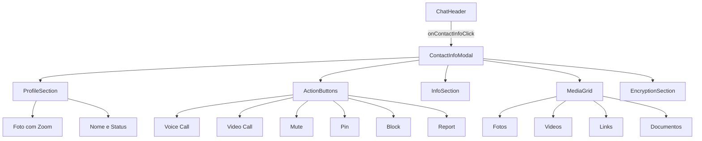

# Plano de Implementação: Modal de Informações de Contato

## Visão Geral
Implementação de um modal de informações de contato estilo WhatsApp que exibe dados completos do contato ao clicar no nome, foto de perfil ou ícone de informações no cabeçalho da conversa.

## Arquitetura do Componente



## Estrutura de Arquivos

```
src/components/whatslidia/modals/
├── ContactInfoModal.tsx     # Componente principal
└── index.ts                  # Atualizar exports

src/components/whatslidia/
├── ChatHeader.tsx           # Integrar modal
└── styles.css               # Adicionar estilos específicos
```

## Design System

### Cores (Tema Escuro - WhatsApp Style)
- **Fundo Principal:** `#0b141a` ou `#1f2c33`
- **Fundo Secundário:** `#2a3942`
- **Bordas:** `#374045` ou `#2a2a2a`
- **Texto Principal:** `#e9edef`
- **Texto Secundário:** `#8696a0`
- **Verde Destaque:** `#00a884`
- **Verde Botões:** `#005c4b`
- **Backdrop:** `rgba(0, 0, 0, 0.7)` com `backdrop-blur-sm`

### Cores (Tema Claro)
- **Fundo Principal:** `white`
- **Fundo Secundário:** `#f0f2f5`
- **Bordas:** `#e9edef`
- **Texto Principal:** `#111b21`
- **Texto Secundário:** `#667781`

### Animações
- **Entrada Desktop:** Slide da direita para esquerda (`translateX(100%)` → `translateX(0)`)
- **Entrada Mobile:** Overlay central com fade in
- **Duração:** 300ms ease-out
- **Backdrop:** Fade in 200ms

### Breakpoints
- **Desktop:** Modal lateral (30% width, min 380px, max 480px)
- **Tablet:** Modal lateral (50% width)
- **Mobile:** Overlay central (100% width, 100% height)

## Especificação do Componente

### Props
```typescript
interface ContactInfoModalProps {
  isOpen: boolean;
  onClose: () => void;
  conversation: Conversation | null;
  isDarkMode: boolean;
}
```

### Seções do Modal

#### 1. Cabeçalho com Foto de Perfil
- Foto em alta resolução (120px)
- Avatar com iniciais como fallback
- Badge de status online/offline
- Zoom ao clicar na foto (expandir para fullscreen)
- Animação de escala suave no hover

#### 2. Informações do Contato
- Nome completo
- Status (online, último acesso, etc.)
- Descrição/About (se disponível)
- Número de telefone formatado
- Labels/tags do contato

#### 3. Botões de Ação (Grid 3 colunas)
| Ícone | Label | Ação |
|-------|-------|------|
| Phone | Áudio | Iniciar chamada de voz |
| Video | Vídeo | Iniciar chamada de vídeo |
| BellOff | Silenciar | Toggle notificações |
| Pin | Fixar | Fixar conversa no topo |
| Ban | Bloquear | Bloquear contato |
| Flag | Reportar | Reportar contato |

#### 4. Mídia Compartilhada
- Tabs: Fotos, Vídeos, Links, Documentos
- Grid responsivo (3 colunas desktop, 2 mobile)
- Scroll horizontal com preview
- Contador de itens por categoria

#### 5. Seção de Criptografia
- Ícone de cadeado/escudo
- Texto informativo sobre E2E encryption
- Link "Saiba mais"

### Comportamentos

#### Desktop (>1024px)
- Modal desliza da direita para esquerda
- Largura: 380-480px
- Backdrop escurecido com blur
- Fecha ao clicar fora ou pressionar ESC

#### Mobile (<768px)
- Overlay em tela cheia
- Botão de voltar no topo esquerdo
- Scroll interno
- Gesture de swipe down para fechar

#### Tablet (768px-1024px)
- Modal lateral com largura de 50%
- Comportamento intermediário

## Mock Data para Desenvolvimento

```typescript
const mockSharedMedia = {
  photos: [
    { id: '1', url: '/mock/photo1.jpg', timestamp: new Date() },
    { id: '2', url: '/mock/photo2.jpg', timestamp: new Date() },
  ],
  videos: [
    { id: '1', url: '/mock/video1.mp4', thumbnail: '/mock/thumb1.jpg', duration: 120 },
  ],
  links: [
    { id: '1', url: 'https://example.com', title: 'Example Site', preview: '...' },
  ],
  documents: [
    { id: '1', name: 'documento.pdf', size: 1024000, type: 'application/pdf' },
  ],
};
```

## Estilos CSS Adicionais

```css
/* Contact Info Modal Specific Styles */
.contact-info-modal {
  --modal-width-desktop: min(max(380px, 30vw), 480px);
  --modal-width-tablet: 50vw;
}

/* Profile photo zoom animation */
.profile-photo-zoom {
  transition: transform 0.3s cubic-bezier(0.4, 0, 0.2, 1);
}

.profile-photo-zoom:hover {
  transform: scale(1.05);
}

.profile-photo-zoom.active {
  transform: scale(3);
  z-index: 100;
}

/* Media grid hover effect */
.media-grid-item {
  transition: all 0.2s ease;
}

.media-grid-item:hover {
  transform: scale(1.02);
  box-shadow: 0 4px 12px rgba(0, 0, 0, 0.15);
}

/* Action button hover */
.action-button {
  transition: all 0.2s ease;
}

.action-button:hover {
  background-color: rgba(0, 168, 132, 0.1);
}

/* Slide from right animation */
@keyframes slideFromRight {
  from {
    transform: translateX(100%);
    opacity: 0;
  }
  to {
    transform: translateX(0);
    opacity: 1;
  }
}

.slide-from-right {
  animation: slideFromRight 0.3s ease-out forwards;
}
```

## Integração com ChatHeader

### Modificações necessárias em ChatHeader.tsx:

1. Adicionar estado para controlar modal:
```typescript
const [isContactInfoOpen, setIsContactInfoOpen] = useState(false);
```

2. Adicionar handlers:
```typescript
const handleOpenContactInfo = () => setIsContactInfoOpen(true);
const handleCloseContactInfo = () => setIsContactInfoOpen(false);
```

3. Tornar áreas clicáveis:
   - Avatar (linha 96-119)
   - Nome do contato (linha 122-128)
   - Botão Info (linha 175-186)
   - Item do menu "Informações do contato" (linha 64-69)

4. Adicionar componente ContactInfoModal no final do return

## Estados e Interações

### Estados do Modal
- **Loading:** Skeleton loader enquanto carrega dados
- **Empty:** Mensagem quando não há mídia compartilhada
- **Error:** Fallback se dados não puderem ser carregados
- **Zoom:** Estado fullscreen para foto de perfil

### Interações
- Click na foto → Zoom fullscreen
- Click fora do modal → Fechar
- Tecla ESC → Fechar
- Click em botão de ação → Executar ação + feedback visual
- Scroll na grid de mídia → Carregar mais (lazy load)
- Tabs de mídia → Filtrar conteúdo

## Acessibilidade

- ARIA labels em todos os botões
- Focus trap dentro do modal
- Suporte a keyboard navigation
- Screen reader announcements para status
- Contraste adequado (WCAG AA)

## Testes a Realizar

1. **Funcionais:**
   - Abertura/fechamento do modal
   - Click em todos os botões de ação
   - Zoom na foto de perfil
   - Navegação por tabs

2. **Responsivos:**
   - Desktop (1920px, 1366px)
   - Tablet (768px-1024px)
   - Mobile (375px, 414px)

3. **Performance:**
   - Lazy loading de imagens
   - Virtualização da lista de mídia (se >50 itens)
   - Animações 60fps

## Implementação Passo a Passo

1. Criar estrutura base do ContactInfoModal.tsx
2. Implementar animações de entrada/saída
3. Criar seção de perfil com zoom
4. Implementar grid de ações
5. Criar componente de mídia compartilhada
6. Adicionar seção de criptografia
7. Estilizar conforme design system
8. Integrar no ChatHeader
9. Testar responsividade
10. Refinar animações e micro-interações
