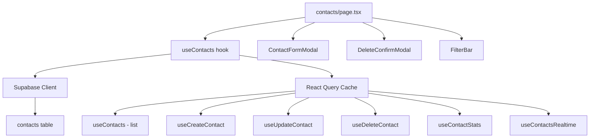
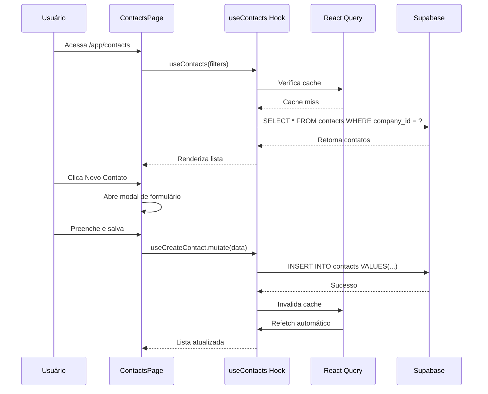

# Plano: Página de Contatos com Dados Reais do Supabase

## Resumo

A página de contatos atual (`/app/contacts`) usa **dados mock** e não possui operações CRUD reais. O objetivo é integrá-la com o Supabase para exibir contatos reais e oferecer as mesmas funcionalidades de criar, editar, excluir e filtrar que existem no `ContactsView` dentro do módulo de atendimentos.

## Análise Atual

### Estado Atual
- **Página de contatos** (`contacts/page.tsx`): Usa `mockContacts` hardcoded, apenas busca por texto, sem CRUD
- **ContactsView no whatslidia** (`views/ContactsView.tsx`): Tem CRUD completo, filtros avançados, mas também usa mock data
- **Tabela `contacts`** no Supabase: Já existe via migration `013_create_contacts_table.sql` com RLS configurado
- **Padrão de hooks**: O projeto usa `@tanstack/react-query` + Supabase (ver `use-notes.ts`, `use-sales-funnel.ts`)

### Estrutura da Tabela `contacts`
| Campo | Tipo | Descrição |
|-------|------|-----------|
| `id` | UUID | Primary key |
| `name` | VARCHAR(255) | Nome do contato |
| `email` | VARCHAR(255) | Email |
| `phone` | VARCHAR(50) | Telefone |
| `avatar` | TEXT | URL do avatar |
| `company` | VARCHAR(255) | Nome da empresa |
| `company_id` | UUID | FK para companies |
| `tags` | TEXT[] | Array de tags |
| `notes` | TEXT | Observações |
| `status` | VARCHAR(50) | active/inactive/lead/client/prospect |
| `source` | VARCHAR(50) | manual/whatsapp/instagram/facebook/email/website |
| `last_contact_at` | TIMESTAMPTZ | Último contato |
| `created_by` | UUID | FK para auth.users |
| `assigned_to` | UUID | FK para auth.users |
| `created_at` | TIMESTAMPTZ | Data de criação |
| `updated_at` | TIMESTAMPTZ | Data de atualização |

## Arquitetura da Solução

## Arquivos a Criar/Modificar

### 1. `src/types/contacts.ts` - Tipos TypeScript
Definir interfaces baseadas na tabela do Supabase:
- `Contact` - Interface principal do contato
- `ContactFormData` - Dados do formulário de criação/edição
- `ContactFilters` - Filtros disponíveis
- `ContactStats` - Estatísticas para os cards
- `ContactStatus` e `ContactSource` - Tipos union

### 2. `src/hooks/use-contacts.ts` - Hook de CRUD com React Query
Seguindo o padrão de `use-notes.ts`:
- `contactKeys` - Chaves de cache do React Query
- `fetchContacts(filters)` - Buscar contatos com filtros e paginação
- `fetchContactStats()` - Buscar estatísticas
- `createContact(data)` - Criar novo contato
- `updateContact(id, data)` - Atualizar contato
- `deleteContact(id)` - Excluir contato
- Hooks exportados:
  - `useContacts(filters)` - Listar com filtros
  - `useContactStats()` - Estatísticas
  - `useCreateContact()` - Mutação de criação
  - `useUpdateContact()` - Mutação de edição
  - `useDeleteContact()` - Mutação de exclusão
  - `useContactsRealtime()` - Inscrição realtime

### 3. `src/hooks/index.ts` - Exportar novos hooks
Adicionar exports do `use-contacts.ts`

### 4. `src/app/(dashboard)/app/contacts/page.tsx` - Reescrever página
Manter o design futurista atual (GlassCard, NeonButton, GlowBadge) mas substituir mock data por dados reais:
- **Header**: Título + botão Novo Contato
- **Stats Cards**: Total, Clientes, Leads, Novos Este Mês (dados reais)
- **Barra de Busca e Filtros**: 
  - Busca por nome, email, telefone, empresa
  - Filtro por status (active, inactive, lead, client, prospect)
  - Filtro por tags
  - Filtro por data do último contato
- **Grid de Contatos**: Cards com informações reais
  - Avatar com iniciais
  - Nome, empresa, email, telefone
  - Tags com cores
  - Status badge
  - Botão de ações (editar, excluir)
- **Modal de Criar/Editar Contato**: Formulário com validação
- **Modal de Confirmação de Exclusão**: Confirmar antes de deletar

## Fluxo de Dados

## Detalhes de Implementação

### Filtros Disponíveis
| Filtro | Tipo | Valores |
|--------|------|---------|
| Busca | Texto | Nome, email, telefone, empresa |
| Status | Select | Todos, Ativo, Inativo, Lead, Cliente, Prospecto |
| Tags | Multi-select | Tags dinâmicas dos contatos |
| Último Contato | Select | Todos, Hoje, Esta semana, Este mês |

### Validações do Formulário
- **Nome**: Obrigatório, mínimo 2 caracteres
- **Telefone**: Obrigatório, formato brasileiro
- **Email**: Opcional, formato válido se preenchido
- **Empresa**: Opcional
- **Tags**: Opcional, array de strings

### Segurança (RLS)
- Contatos são filtrados por `company_id` do usuário autenticado
- Super admins podem ver todos os contatos
- RLS policies já configuradas na migration

## Decisões de Design
- **Manter o design futurista** atual (GlassCard, NeonButton, GlowBadge) em vez de usar o estilo WhatsApp do ContactsView
- **Usar React Query** seguindo o padrão consolidado do projeto
- **Filtragem por company_id** automática via RLS + hook
- **Realtime updates** via Supabase subscriptions para refetch automático
