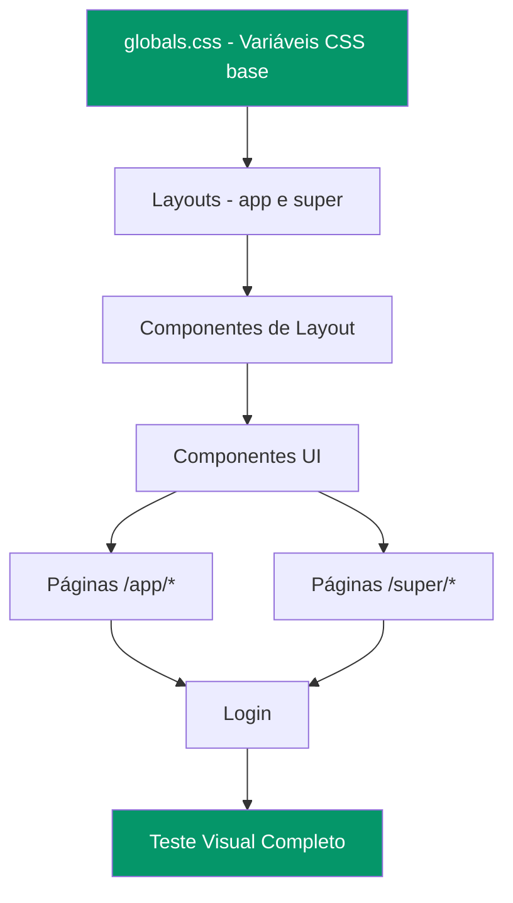

# Plano: Tema Escuro/Claro Completo - LIDIA 2.0

## Diagnóstico

### Problema Principal
O sistema LIDIA 2.0 possui **duas áreas de dashboard** com abordagens de tema completamente diferentes:

1. **Dashboard Super (`/super/*`)** — Já usa parcialmente o padrão `dark:` do Tailwind, mas com inconsistências
2. **Dashboard App (`/app/*`)** — Usa cores **100% hardcoded** para tema escuro, sem nenhum suporte a tema claro

### Evidências Visuais
Conforme as imagens de referência, no modo escuro:
- Cards internos ficam com fundo claro/branco quebrando a uniformidade
- Sidebar e header estão escuros mas o conteúdo principal tem elementos claros
- Gráficos e estatísticas têm backgrounds brancos inconsistentes

---

## Arquitetura do Sistema de Temas

### Estrutura Atual
```
ThemeProvider (src/components/theme-provider.tsx)
  └── Adiciona classe "dark" ou "light" no <html>
  └── Armazena preferência no localStorage
  └── Toggle via ThemeToggleSwitch

globals.css
  └── :root → variáveis dark (padrão)
  └── .light → variáveis light
  └── Variáveis CSS: --background, --foreground, --card, --border, etc.
```

### Estratégia de Correção
Usar o padrão `dark:` prefix do Tailwind CSS em TODOS os componentes, garantindo que:
- **Tema escuro**: backgrounds `#000000` a `#0f0f0f`, textos claros
- **Tema claro**: backgrounds `#ffffff` a `#f8fafc`, textos escuros
- Usar variáveis CSS semânticas onde possível: `bg-background`, `text-foreground`, `bg-card`, `text-card-foreground`

---

## Paleta de Cores Definida

### Tema Escuro (Padrão)
| Elemento | Cor | Uso |
|----------|-----|-----|
| Background principal | `#000000` | Body, main content |
| Background secundário | `#0a0a0a` / `#0f0f0f` | Cards, sidebar |
| Background terciário | `#111111` | Inputs, hover states |
| Texto principal | `#f8fafc` | Títulos, conteúdo |
| Texto secundário | `#94a3b8` | Subtítulos, labels |
| Texto terciário | `#64748b` | Placeholders, hints |
| Bordas | `rgba(16,185,129,0.15)` | Bordas com toque verde |
| Accent | `#10b981` | Botões, links, indicadores |

### Tema Claro
| Elemento | Cor | Uso |
|----------|-----|-----|
| Background principal | `#ffffff` | Body, main content |
| Background secundário | `#f8fafc` / `#f1f5f9` | Cards, sidebar |
| Background terciário | `#e2e8f0` | Inputs, hover states |
| Texto principal | `#0f172a` | Títulos, conteúdo |
| Texto secundário | `#475569` | Subtítulos, labels |
| Texto terciário | `#94a3b8` | Placeholders, hints |
| Bordas | `rgba(0,0,0,0.08)` | Bordas sutis |
| Accent | `#059669` | Botões, links, indicadores |

---

## Arquivos a Modificar

### 1. CSS Global — `src/app/globals.css`
- Adicionar variáveis `.light` para scrollbar
- Ajustar `.light .glass` para backgrounds totalmente brancos
- Adicionar regras de scrollbar para tema claro
- Garantir que `bg-gradient-mesh` tenha versão light

### 2. Layout App — `src/app/(dashboard)/app/layout.tsx`
**Problema**: `bg-[#020617]` hardcoded
**Solução**: Trocar para `dark:bg-black bg-white` ou `bg-background`

### 3. Layout Super — `src/app/(dashboard)/super/layout.tsx`
**Problema**: Glows de background fixos
**Solução**: Condicionar opacidade dos glows ao tema

### 4. Header App — `src/components/header.tsx`
**Problema**: Totalmente hardcoded — `bg-slate-950/80`, `text-white`, `border-white/10`, `bg-white/5`, `text-slate-400`, `text-slate-500`, `text-slate-200`
**Solução**: Adicionar `dark:` prefix em TODOS os elementos

### 5. Sidebar App — `src/components/sidebar.tsx`
**Problema**: Muitos elementos sem `dark:` prefix — `border-white/5`, `bg-white/5`, `text-slate-400`, `hover:bg-white/5`, `bg-black/80`, `border-white/10`
**Solução**: Adicionar `dark:` prefix e equivalentes light

### 6. Super Sidebar — `src/components/super-sidebar.tsx`
**Problema**: Mobile sidebar sem `dark:` prefixes
**Solução**: Adicionar `dark:` prefix na seção mobile

### 7. Super Header — `src/components/super-header.tsx`
**Problema**: Pequenas inconsistências
**Solução**: Ajustes pontuais

### 8. Componentes UI
- `glass-card.tsx` — OK, já tem dark:/light
- `glow-badge.tsx` — OK, já tem dark:/light
- `neon-button.tsx` — OK, já tem dark:/light
- `animated-input.tsx` — OK, já tem dark:/light
- `card.tsx` — Usa variáveis CSS, OK
- `protected-route.tsx` — Precisa de dark: prefixes

### 9. Páginas /app/* (MAIOR VOLUME DE TRABALHO)
Todas estas páginas usam cores hardcoded sem `dark:`:

| Página | Arquivo | Severidade |
|--------|---------|------------|
| Central | `app/central/page.tsx` | Alta |
| Atendimentos | `app/attendances/page.tsx` | Alta |
| Bulk | `app/bulk/page.tsx` | Alta |
| Contatos | `app/contacts/page.tsx` | Alta |
| Kanban | `app/kanban/page.tsx` | Alta |
| Analytics | `app/analytics/page.tsx` | Alta |
| Usuários | `app/users/page.tsx` | Alta |
| Configurações | `app/settings/page.tsx` | Alta |
| Perfil | `app/profile/page.tsx` | Alta |
| Notificações | `app/notifications/page.tsx` | Alta |
| Conexão | `app/connection/page.tsx` | Média (parcial) |

**Padrão de substituição para páginas /app/*:**
```
text-white          → dark:text-white text-slate-900
text-slate-400      → dark:text-slate-400 text-slate-500
text-slate-500      → dark:text-slate-500 text-slate-400
text-slate-300      → dark:text-slate-300 text-slate-700
text-slate-200      → dark:text-slate-200 text-slate-800
bg-white/5          → dark:bg-white/5 bg-slate-100
bg-white/10         → dark:bg-white/10 bg-slate-200
hover:bg-white/5    → hover:dark:bg-white/5 hover:bg-slate-100
border-white/10     → dark:border-white/10 border-slate-200
border-white/5      → dark:border-white/5 border-slate-100
bg-black/80         → dark:bg-black/80 bg-white/80
bg-slate-950/80     → dark:bg-slate-950/80 bg-white/80
```

### 10. Páginas /super/* (AJUSTES MENORES)
| Página | Arquivo | Severidade |
|--------|---------|------------|
| API WABA | `super/api-waba/page.tsx` | Alta (sem dark:) |
| Central | `super/central/page.tsx` | Baixa |
| Plans | `super/plans/page.tsx` | Baixa |
| Companies | `super/companies/page.tsx` | Baixa |
| Company Users | `super/company-users/page.tsx` | Baixa |
| Settings | `super/settings/page.tsx` | Baixa |

### 11. Login — `src/app/login/page.tsx`
**Problema**: `border-white/10` hardcoded no footer
**Solução**: Adicionar `dark:` prefix

---

## Ordem de Execução

1. **globals.css** — Base do sistema de temas
2. **Layouts** — app/layout.tsx e super/layout.tsx
3. **Componentes de layout** — header.tsx, sidebar.tsx, super-sidebar.tsx, super-header.tsx
4. **Componentes UI** — protected-route.tsx
5. **Páginas /app/*** — Todas as 11 páginas
6. **Páginas /super/*** — api-waba e ajustes menores
7. **Login** — Ajustes finais
8. **Teste visual** — Verificar ambos os temas

---

## Diagrama de Dependências



## Estimativa de Arquivos
- **Total de arquivos a modificar**: ~25 arquivos
- **Arquivos com mudanças extensas**: ~13 (páginas /app/*)
- **Arquivos com mudanças moderadas**: ~5 (layouts + componentes de layout)
- **Arquivos com mudanças pequenas**: ~7 (globals.css, UI components, login)
