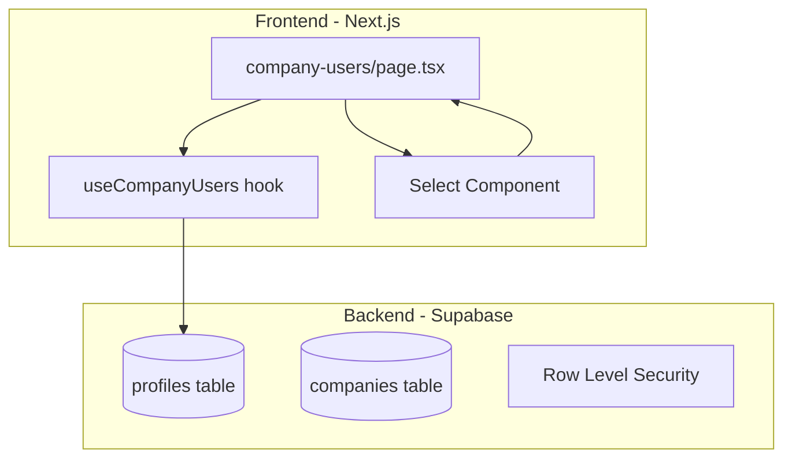

# Plano de Implementação: Filtragem Dinâmica + Verificação Automática de Email

## Visão Geral

Este plano detalha a implementação de duas funcionalidades críticas no sistema LIDIA 2.0:

1. **Sistema de Filtragem Dinâmica** na interface administrativa de usuários corporativos
2. **Verificação Automática de Email** para usuários criados via painel administrativo

---

## Fase 1: Sistema de Filtragem Dinâmica

### Objetivo
Implementar filtros visuais na tela `/super/company-users` permitindo filtrar usuários por empresa e/ou função, com dropdowns dependentes que atualizam a lista em tempo real.

### Componentes Envolvidos



### Estrutura de Filtros

```typescript
interface UserFilters {
  companyId: string | null;    // Filtra por empresa específica
  role: UserRole | null;       // Filtra por função/cargo
  searchTerm: string;          // Busca por nome/email (existente)
  status: 'all' | 'active' | 'inactive'; // Filtra por status
}
```

### Roles Disponíveis por Contexto

| Role | Label | Descrição |
|------|-------|-----------|
| CLIENT_ADMIN | Administrador | Acesso total à empresa |
| CLIENT_MANAGER | Gerente | Gerencia atendimentos e equipe |
| CLIENT_AGENT | Agente | Atendimento ao cliente |
| CLIENT_VIEWER | Visualizador | Apenas visualização de dados |

### Implementação no Hook `useCompanyUsers`

**Alterações em `src/hooks/use-company-users.ts`:**

1. Adicionar interface de filtros:
```typescript
interface UserFilters {
  companyId?: string | null;
  role?: UserRole | null;
  status?: 'all' | 'active' | 'inactive';
  searchTerm?: string;
}
```

2. Modificar função `fetchUsers` para aceitar filtros:
```typescript
const fetchUsers = useCallback(async (filters?: UserFilters) => {
  let query = supabase
    .from("profiles")
    .select(`*, company:company_id (id, name)`)
    .neq("role", "SUPER_USER")
    .order("created_at", { ascending: false });

  // Aplicar filtros dinamicamente
  if (filters?.companyId) {
    query = query.eq("company_id", filters.companyId);
  }
  
  if (filters?.role) {
    query = query.eq("role", filters.role);
  }
  
  if (filters?.status && filters.status !== 'all') {
    query = query.eq("is_active", filters.status === 'active');
  }
  
  // ... resto da implementação
}, [supabase]);
```

### Implementação na Página

**Alterações em `src/app/(dashboard)/super/company-users/page.tsx`:**

1. Adicionar estado para filtros:
```typescript
const [filters, setFilters] = useState<UserFilters>({
  companyId: null,
  role: null,
  status: 'all',
});
```

2. Criar componente de filtros avançados:
```typescript
function FilterBar({ 
  filters, 
  onFilterChange, 
  companies,
  availableRoles 
}: FilterBarProps) {
  return (
    <div className="flex flex-col md:flex-row gap-4">
      {/* Filtro por Empresa */}
      <Select
        value={filters.companyId || 'all'}
        onValueChange={(value) => 
          onFilterChange({ ...filters, companyId: value === 'all' ? null : value })
        }
        options={[
          { value: 'all', label: 'Todas as Empresas' },
          ...companies.map(c => ({ value: c.id, label: c.name }))
        ]}
      />
      
      {/* Filtro por Função - Dependente da Empresa */}
      <Select
        value={filters.role || 'all'}
        onValueChange={(value) => 
          onFilterChange({ ...filters, role: value === 'all' ? null : value as UserRole })
        }
        options={availableRoles}
        disabled={!filters.companyId} // Desabilitado até selecionar empresa
      />
      
      {/* Filtro por Status */}
      <Select
        value={filters.status}
        onValueChange={(value) => 
          onFilterChange({ ...filters, status: value as UserFilters['status'] })
        }
        options={[
          { value: 'all', label: 'Todos os Status' },
          { value: 'active', label: 'Ativos' },
          { value: 'inactive', label: 'Inativos' },
        ]}
      />
    </div>
  );
}
```

3. Lógica de roles disponíveis baseada na empresa:
```typescript
const availableRoles = useMemo(() => {
  // Se não há empresa selecionada, mostrar todas as roles
  if (!filters.companyId) {
    return allRoleOptions;
  }
  
  // Filtrar roles baseado nos usuários existentes da empresa
  // ou mostrar todas as roles disponíveis no sistema
  const companyUsers = users.filter(u => u.company_id === filters.companyId);
  const usedRoles = new Set(companyUsers.map(u => u.role));
  
  return allRoleOptions.map(role => ({
    ...role,
    disabled: usedRoles.size > 0 && !usedRoles.has(role.value as UserRole)
  }));
}, [filters.companyId, users]);
```

### UI/UX Considerações

1. **Estado Inicial**: Todos os filtros em "Todos" para mostrar todos os usuários
2. **Dependência**: Ao selecionar empresa, o dropdown de funções se atualiza
3. **Feedback Visual**: Indicadores de filtros ativos (badges)
4. **Limpar Filtros**: Botão para resetar todos os filtros
5. **Contadores**: Mostrar quantidade de resultados filtrados

---

## Fase 2: Verificação Automática de Email

### Objetivo
Quando um usuário é criado via painel administrativo, o email deve ser automaticamente verificado, permitindo login imediato sem necessidade de confirmação via link.

### Fluxo Atual vs Novo

```mermaid
sequenceDiagram
    participant Admin as Administrador
    participant UI as Interface
    participant Hook as useCompanyUsers
    participant SB as Supabase Auth
    participant DB as auth.users
    
    rect rgb(50,50,50)
        Note over Admin,DB: FLUXO ATUAL
        Admin->>UI: Clica "Novo Usuário"
        UI->>Hook: createUser(userData)
        Hook->>SB: signUp(email, password)
        SB->>DB: Cria usuário<br/>email_confirmed_at = null
        DB-->>SB: User criado (não verificado)
        SB-->>Hook: Retorna user
        Hook->>DB: INSERT profiles
        Note over Admin: Usuário recebe email<br/>de confirmação e precisa<br/>clicar no link
    end
    
    rect rgb(0,50,0)
        Note over Admin,DB: FLUXO NOVO
        Admin->>UI: Clica "Novo Usuário"
        UI->>Hook: createUser(userData, { autoVerify: true })
        Hook->>SB: signUp(email, password)
        SB->>DB: Cria usuário
        DB-->>SB: User criado
        SB-->>Hook: Retorna user
        Hook->>SB: auth.admin.updateUserById<br/>(email_confirmed_at: now)
        SB->>DB: Atualiza email_confirmed_at
        Hook->>DB: INSERT profiles
        Note over Admin: Usuário pode fazer<br/>login imediatamente!
    end
```



### Implementação no Hook

**Alterações em `src/hooks/use-company-users.ts`:**

1. Modificar interface de criação:
```typescript
interface CreateUserOptions {
  autoVerifyEmail?: boolean; // Default: true para criação via admin
}
```

2. Atualizar função `createUser`:
```typescript
const createUser = useCallback(
  async (
    userData: UserFormData, 
    options: CreateUserOptions = { autoVerifyEmail: true }
  ): Promise<{ success: boolean; error?: string }> => {
    try {
      // 1. Criar usuário no Auth
      const { data: authData, error: authError } = await supabase.auth.signUp({
        email: userData.email,
        password: userData.password || generateSecurePassword(),
        options: {
          data: { full_name: userData.full_name },
        },
      });

      if (authError) throw authError;
      if (!authData.user) throw new Error("Falha ao criar usuário");

      // 2. VERIFICAÇÃO AUTOMÁTICA DE EMAIL
      if (options.autoVerifyEmail) {
        // Usar service role key para atualizar email_confirmed_at
        const { error: verifyError } = await supabase.rpc(
          'admin_confirm_user_email',
          { user_id: authData.user.id }
        );
        
        if (verifyError) {
          console.warn('Não foi possível verificar email automaticamente:', verifyError);
          // Não falhar a criação, apenas logar o warning
        }
      }

      // 3. Criar profile
      const { error: profileError } = await supabase.from("profiles").insert({
        user_id: authData.user.id,
        email: userData.email,
        full_name: userData.full_name,
        phone: userData.phone,
        role: userData.role || "CLIENT_AGENT",
        company_id: userData.company_id,
        is_active: userData.is_active ?? true,
      });

      if (profileError) {
        // Rollback: deletar usuário do auth se profile falhar
        await supabase.rpc('admin_delete_user', { user_id: authData.user.id });
        throw profileError;
      }

      await fetchUsers();
      return { success: true };
    } catch (err) {
      console.error("Error creating user:", err);
      return {
        success: false,
        error: err instanceof Error ? err.message : "Erro ao criar usuário",
      };
    }
  },
  [supabase, fetchUsers]
);
```

### Funções RPC Necessárias (Supabase)

**Arquivo: `supabase/migrations/006_add_auto_verify_functions.sql`**

```sql
-- Função para verificar email de usuário automaticamente (admin only)
CREATE OR REPLACE FUNCTION admin_confirm_user_email(user_id UUID)
RETURNS VOID
LANGUAGE plpgsql
SECURITY DEFINER
SET search_path = public
AS $$
DECLARE
    caller_role user_role;
BEGIN
    -- Verificar se quem chamou é SUPER_USER
    SELECT role INTO caller_role
    FROM profiles
    WHERE user_id = auth.uid();
    
    IF caller_role != 'SUPER_USER' THEN
        RAISE EXCEPTION 'Apenas super usuários podem verificar emails';
    END IF;
    
    -- Atualizar email_confirmed_at na tabela auth.users
    UPDATE auth.users
    SET email_confirmed_at = NOW(),
        updated_at = NOW()
    WHERE id = user_id;
END;
$$;

-- Função para deletar usuário (usada em rollback)
CREATE OR REPLACE FUNCTION admin_delete_user(user_id UUID)
RETURNS VOID
LANGUAGE plpgsql
SECURITY DEFINER
SET search_path = public
AS $$
DECLARE
    caller_role user_role;
BEGIN
    -- Verificar permissões
    SELECT role INTO caller_role
    FROM profiles
    WHERE user_id = auth.uid();
    
    IF caller_role != 'SUPER_USER' THEN
        RAISE EXCEPTION 'Apenas super usuários podem deletar usuários';
    END IF;
    
    -- Deletar da auth.users (cascade deleta profiles)
    DELETE FROM auth.users WHERE id = user_id;
END;
$$;

-- Grant execute permissions
GRANT EXECUTE ON FUNCTION admin_confirm_user_email(UUID) TO authenticated;
GRANT EXECUTE ON FUNCTION admin_delete_user(UUID) TO authenticated;
```

### Considerações de Segurança

1. **Service Role Key**: As funções usam `SECURITY DEFINER` para executar com privilégios elevados
2. **Validação de Permissões**: Verificação de que o caller é SUPER_USER
3. **Rollback Automático**: Se a criação do profile falhar, o usuário auth é deletado
4. **Audit Logs**: Registrar ações de criação de usuário com flag de auto-verificação

---

## Estrutura de Arquivos Modificados

### Frontend

| Arquivo | Alterações |
|---------|------------|
| `src/hooks/use-company-users.ts` | Adicionar filtros dinâmicos + verificação automática de email |
| `src/app/(dashboard)/super/company-users/page.tsx` | Adicionar UI de filtros com dropdowns dependentes |
| `src/components/modals/user-modal.tsx` | (Opcional) Adicionar checkbox para opt-out de auto-verificação |

### Backend (Supabase)

| Arquivo | Descrição |
|---------|-----------|
| `supabase/migrations/006_add_auto_verify_functions.sql` | Funções RPC para verificação automática |

---

## Checklist de Implementação

### Fase 1: Filtragem Dinâmica
- [ ] Adicionar interface `UserFilters` no hook
- [ ] Modificar `fetchUsers` para aceitar parâmetros de filtro
- [ ] Criar estado de filtros na página
- [ ] Implementar componente visual de filtros
- [ ] Adicionar lógica de dropdowns dependentes
- [ ] Implementar atualização em tempo real
- [ ] Adicionar botão de limpar filtros
- [ ] Testar combinações de filtros

### Fase 2: Email Auto-Verificado
- [ ] Criar migration com funções RPC
- [ ] Atualizar interface `UserFormData` com opções
- [ ] Modificar função `createUser` no hook
- [ ] Implementar verificação automática via RPC
- [ ] Adicionar rollback em caso de erro
- [ ] Testar criação de usuário com email verificado
- [ ] Verificar se login funciona imediatamente
- [ ] Adicionar logs de auditoria

---

## Testes Recomendados

### Testes de Filtragem
1. Filtrar por empresa específica → mostrar apenas usuários dessa empresa
2. Selecionar empresa → dropdown de roles deve atualizar
3. Combinar múltiplos filtros → resultados devem ser interseção
4. Limpar filtros → voltar à lista completa
5. Filtro com 0 resultados → mostrar estado vazio apropriado

### Testes de Auto-Verificação
1. Criar usuário via admin → verificar se `email_confirmed_at` está preenchido
2. Tentar login imediato → deve funcionar sem confirmação
3. Verificar audit logs → ação deve ser registrada
4. Testar rollback → se profile falhar, usuário auth deve ser removido
5. Testar permissões → usuário não-admin não deve conseguir usar RPC

---

## Notas Técnicas Adicionais

### Sobre o Supabase Auth

O Supabase armazena os dados de autenticação na tabela `auth.users` (schema auth). Campos relevantes:
- `email`: Email do usuário
- `email_confirmed_at`: Timestamp de confirmação (NULL = não confirmado)
- `confirmed_at`: Alias para email_confirmed_at

### Sobre Row Level Security

As funções RPC usam `SECURITY DEFINER` o que significa que executam com os privilégios do dono da função (bypass RLS). Por isso é crucial validar permissões dentro da função.

### Sobre o Hook useCompanyUsers

O hook atualmente usa `useMemo` para criar o cliente Supabase. Isso é importante manter para evitar recriações desnecessárias.

---

## Próximos Passos

Após aprovação deste plano, a implementação deve ser feita no modo **Code** seguindo a ordem:

1. Criar migration do Supabase
2. Atualizar hook `useCompanyUsers`
3. Atualizar página `company-users/page.tsx`
4. Testar e validar
