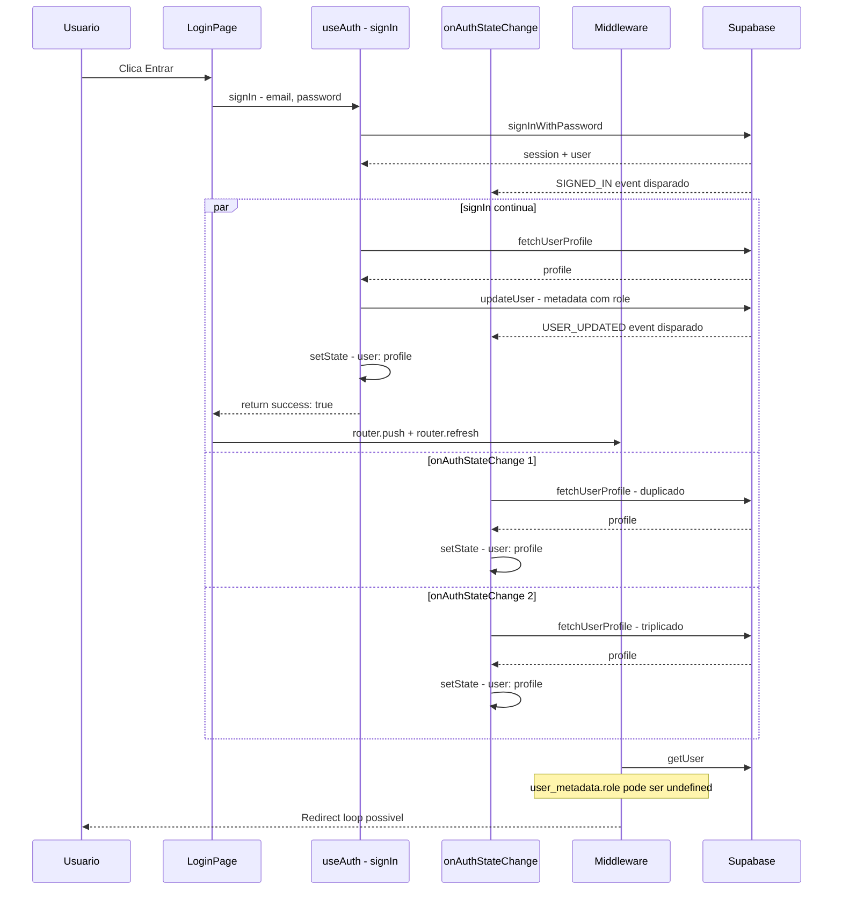
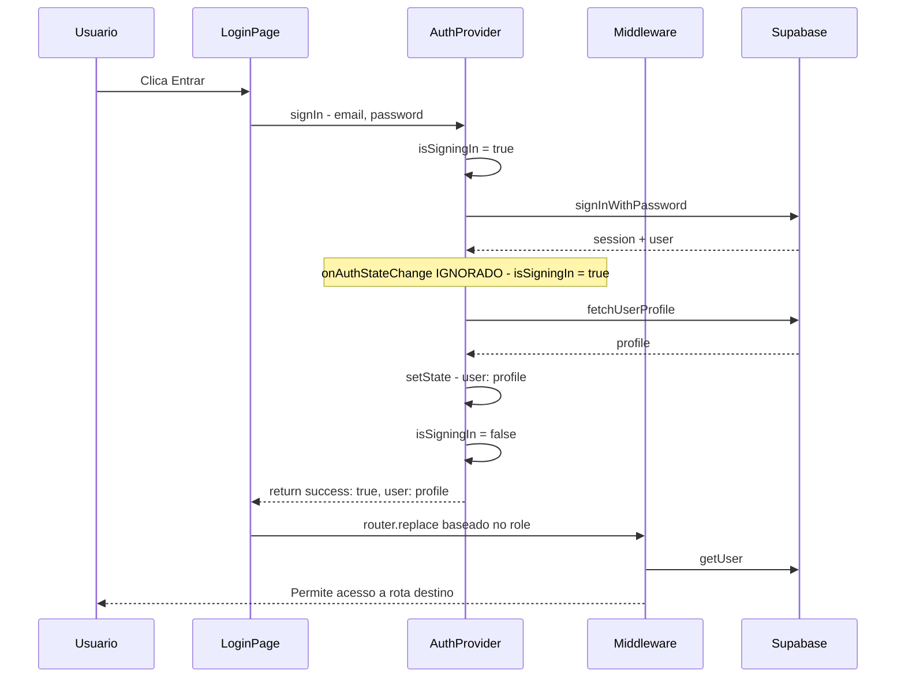

# Plano de Correção: Loop de Login no Frontend

## Problema
O usuário faz login mas fica preso em um loop infinito, não conseguindo autenticar. O botão fica em "Entrando..." ou o usuário é redirecionado repetidamente entre `/login` e as rotas protegidas.

## Diagnóstico - Causas Raiz Identificadas

### 1. Race Condition entre `signIn()` e `onAuthStateChange`
- O `signIn()` em `src/hooks/use-auth.ts:174` faz login, busca profile e seta estado
- Simultaneamente, o `onAuthStateChange` em `src/hooks/use-auth.ts:149` é disparado e faz a mesma coisa
- O `signIn()` ainda chama `supabase.auth.updateUser()` na linha 198 para atualizar metadata, o que dispara **outro** evento `onAuthStateChange`
- Resultado: 3 chamadas concorrentes ao `fetchUserProfile`, estados sendo sobrescritos

### 2. Múltiplas instâncias de `useAuth()` sem estado compartilhado
- Cada componente que chama `useAuth()` cria sua própria instância com seu próprio `onAuthStateChange` listener
- Componentes afetados: `LoginForm`, `ProtectedRoute`, `usePermissions` via `Sidebar`
- Cada instância faz queries independentes ao banco, multiplicando o problema

### 3. `router.refresh()` no `redirectBasedOnRole` causa re-execução do middleware
- Linha 264 de `use-auth.ts`: `router.refresh()` força o middleware a re-executar
- O middleware verifica `user_metadata.role` que pode ainda não estar atualizado
- Isso pode causar redirecionamento incorreto

### 4. Middleware não lida com `user_metadata.role` undefined
- Na primeira autenticação, `user_metadata.role` pode ser `undefined`
- O middleware em `src/middleware.ts:22` assume que o role existe
- Se role é undefined, o middleware não redireciona corretamente quando o usuário logado acessa `/login`

## Diagrama do Fluxo Atual com Problema



## Plano de Correção

### Passo 1: Criar AuthProvider com React Context
**Arquivo:** `src/contexts/auth-context.tsx` - NOVO

Criar um Context Provider que centraliza o estado de autenticação, evitando múltiplas instâncias independentes do hook.

```
- Criar AuthContext com createContext
- Criar AuthProvider que encapsula toda a logica de auth
- Estado compartilhado entre todos os componentes
- Unico listener onAuthStateChange
- Unica instancia do Supabase client
```

### Passo 2: Refatorar `use-auth.ts` para usar o Context
**Arquivo:** `src/hooks/use-auth.ts` - MODIFICAR

```
- useAuth passa a consumir o AuthContext
- Remove logica duplicada de estado e listeners
- Mantem a mesma interface publica para nao quebrar componentes
```

### Passo 3: Corrigir Race Condition no `signIn`
**Arquivo:** `src/contexts/auth-context.tsx`

```
- Adicionar flag isSigningIn para bloquear onAuthStateChange durante login
- signIn seta isSigningIn = true antes de chamar signInWithPassword
- onAuthStateChange verifica isSigningIn e ignora eventos durante login ativo
- signIn seta isSigningIn = false ao finalizar
- Mover updateUser para DEPOIS do redirect, ou remover completamente
```

### Passo 4: Remover `router.refresh()` do `redirectBasedOnRole`
**Arquivo:** `src/hooks/use-auth.ts` ou `src/contexts/auth-context.tsx`

```
- Remover router.refresh() da funcao redirectBasedOnRole
- router.push ja e suficiente para navegacao
- router.refresh causa re-execucao desnecessaria do middleware
```

### Passo 5: Corrigir Middleware para role undefined
**Arquivo:** `src/middleware.ts`

```
- Quando user esta logado e acessa /login mas role e undefined:
  - Redirecionar para /app/central como fallback seguro
  - Nao ficar em loop tentando determinar o role
- Quando user acessa /app/* sem role definido:
  - Permitir acesso, deixar o frontend lidar com permissoes
```

### Passo 6: Integrar AuthProvider no Layout Root
**Arquivo:** `src/app/layout.tsx` - MODIFICAR

```
- Envolver a aplicacao com AuthProvider
- Garantir que o provider esta acima de todos os componentes que usam useAuth
```

### Passo 7: Simplificar fluxo do `signIn` na LoginPage
**Arquivo:** `src/app/login/page.tsx` - MODIFICAR

```
- Apos signIn bem-sucedido, usar router.replace ao inves de router.push
  para evitar que o usuario volte para /login com o botao voltar
- Remover dependencia de redirectBasedOnRole, fazer redirect direto
```

## Diagrama do Fluxo Corrigido



## Arquivos Afetados

| Arquivo | Acao | Descricao |
|---------|------|-----------|
| `src/contexts/auth-context.tsx` | CRIAR | Context Provider centralizado |
| `src/hooks/use-auth.ts` | MODIFICAR | Consumir context ao inves de logica propria |
| `src/middleware.ts` | MODIFICAR | Tratar role undefined |
| `src/app/layout.tsx` | MODIFICAR | Adicionar AuthProvider |
| `src/app/login/page.tsx` | MODIFICAR | Usar router.replace, simplificar redirect |

## Riscos e Mitigacoes

- **Risco:** Quebrar componentes que dependem de `useAuth`
  - **Mitigacao:** Manter a mesma interface publica do hook
- **Risco:** Perder funcionalidade de updateUser metadata
  - **Mitigacao:** Mover para um efeito colateral apos login bem-sucedido, fora do fluxo critico
