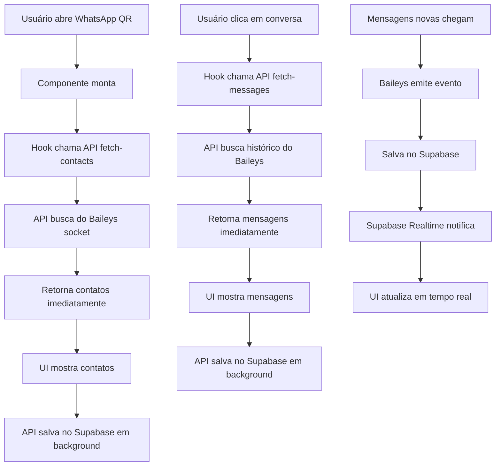

# Plano de Correção: Carregamento de Mensagens e Contatos WhatsApp

## Problema
O WhatsLidia não está carregando mensagens antigas nem mostrando todos os contatos. A interface fica travada em "Carregando conversas..." ou mostra lista vazia.

## Causa Raiz
O sistema depende exclusivamente do Supabase para dados, mas:
1. Os contatos só são salvos no Supabase quando o Baileys emite eventos `contacts.upsert`
2. O histórico de mensagens (`syncFullHistory`) pode não estar sendo persistido corretamente
3. Não existe mecanismo para forçar sincronização quando o usuário abre o chat

## Solução Proposta pelo Usuário
**Carregar os dados primeiro na memória/interface e depois salvar no Supabase em segundo plano.**

Isso significa:
1. Buscar contatos/mensagens diretamente do Baileys primeiro
2. Mostrar na interface imediatamente
3. Salvar no Supabase em background (não bloqueia a UI)

## Implementação

### 1. Criar Endpoint para Buscar Contatos do WhatsApp (Direto)

**Arquivo:** `src/app/api/whatsapp/sessions/[id]/fetch-contacts/route.ts`

```typescript
// GET /api/whatsapp/sessions/[id]/fetch-contacts
// Retorna contatos diretamente do Baileys (não do Supabase)
// Salva no Supabase em background
```

### 2. Criar Endpoint para Buscar Mensagens do WhatsApp (Direto)

**Arquivo:** `src/app/api/whatsapp/sessions/[id]/fetch-messages/route.ts`

```typescript
// GET /api/whatsapp/sessions/[id]/fetch-messages?phone=xxx
// Retorna mensagens diretamente do Baileys (não do Supabase)
// Salva no Supabase em background
```

### 3. Modificar BaileysService

**Arquivo:** `src/lib/whatsapp/baileys-service.ts`

Adicionar métodos:
- `fetchContactsFromWhatsApp()` - Busca contatos direto do socket
- `fetchMessagesFromWhatsApp(phone, limit)` - Busca mensagens direto do socket
- `saveContactsToSupabase(contacts)` - Salva em background
- `saveMessagesToSupabase(messages)` - Salva em background

### 4. Modificar useWhatsAppContacts Hook

**Arquivo:** `src/hooks/use-whatsapp-contacts.ts`

**Mudanças:**
- Nova função `fetchFromWhatsApp()` que chama o endpoint direto
- Primeiro tenta buscar do WhatsApp, mostra imediatamente
- Depois salva no Supabase em background
- Mantém polling do Supabase para atualizações em tempo real

**Fluxo:**
```
1. Componente monta -> chama fetchFromWhatsApp()
2. API busca do Baileys -> retorna imediatamente
3. Hook atualiza estado -> UI mostra contatos
4. API salva no Supabase em background (não bloqueia)
5. Supabase Realtime atualiza se houver mudanças
```

### 5. Modificar useWhatsAppMessages Hook

**Arquivo:** `src/hooks/use-whatsapp-messages.ts`

**Mudanças:**
- Nova função `fetchMessagesFromWhatsApp(phone)` 
- Busca direto do Baileys primeiro
- Mostra na interface imediatamente
- Salva no Supabase em background

### 6. Modificar WhatsLidiaRealLayout

**Arquivo:** `src/components/whatslidia/WhatsLidiaRealLayout.tsx`

**Mudanças:**
- Usar os novos hooks que buscam do WhatsApp primeiro
- Remover estado de "Carregando..." longo
- Mostrar dados assim que disponíveis

## Diagrama da Nova Solução



## Vantagens desta Abordagem

1. **Velocidade** - Dados aparecem imediatamente, sem esperar o Supabase
2. **Sincronização** - Supabase continua sendo a fonte da verdade para realtime
3. **Persistência** - Dados são salvos para consultas futuras
4. **Offline** - Se o WhatsApp estiver conectado, os dados aparecem

## Arquivos a Modificar/Criar

### Novos Arquivos:
1. `src/app/api/whatsapp/sessions/[id]/fetch-contacts/route.ts`
2. `src/app/api/whatsapp/sessions/[id]/fetch-messages/route.ts`

### Modificações:
3. `src/lib/whatsapp/baileys-service.ts` - Adicionar métodos de fetch direto
4. `src/hooks/use-whatsapp-contacts.ts` - Nova lógica de fetch
5. `src/hooks/use-whatsapp-messages.ts` - Nova lógica de fetch
6. `src/components/whatslidia/WhatsLidiaRealLayout.tsx` - Ajustar para nova API

## Testes

1. Conectar sessão QR
2. Abrir WhatsLidia
3. Verificar se contatos aparecem rapidamente (direto do Baileys)
4. Clicar em um contato
5. Verificar se mensagens antigas aparecem
6. Enviar mensagem nova
7. Verificar se aparece em tempo real
8. Recarregar página - verificar se dados persistiram no Supabase
