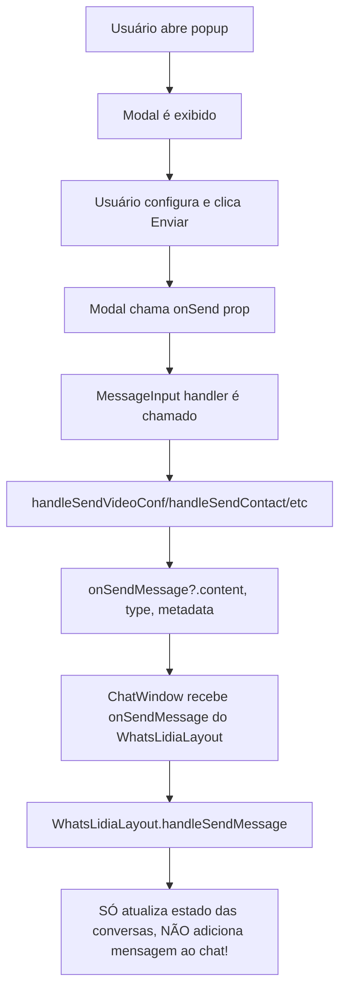

# Plano de Correção: Envios de Arquivos e Popups do WhatsLidia

## Resumo do Problema

O usuário relatou dois problemas principais:
1. **Envio de arquivos/imagem**: Ao selecionar arquivo/imagem, o modal de preview não aparece ou não envia
2. **Popups do menu de anexos**: Todos os popups (VideoConf, ContactPicker, ListBuilder, TemplatePicker, CTABuilder, ReplyButtons, Location) não estão enviando mensagens quando configurados

## Análise Técnica

### Problema 1: Envio de Arquivos/Imagem

**Fluxo atual:**
```
AttachmentMenu (gallery click) 
  → fileInputRef.current?.click() 
  → handleFileSelect 
  → setShowCaptionModal(true) 
  → Modal de preview aparece
  → Usuário clica Enviar
  → handleSend 
  → onSendAttachments(selectedFiles, caption)
```

**Possíveis causas:**
1. O `fileInputRef` pode não estar sendo acionado corretamente
2. O evento `onChange` do input file pode não estar disparando
3. O estado `showCaptionModal` pode não estar atualizando
4. O `AnimatePresence` pode estar impedindo a renderização do modal

### Problema 2: Popups Não Enviando

**Fluxo problemático identificado:**



**O problema:** O `ChatWindow` tem seu próprio estado de mensagens (`messages`) e um handler local `handleSendMessage` que adiciona mensagens ao estado. Porém, quando renderiza o `MessageInput`, ele passa `onSendMessage={onSendMessage}` (vindo do WhatsLidiaLayout), não o handler local.

**Resultado:** Os modais chamam `onSendMessage` que só atualiza metadados da conversa no WhatsLidiaLayout, mas nunca adiciona a mensagem ao estado local do ChatWindow, então a mensagem não aparece na interface.

## Soluções Propostas

### Solução 1: Corrigir Envio de Arquivos

No `AttachmentMenu.tsx`:
1. Verificar se o `fileInputRef` está funcionando corretamente
2. Garantir que o `handleFileSelect` seja chamado
3. Verificar se o estado `showCaptionModal` está atualizando
4. Verificar se o modal de preview está sendo renderizado corretamente pelo AnimatePresence

### Solução 2: Corrigir Integração dos Modais

No `ChatWindow.tsx`:
1. Criar um novo handler que combine:
   - Adicionar mensagem ao estado local (como faz o handleSendMessage local)
   - Chamar o onSendMessage externo do WhatsLidiaLayout (para atualizar metadados)
2. Passar este novo handler para o MessageInput

**Exemplo de implementação:**
```typescript
// No ChatWindow.tsx
const handleSendMessageWithType = (content: string, type?: string, metadata?: any) => {
  // 1. Adicionar mensagem ao estado local (igual ao handleSendMessage local)
  if (!conversation) return;
  
  const newMessage: Message = {
    id: `msg-${Date.now()}`,
    conversationId: conversation.id,
    content,
    type: type || 'text',
    status: 'sent',
    isFromMe: true,
    timestamp: new Date(),
    metadata,
  };
  
  setMessages((prev) => [...prev, newMessage]);
  
  // 2. Chamar handler externo para atualizar metadados da conversa
  onSendMessage?.(content);
  
  // 3. Simular status updates
  setTimeout(() => {
    setMessages((prev) =>
      prev.map((m) =>
        m.id === newMessage.id ? { ...m, status: 'delivered' } : m
      )
    );
  }, 1000);
  
  setTimeout(() => {
    setMessages((prev) =>
      prev.map((m) => (m.id === newMessage.id ? { ...m, status: 'read' } : m))
    );
  }, 2500);
};

// Passar para o MessageInput
<MessageInput
  onSend={handleSendMessage}
  onSendAttachments={handleSendAttachments}
  onSendMessage={handleSendMessageWithType}  // NOVO HANDLER
  ...
/>
```

### Solução 3: Atualizar MessageInput.tsx

Verificar se os handlers dos modais estão corretamente chamando `onSendMessage` com os parâmetros adequados (content, type, metadata).

## Checklist de Testes

- [x] Selecionar arquivo/imagem e verificar se modal de preview aparece
- [x] Enviar arquivo/imagem e verificar se aparece no chat
- [x] VideoConf: criar link e verificar se aparece no chat
- [x] ContactPicker: selecionar contato e verificar se aparece no chat
- [x] ListBuilder: criar lista e verificar se aparece no chat
- [x] TemplatePicker: selecionar template e verificar se aparece no chat
- [x] CTABuilder: criar CTA e verificar se aparece no chat
- [x] ReplyButtons: criar botões e verificar se aparece no chat
- [x] Location (send): enviar localização e verificar se aparece no chat
- [x] Location (request): solicitar localização e verificar se aparece no chat

## Resumo das Correções Implementadas

### 1. ChatWindow.tsx
- **Adicionado** `handleSendMessageWithType` handler que:
  - Adiciona mensagens ao estado local (para aparecerem no chat)
  - Chama o handler externo do WhatsLidiaLayout (para atualizar metadados)
  - Suporta tipo e metadata das mensagens
- **Atualizado** `MessageInput` para usar `handleSendMessageWithType` em vez de `onSendMessage` do WhatsLidiaLayout
- **Adicionado** import do tipo `MessageType`

### 2. AttachmentMenu.tsx
- **Corrigido** fluxo de clique em "Arquivo Galeria":
  - Adicionado `setTimeout` para garantir que o file picker abra antes do menu fechar
  - Isso evita que o componente seja desmontado antes da seleção de arquivos
- **Aumentado** z-index do modal de preview para `z-[100]` (backdrop) e `z-[101]` (modal)
- **Adicionado** console.logs para debugging do fluxo de arquivos

### 3. Todos os Modais (7 arquivos)
Atualizados z-index para consistência:
- `VideoConfModal.tsx`
- `ContactPickerModal.tsx`
- `ListBuilderModal.tsx`
- `TemplatePickerModal.tsx`
- `CTABuilderModal.tsx`
- `ReplyButtonsModal.tsx`
- `LocationModal.tsx`

**Mudança:** `z-50` → `z-[100]` (backdrop) e `z-[101]` (modal)

### Build
✅ Build executado com sucesso - nenhum erro de compilação!

## Arquivos a Modificar

1. `lidia2.0/src/components/whatslidia/ChatWindow.tsx` - Criar handler unificado
2. `lidia2.0/src/components/whatslidia/AttachmentMenu.tsx` - Verificar fluxo de arquivos
3. Opcional: `lidia2.0/src/components/whatslidia/MessageInput.tsx` - Verificar handlers
