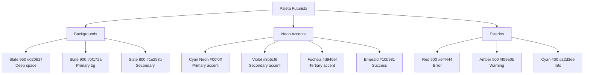
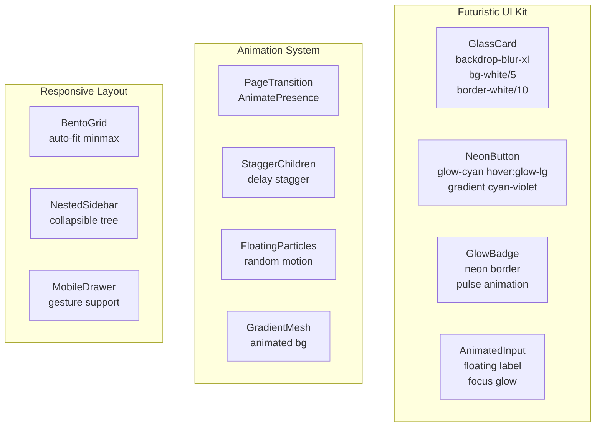
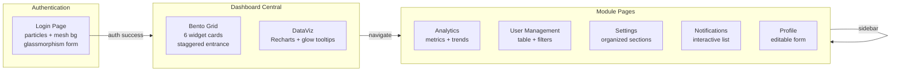

# Arquitetura de Design Futurista - LIDIA 2.0

## Sistema de Cores



## Estrutura de Componentes



## Flow de Navegação



## Glassmorphism Specification

```css
/* Base Glass Effect */
.glass {
  background: rgba(255, 255, 255, 0.03);
  backdrop-filter: blur(20px);
  -webkit-backdrop-filter: blur(20px);
  border: 1px solid rgba(255, 255, 255, 0.08);
  box-shadow: 
    0 4px 30px rgba(0, 0, 0, 0.1),
    inset 0 1px 0 rgba(255, 255, 255, 0.05);
}

/* Neon Glow Effects */
.glow-cyan {
  box-shadow: 
    0 0 20px rgba(0, 240, 255, 0.3),
    0 0 40px rgba(0, 240, 255, 0.1);
}

.glow-violet {
  box-shadow: 
    0 0 20px rgba(139, 92, 246, 0.3),
    0 0 40px rgba(139, 92, 246, 0.1);
}

/* Gradient Text */
.gradient-text {
  background: linear-gradient(135deg, #00f0ff 0%, #8b5cf6 100%);
  -webkit-background-clip: text;
  -webkit-text-fill-color: transparent;
}
```

## Responsividade

| Breakpoint | Sidebar | Grid | Typography |
|------------|---------|------|------------|
| Mobile (<640px) | Drawer slide-out | 1 column | 14px base |
| Tablet (640-1024px) | Collapsible rail | 2 columns | 15px base |
| Desktop (>1024px) | Full expanded | 3-4 columns | 16px base |

## Estrutura de Arquivos

```
src/
├── app/
│   ├── login/page.tsx           # Auth com animações
│   ├── (dashboard)/
│   │   ├── app/
│   │   │   ├── layout.tsx       # Dashboard layout
│   │   │   ├── central/page.tsx # Bento grid
│   │   │   ├── analytics/page.tsx
│   │   │   ├── users/page.tsx
│   │   │   ├── settings/page.tsx
│   │   │   ├── notifications/page.tsx
│   │   │   └── profile/page.tsx
├── components/
│   ├── ui/
│   │   ├── glass-card.tsx
│   │   ├── neon-button.tsx
│   │   ├── glow-badge.tsx
│   │   └── animated-input.tsx
│   ├── animations/
│   │   ├── page-transition.tsx
│   │   ├── floating-particles.tsx
│   │   └── gradient-mesh.tsx
│   ├── sidebar.tsx              # Nested nav
│   ├── header.tsx               # Futuristic
│   └── bento-grid.tsx           # Dashboard layout
├── lib/
│   ├── animations.ts            # Framer variants
│   └── utils.ts
└── styles/
    └── futuristic-theme.css     # Custom properties
```
