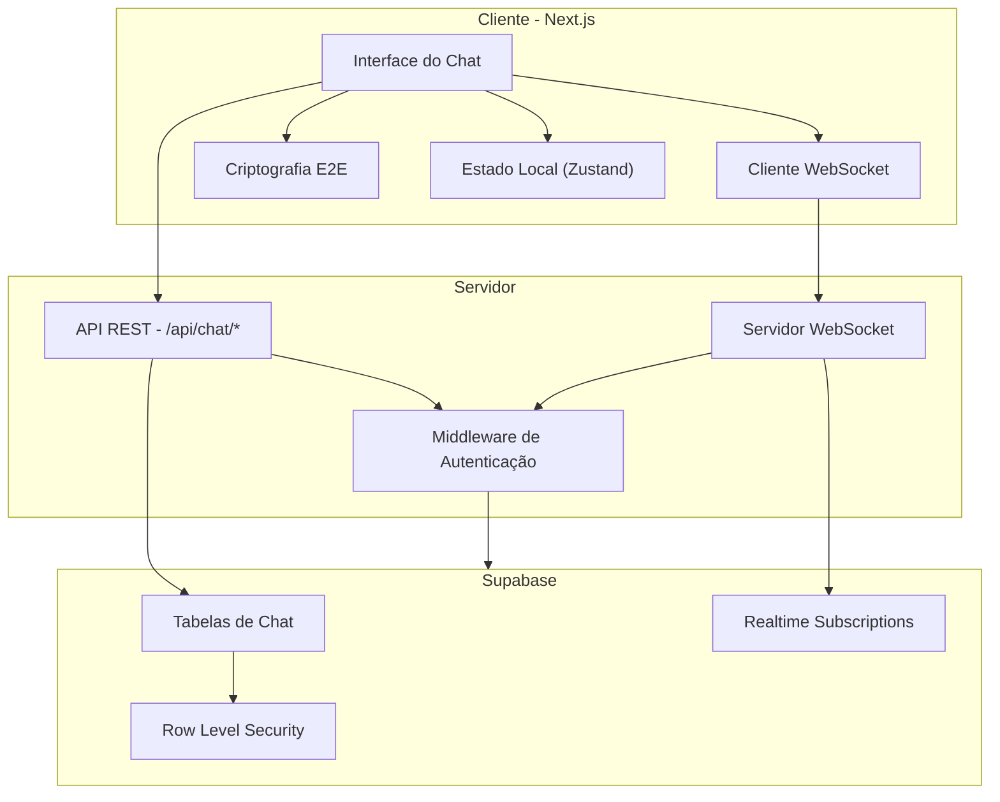
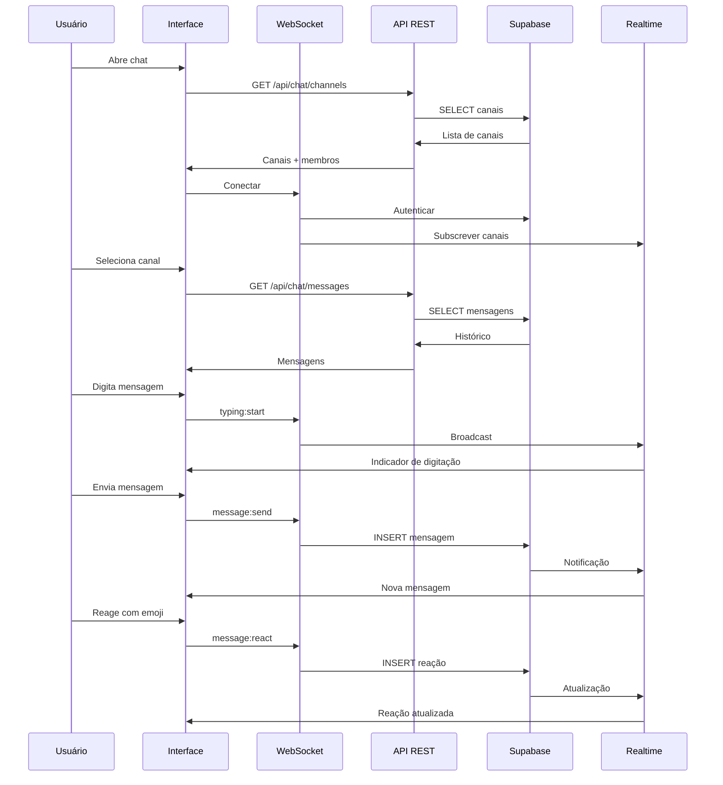

# Arquitetura do Sistema de Chat Corporativo Interno - LIDIA 2.0

## Visão Geral

Sistema completo de chat corporativo em tempo real para comunicação interna da equipe, integrado à página de atendimento existente. O sistema permite conversas em canais (salas) e chats diretos entre membros da equipe, com sincronização em tempo real via WebSocket.

## Funcionalidades Principais

### Core
- [x] Sidebar navegável com lista de salas de conversa
- [x] Canal geral para toda a empresa
- [x] Chats diretos individuais entre membros cadastrados
- [x] Indicadores de status online/offline
- [x] Histórico persistente de mensagens
- [x] Busca avançada por palavras-chave, datas ou usuários

### Mensagens
- [x] Envio de mensagens de texto
- [x] Envio de anexos (imagens, documentos, áudio)
- [x] Menções com @usuario
- [x] Reações às mensagens (emoji)
- [x] Responder mensagem específica
- [x] Fixação de mensagens importantes no topo
- [x] Indicadores de digitação em tempo real
- [x] Status de leitura (enviado, entregue, lido)

### Notificações
- [x] Notificações sonoras configuráveis
- [x] Notificações visuais (badges, toasts)
- [x] Contador de mensagens não lidas

### Segurança
- [x] Criptografia end-to-end para mensagens
- [x] Integração com sistema de permissões existente
- [x] Controle de acesso por departamento ou nível hierárquico
- [x] Auditoria de ações no chat

### UI/UX
- [x] Design responsivo (mobile e desktop)
- [x] Interface intuitiva diferenciando mensagens enviadas/recebidas
- [x] Avatares de usuários
- [x] Timestamps precisos
- [x] Tema escuro/claro consistente com o sistema

### Administração
- [x] Painel administrativo para gerenciamento de usuários
- [x] Criação e gestão de grupos/canais
- [x] Configuração de permissões por canal

## Arquitetura do Sistema



## Estrutura de Arquivos

```
src/
├── app/(dashboard)/app/atendimento/
│   ├── layout.tsx                      # Layout existente (atualizado)
│   ├── page.tsx                        # Página principal de atendimento
│   ├── comunicacao/                    # NOVA ROTA - Chat Corporativo
│   │   ├── page.tsx                    # Server Component
│   │   ├── layout.tsx                  # Layout específico do chat
│   │   └── components/
│   │       ├── InternalChatLayout.tsx  # Layout principal do chat
│   │       ├── ChatSidebar.tsx         # Sidebar com canais e usuários
│   │       ├── ChatRoom.tsx            # Área de mensagens
│   │       ├── MessageList.tsx         # Lista de mensagens
│   │       ├── MessageInput.tsx        # Input de mensagens
│   │       ├── MessageBubble.tsx       # Bolha de mensagem
│   │       ├── UserList.tsx            # Lista de usuários online
│   │       ├── ChannelList.tsx         # Lista de canais
│   │       ├── SearchMessages.tsx      # Busca de mensagens
│   │       ├── AttachmentUploader.tsx  # Upload de anexos
│   │       ├── EmojiReactions.tsx      # Reações com emoji
│   │       ├── TypingIndicator.tsx     # Indicador de digitação
│   │       ├── PinnedMessages.tsx      # Mensagens fixadas
│   │       └── UserMention.tsx         # Menção de usuários
│   ├── funil/                          # Existente
│   ├── protocolos/                     # Existente
│   ├── avaliacoes/                     # Existente
│   └── notas/                          # Existente
├── components/
│   └── internal-chat/                  # Componentes reutilizáveis
│       ├── ChatHeader.tsx
│       ├── ChatEmptyState.tsx
│       ├── ChatSkeleton.tsx
│       └── ChatNotification.tsx
├── hooks/
│   ├── use-internal-chat.ts            # Hook principal do chat
│   ├── use-websocket.ts                # Hook de WebSocket
│   ├── use-encryption.ts               # Hook de criptografia
│   └── use-notifications.ts            # Hook de notificações
├── lib/
│   ├── chat/
│   │   ├── encryption.ts               # Utilitários de criptografia
│   │   ├── websocket.ts                # Cliente WebSocket
│   │   └── notifications.ts            # Gerenciador de notificações
│   └── supabase/
│       └── realtime.ts                 # Configuração Realtime
├── types/
│   └── internal-chat.ts                # Tipos do chat interno
└── api/
    └── chat/
        ├── route.ts                    # API de mensagens
        ├── channels/
        │   └── route.ts                # API de canais
        ├── upload/
        │   └── route.ts                # API de upload de arquivos
        └── search/
            └── route.ts                # API de busca
```

## Schema do Banco de Dados (Supabase)

### Novas Tabelas

```sql
-- ============================================================
-- INTERNAL CHAT SYSTEM - Novas Tabelas
-- ============================================================

-- Tipos de canal
CREATE TYPE channel_access_type AS ENUM ('public', 'private', 'restricted');
CREATE TYPE message_type AS ENUM ('text', 'image', 'video', 'document', 'audio', 'system');
CREATE TYPE user_status AS ENUM ('online', 'away', 'busy', 'offline');

-- Canais/Salas de conversa
CREATE TABLE chat_channels (
    id UUID PRIMARY KEY DEFAULT uuid_generate_v4(),
    company_id UUID NOT NULL REFERENCES companies(id) ON DELETE CASCADE,
    name TEXT NOT NULL,
    description TEXT,
    type channel_access_type DEFAULT 'public',
    created_by UUID NOT NULL REFERENCES auth.users(id),
    is_general BOOLEAN DEFAULT false,  -- Canal geral da empresa
    is_active BOOLEAN DEFAULT true,
    avatar_url TEXT,
    member_count INTEGER DEFAULT 0,
    last_message_at TIMESTAMPTZ,
    created_at TIMESTAMPTZ DEFAULT NOW(),
    updated_at TIMESTAMPTZ DEFAULT NOW()
);

-- Membros dos canais
CREATE TABLE chat_channel_members (
    id UUID PRIMARY KEY DEFAULT uuid_generate_v4(),
    channel_id UUID NOT NULL REFERENCES chat_channels(id) ON DELETE CASCADE,
    user_id UUID NOT NULL REFERENCES auth.users(id) ON DELETE CASCADE,
    role TEXT DEFAULT 'member',  -- 'admin', 'member'
    joined_at TIMESTAMPTZ DEFAULT NOW(),
    last_read_at TIMESTAMPTZ,
    is_muted BOOLEAN DEFAULT false,
    notification_count INTEGER DEFAULT 0,
    UNIQUE(channel_id, user_id)
);

-- Mensagens
CREATE TABLE chat_messages (
    id UUID PRIMARY KEY DEFAULT uuid_generate_v4(),
    channel_id UUID REFERENCES chat_channels(id) ON DELETE CASCADE,
    direct_recipient_id UUID REFERENCES auth.users(id) ON DELETE CASCADE,
    sender_id UUID NOT NULL REFERENCES auth.users(id),
    company_id UUID NOT NULL REFERENCES companies(id) ON DELETE CASCADE,
    type message_type DEFAULT 'text',
    content TEXT NOT NULL,  -- Conteúdo criptografado (opcional)
    content_encrypted TEXT, -- Conteúdo criptografado E2E
    iv TEXT,                -- Vetor de inicialização para criptografia
    metadata JSONB DEFAULT '{}',  -- { fileName, fileSize, mimeType, etc }
    reply_to_id UUID REFERENCES chat_messages(id),
    is_edited BOOLEAN DEFAULT false,
    edited_at TIMESTAMPTZ,
    created_at TIMESTAMPTZ DEFAULT NOW(),
    -- Garante que uma mensagem pertence a um canal OU é direta
    CONSTRAINT channel_or_direct CHECK (
        (channel_id IS NOT NULL AND direct_recipient_id IS NULL) OR
        (channel_id IS NULL AND direct_recipient_id IS NOT NULL)
    )
);

-- Status de leitura das mensagens
CREATE TABLE chat_message_read_status (
    id UUID PRIMARY KEY DEFAULT uuid_generate_v4(),
    message_id UUID NOT NULL REFERENCES chat_messages(id) ON DELETE CASCADE,
    user_id UUID NOT NULL REFERENCES auth.users(id) ON DELETE CASCADE,
    read_at TIMESTAMPTZ DEFAULT NOW(),
    UNIQUE(message_id, user_id)
);

-- Reações às mensagens
CREATE TABLE chat_message_reactions (
    id UUID PRIMARY KEY DEFAULT uuid_generate_v4(),
    message_id UUID NOT NULL REFERENCES chat_messages(id) ON DELETE CASCADE,
    user_id UUID NOT NULL REFERENCES auth.users(id) ON DELETE CASCADE,
    emoji TEXT NOT NULL,
    created_at TIMESTAMPTZ DEFAULT NOW(),
    UNIQUE(message_id, user_id, emoji)
);

-- Mensagens fixadas
CREATE TABLE chat_pinned_messages (
    id UUID PRIMARY KEY DEFAULT uuid_generate_v4(),
    channel_id UUID NOT NULL REFERENCES chat_channels(id) ON DELETE CASCADE,
    message_id UUID NOT NULL REFERENCES chat_messages(id) ON DELETE CASCADE,
    pinned_by UUID NOT NULL REFERENCES auth.users(id),
    pinned_at TIMESTAMPTZ DEFAULT NOW(),
    UNIQUE(channel_id, message_id)
);

-- Status online dos usuários
CREATE TABLE chat_user_status (
    user_id UUID PRIMARY KEY REFERENCES auth.users(id) ON DELETE CASCADE,
    company_id UUID NOT NULL REFERENCES companies(id) ON DELETE CASCADE,
    status user_status DEFAULT 'offline',
    last_seen_at TIMESTAMPTZ DEFAULT NOW(),
    custom_status TEXT,
    updated_at TIMESTAMPTZ DEFAULT NOW()
);

-- Digitação em tempo real
CREATE TABLE chat_typing_indicators (
    id UUID PRIMARY KEY DEFAULT uuid_generate_v4(),
    channel_id UUID REFERENCES chat_channels(id) ON DELETE CASCADE,
    direct_recipient_id UUID REFERENCES auth.users(id) ON DELETE CASCADE,
    user_id UUID NOT NULL REFERENCES auth.users(id) ON DELETE CASCADE,
    started_at TIMESTAMPTZ DEFAULT NOW(),
    expires_at TIMESTAMPTZ DEFAULT NOW() + INTERVAL '30 seconds',
    UNIQUE(channel_id, user_id),
    UNIQUE(direct_recipient_id, user_id)
);

-- Anexos
CREATE TABLE chat_attachments (
    id UUID PRIMARY KEY DEFAULT uuid_generate_v4(),
    message_id UUID NOT NULL REFERENCES chat_messages(id) ON DELETE CASCADE,
    file_name TEXT NOT NULL,
    file_size INTEGER NOT NULL,
    mime_type TEXT NOT NULL,
    storage_path TEXT NOT NULL,
    thumbnail_path TEXT,
    duration INTEGER,  -- Para áudio/vídeo
    width INTEGER,     -- Para imagens/vídeos
    height INTEGER,
    created_at TIMESTAMPTZ DEFAULT NOW()
);

-- Índices
CREATE INDEX idx_chat_channels_company_id ON chat_channels(company_id);
CREATE INDEX idx_chat_channels_is_general ON chat_channels(is_general) WHERE is_general = true;
CREATE INDEX idx_chat_channel_members_channel_id ON chat_channel_members(channel_id);
CREATE INDEX idx_chat_channel_members_user_id ON chat_channel_members(user_id);
CREATE INDEX idx_chat_messages_channel_id ON chat_messages(channel_id);
CREATE INDEX idx_chat_messages_direct_recipient ON chat_messages(direct_recipient_id, sender_id);
CREATE INDEX idx_chat_messages_created_at ON chat_messages(created_at DESC);
CREATE INDEX idx_chat_messages_content_search ON chat_messages USING gin(to_tsvector('portuguese', content));
CREATE INDEX idx_chat_user_status_company_id ON chat_user_status(company_id);
CREATE INDEX idx_chat_message_read_status_message_id ON chat_message_read_status(message_id);

-- Triggers para updated_at
CREATE TRIGGER update_chat_channels_updated_at BEFORE UPDATE ON chat_channels
    FOR EACH ROW EXECUTE FUNCTION update_updated_at_column();
```

### Row Level Security (RLS)

```sql
-- Enable RLS
ALTER TABLE chat_channels ENABLE ROW LEVEL SECURITY;
ALTER TABLE chat_channel_members ENABLE ROW LEVEL SECURITY;
ALTER TABLE chat_messages ENABLE ROW LEVEL SECURITY;
ALTER TABLE chat_message_read_status ENABLE ROW LEVEL SECURITY;
ALTER TABLE chat_message_reactions ENABLE ROW LEVEL SECURITY;
ALTER TABLE chat_pinned_messages ENABLE ROW LEVEL SECURITY;
ALTER TABLE chat_user_status ENABLE ROW LEVEL SECURITY;
ALTER TABLE chat_typing_indicators ENABLE ROW LEVEL SECURITY;
ALTER TABLE chat_attachments ENABLE ROW LEVEL SECURITY;

-- Políticas para chat_channels
CREATE POLICY "Users can view channels in their company" ON chat_channels
    FOR SELECT USING (
        EXISTS (
            SELECT 1 FROM profiles 
            WHERE profiles.user_id = auth.uid() 
            AND profiles.company_id = chat_channels.company_id
        )
    );

CREATE POLICY "Admins can create channels" ON chat_channels
    FOR INSERT WITH CHECK (
        EXISTS (
            SELECT 1 FROM profiles 
            WHERE profiles.user_id = auth.uid() 
            AND profiles.company_id = chat_channels.company_id
            AND profiles.role IN ('CLIENT_ADMIN', 'CLIENT_MANAGER')
        )
    );

-- Políticas para chat_channel_members
CREATE POLICY "Users can view members of their channels" ON chat_channel_members
    FOR SELECT USING (
        EXISTS (
            SELECT 1 FROM chat_channel_members cm
            JOIN chat_channels c ON c.id = cm.channel_id
            WHERE cm.user_id = auth.uid()
            AND chat_channel_members.channel_id = cm.channel_id
        )
    );

-- Políticas para chat_messages
CREATE POLICY "Users can view messages in their channels or direct messages" ON chat_messages
    FOR SELECT USING (
        -- Mensagem em canal que o usuário participa
        EXISTS (
            SELECT 1 FROM chat_channel_members
            WHERE chat_channel_members.channel_id = chat_messages.channel_id
            AND chat_channel_members.user_id = auth.uid()
        )
        OR
        -- Mensagem direta enviada ou recebida pelo usuário
        (chat_messages.direct_recipient_id = auth.uid() OR chat_messages.sender_id = auth.uid())
    );

CREATE POLICY "Users can send messages to their channels" ON chat_messages
    FOR INSERT WITH CHECK (
        chat_messages.sender_id = auth.uid()
        AND (
            -- Canal que o usuário participa
            EXISTS (
                SELECT 1 FROM chat_channel_members
                WHERE chat_channel_members.channel_id = chat_messages.channel_id
                AND chat_channel_members.user_id = auth.uid()
            )
            OR
            -- Mensagem direta para alguém da mesma empresa
            EXISTS (
                SELECT 1 FROM profiles p1
                JOIN profiles p2 ON p1.company_id = p2.company_id
                WHERE p1.user_id = auth.uid()
                AND p2.user_id = chat_messages.direct_recipient_id
            )
        )
    );
```

## Tipos TypeScript

```typescript
// types/internal-chat.ts

export type ChannelType = 'public' | 'private' | 'restricted';
export type MessageType = 'text' | 'image' | 'video' | 'document' | 'audio' | 'system';
export type UserStatus = 'online' | 'away' | 'busy' | 'offline';
export type ChannelMemberRole = 'admin' | 'member';

export interface ChatChannel {
  id: string;
  companyId: string;
  name: string;
  description?: string;
  type: ChannelType;
  createdBy: string;
  isGeneral: boolean;
  isActive: boolean;
  avatarUrl?: string;
  memberCount: number;
  lastMessageAt?: string;
  createdAt: string;
  updatedAt: string;
  // Joined fields
  unreadCount?: number;
  isMuted?: boolean;
  lastReadAt?: string;
}

export interface ChatChannelMember {
  id: string;
  channelId: string;
  userId: string;
  user?: {
    id: string;
    name: string;
    avatar?: string;
    status: UserStatus;
  };
  role: ChannelMemberRole;
  joinedAt: string;
  lastReadAt?: string;
  isMuted: boolean;
  notificationCount: number;
}

export interface ChatMessage {
  id: string;
  channelId?: string;
  directRecipientId?: string;
  senderId: string;
  sender?: {
    id: string;
    name: string;
    avatar?: string;
  };
  companyId: string;
  type: MessageType;
  content: string;
  contentEncrypted?: string;
  iv?: string;
  metadata?: MessageMetadata;
  replyToId?: string;
  replyTo?: {
    id: string;
    content: string;
    senderName: string;
  };
  isEdited: boolean;
  editedAt?: string;
  createdAt: string;
  // Joined fields
  reactions?: MessageReaction[];
  readBy?: string[];  // IDs de usuários que leram
  isPinned?: boolean;
}

export interface MessageMetadata {
  fileName?: string;
  fileSize?: number;
  mimeType?: string;
  duration?: number;
  width?: number;
  height?: number;
  url?: string;
  thumbnailUrl?: string;
}

export interface MessageReaction {
  emoji: string;
  count: number;
  userReacted: boolean;
  users?: string[];
}

export interface ChatPinnedMessage {
  id: string;
  channelId: string;
  messageId: string;
  message?: ChatMessage;
  pinnedBy: string;
  pinnedAt: string;
}

export interface ChatUserStatus {
  userId: string;
  companyId: string;
  status: UserStatus;
  lastSeenAt: string;
  customStatus?: string;
  updatedAt: string;
}

export interface ChatTypingIndicator {
  channelId?: string;
  directRecipientId?: string;
  userId: string;
  user?: {
    name: string;
    avatar?: string;
  };
  startedAt: string;
  expiresAt: string;
}

export interface ChatAttachment {
  id: string;
  messageId: string;
  fileName: string;
  fileSize: number;
  mimeType: string;
  url: string;
  thumbnailUrl?: string;
  duration?: number;
  width?: number;
  height?: number;
}

export interface ChatSearchResult {
  messages: ChatMessage[];
  channels: ChatChannel[];
  totalCount: number;
}

export interface ChatState {
  channels: ChatChannel[];
  directMessages: ChatChannel[];  // Conversas diretas como pseudo-canais
  currentChannel: ChatChannel | null;
  messages: ChatMessage[];
  pinnedMessages: ChatPinnedMessage[];
  onlineUsers: ChatUserStatus[];
  typingUsers: ChatTypingIndicator[];
  isLoading: boolean;
  hasMoreMessages: boolean;
}
```

## WebSocket Events

```typescript
// Eventos do servidor para cliente
interface ServerEvents {
  'message:new': (message: ChatMessage) => void;
  'message:updated': (message: ChatMessage) => void;
  'message:deleted': (messageId: string) => void;
  'message:reaction': (data: { messageId: string; reactions: MessageReaction[] }) => void;
  'message:read': (data: { messageId: string; userId: string; readAt: string }) => void;
  'channel:typing': (data: ChatTypingIndicator) => void;
  'user:status': (data: ChatUserStatus) => void;
  'channel:member_joined': (data: { channelId: string; member: ChatChannelMember }) => void;
  'channel:member_left': (data: { channelId: string; userId: string }) => void;
  'channel:message_pinned': (data: ChatPinnedMessage) => void;
  'channel:message_unpinned': (data: { channelId: string; messageId: string }) => void;
}

// Eventos do cliente para servidor
interface ClientEvents {
  'message:send': (data: { channelId?: string; recipientId?: string; content: string; type: MessageType; metadata?: any }) => void;
  'message:edit': (data: { messageId: string; content: string }) => void;
  'message:delete': (messageId: string) => void;
  'message:react': (data: { messageId: string; emoji: string }) => void;
  'message:read': (messageId: string) => void;
  'typing:start': (data: { channelId?: string; recipientId?: string }) => void;
  'typing:stop': (data: { channelId?: string; recipientId?: string }) => void;
  'channel:join': (channelId: string) => void;
  'channel:leave': (channelId: string) => void;
  'user:status_update': (status: UserStatus) => void;
}
```

## Componentes Principais

### 1. InternalChatLayout
Layout principal que gerencia o estado do chat, conexão WebSocket e distribui os dados para os componentes filhos.

### 2. ChatSidebar
Sidebar contendo:
- Lista de canais (com #geral fixo no topo)
- Seção de conversas diretas
- Indicadores de mensagens não lidas
- Status online/offline dos usuários

### 3. ChatRoom
Área principal de chat contendo:
- Header com nome do canal/info do usuário
- Lista de mensagens fixadas
- Lista de mensagens
- Indicador de digitação
- Input de mensagens

### 4. MessageBubble
Componente de mensagem com:
- Avatar do remetente
- Nome e timestamp
- Conteúdo da mensagem
- Anexos (preview/download)
- Reações
- Menu de ações (responder, editar, fixar, excluir)

## Hooks Customizados

```typescript
// hooks/use-internal-chat.ts
export function useInternalChat() {
  const [state, dispatch] = useReducer(chatReducer, initialState);
  const { socket, isConnected } = useWebSocket();
  
  // Carregar canais
  const loadChannels = useCallback(async () => { ... }, []);
  
  // Carregar mensagens de um canal
  const loadMessages = useCallback(async (channelId: string, page?: number) => { ... }, []);
  
  // Enviar mensagem
  const sendMessage = useCallback(async (content: string, options?: SendOptions) => { ... }, []);
  
  // Marcar como lido
  const markAsRead = useCallback(async (messageId: string) => { ... }, []);
  
  // Buscar mensagens
  const searchMessages = useCallback(async (query: string, filters?: SearchFilters) => { ... }, []);
  
  return {
    ...state,
    isConnected,
    loadChannels,
    loadMessages,
    sendMessage,
    markAsRead,
    searchMessages,
  };
}

// hooks/use-websocket.ts
export function useWebSocket() {
  const [socket, setSocket] = useState<Socket | null>(null);
  const [isConnected, setIsConnected] = useState(false);
  
  // Conectar ao WebSocket
  // Gerenciar reconexão automática
  // Lidar com eventos do servidor
  
  return { socket, isConnected };
}

// hooks/use-encryption.ts
export function useEncryption() {
  // Gerar chaves de criptografia
  // Criptografar mensagem
  // Descriptografar mensagem
  // Rotacionar chaves
  
  return {
    encrypt,
    decrypt,
    generateKey,
  };
}
```

## Integração com Sistema de Permissões

O sistema de chat respeita as permissões existentes do LIDIA 2.0:

| Permissão | Ação no Chat |
|-----------|--------------|
| `canViewAttendances` | Acesso ao chat interno |
| `canManageUsers` | Criar canais, gerenciar membros |
| `CLIENT_ADMIN` | Acesso total a todos os canais |
| `CLIENT_MANAGER` | Criar canais, moderar mensagens |
| `CLIENT_AGENT` | Participar de canais, enviar mensagens |
| `CLIENT_VIEWER` | Apenas visualizar (sem enviar) |

## Fluxo de Dados



## Considerações de Performance

1. **Paginação**: Carregar mensagens em lotes de 50
2. **Virtualização**: Usar react-window para listas grandes
3. **Otimista**: Atualizar UI antes da confirmação do servidor
4. **Cache**: TanStack Query para cache de canais e usuários
5. **Lazy Loading**: Carregar anexos sob demanda
6. **Debouncing**: Busca com debounce de 300ms

## Considerações de Segurança

1. **Criptografia E2E**: Usar AES-256-GCM para mensagens
2. **Validação**: Sanitizar todo input do usuário
3. **Rate Limiting**: Limitar mensagens por minuto
4. **Autenticação**: JWT em todas as requisições WebSocket
5. **RLS**: Políticas rigorosas no Supabase
6. **Audit**: Log de todas as ações administrativas

## Migração de Dados

Para empresas existentes:
1. Criar canal #geral automaticamente
2. Adicionar todos os usuários ativos como membros
3. Definir administradores como admins do canal

## Próximos Passos

1. Aprovar arquitetura
2. Criar migration do banco de dados
3. Implementar backend (API + WebSocket)
4. Implementar frontend (componentes)
5. Testes de integração
6. Deploy gradual
