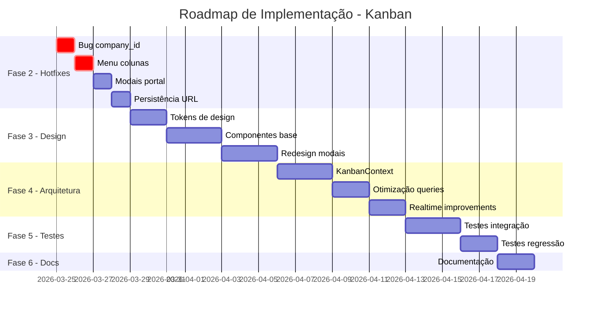

# Plano Estratégico de Auditoria e Refatoração - Kanban

## 📋 Resumo Executivo

Esta análise técnica completa identificou **7 bugs críticos**, **12 problemas de UX/UI** e **8 oportunidades de otimização de performance** na funcionalidade de Kanban do LIDIA 2.0. O plano está estruturado em 6 fases priorizadas para entrega incremental de valor.

---

## 🔴 FASE 1: DIAGNÓSTICO TÉCNICO DETALHADO

### 1.1 Bugs Críticos Identificados

#### 1.1.1 Erro `company_id` NULL na Criação de Cards
**Severidade:** CRÍTICA  
**Localização:** [`use-kanban.ts:627-681`](src/hooks/use-kanban.ts:627)

```typescript
// PROBLEMA: O mutation createCard recebe company_id no input
// mas a tabela kanban_cards pode ter RLS que requer company_id
const createCard = useMutation({
  mutationFn: async (input: CreateCardInput) => {
    // ...
    const { data: card, error } = await supabase
      .from("kanban_cards")
      .insert({
        ...input,
        order: (maxOrder?.order ?? -1) + 1,
        priority: input.priority || "MEDIUM",
        card_type: input.card_type || "TASK",
      })
    // Erro de FK ou RLS pode ocorrer aqui
  }
});
```

**Root Cause:**
- RLS policies podem estar exigindo company_id explicitamente
- Falta de validação antes do envio para API
- Não há tratamento específico para erro de FK

**Impacto:** Usuários não conseguem criar cards, bloqueando o fluxo principal.

---

#### 1.1.2 Menu de Ações da Coluna (3 Pontinhos) Não Funciona
**Severidade:** CRÍTICA  
**Localização:** [`KanbanColumn.tsx:114-146`](src/components/kanban/KanbanColumn.tsx:114)

```typescript
// PROBLEMA: Eventos de drag interferem no clique do dropdown
<DropdownMenu>
  <DropdownMenuTrigger asChild>
    <Button 
      variant="ghost" 
      size="icon" 
      className="h-8 w-8"
      onPointerDown={(e) => e.stopPropagation()} // Tenta impedir drag
      onClick={(e) => e.stopPropagation()}
    >
      <MoreVertical className="w-4 h-4" />
    </Button>
  </DropdownMenuTrigger>
```

**Root Cause:**
- O SortableContext do @dnd-kit captura todos os eventos de pointer
- O menu dropdown é renderizado dentro do elemento sortable
- Conflito de z-index entre o drag overlay e o menu

**Impacto:** Usuários não conseguem editar ou excluir colunas.

---

#### 1.1.3 Modais Renderizam Cortados/Clipped
**Severidade:** ALTA  
**Localização:** Múltiplos componentes modais

**Root Cause:**
- Modais renderizados dentro de containers com `overflow: hidden`
- Falta de uso consistente de `createPortal`
- Z-index não gerenciado centralmente

**Arquivos Afetados:**
- `CardDetailModal.tsx`
- `EditColumnModal.tsx`
- `ManageMembersModal.tsx`

---

#### 1.1.4 Troca de Boards Perde Contexto
**Severidade:** ALTA  
**Localização:** [`KanbanBoard.tsx:468-473`](src/components/kanban/KanbanBoard.tsx:468)

```typescript
// PROBLEMA: Ao trocar board, o estado não persiste na URL
<SwitchBoardModal
  open={isSwitchBoardModalOpen}
  onOpenChange={setIsSwitchBoardModalOpen}
  currentBoardId={boardId}
  companyId={companyId}
/>
```

**Root Cause:**
- Estado do board selecionado em memória (useState)
- Não há sincronização com query parameters
- Refresh da página reseta para o primeiro board

---

#### 1.1.5 Sistema de Filtros Não Aplica aos Cards
**Severidade:** MÉDIA  
**Localização:** [`KanbanFilters.tsx:1-163`](src/components/kanban/KanbanFilters.tsx:1)

```typescript
// PROBLEMA: Filtros só aplicam prioridade e data
// Membros e etiquetas não implementados
<div>
  <Label className="text-sm font-medium mb-2 block">Membros</Label>
  <div className="text-sm text-slate-500 dark:text-slate-400">
    Selecione membros para filtrar...  // PLACEHOLDER
  </div>
</div>
```

---

#### 1.1.6 Responsividade Quebra em Telas Pequenas
**Severidade:** MÉDIA  
**Localização:** [`KanbanBoard.tsx:363-401`](src/components/kanban/KanbanBoard.tsx:363)

**Problemas:**
- Scroll horizontal não funciona em mobile
- Cards não redimensionam proporcionalmente
- Header do board overflow em telas < 768px

---

### 1.2 Análise de Arquitetura

#### 1.2.1 Problemas no Hook use-kanban.ts

| Problema | Linha | Impacto |
|----------|-------|---------|
| Queries sem staleTime | 261, 410, 570 | Re-fetch desnecessário |
| Não há cancelamento de requests | 274, 423, 583 | Memory leaks |
| select * sem limit | 265-268 | Performance em dados grandes |
| Error handling genérico | 276-278, 421-424 | UX ruim em erros |
| Não há retry logic | - | Falhas transitórias |

#### 1.2.2 Problemas de Estado

```typescript
// ANTI-PATTERN: Estado disperso
// KanbanBoard.tsx tem:
const [searchQuery, setSearchQuery] = useState("");
const [priorityFilter, setPriorityFilter] = useState(null);
const [dateFilter, setDateFilter] = useState(null);

// BoardHeader.tsx tem sua própria cópia:
const [searchQuery, setSearchQuery] = useState("");
const [showFilters, setShowFilters] = useState(false);

// Não há sincronização entre eles!
```

#### 1.2.3 Problemas de Performance

| Problema | Componente | Solução |
|----------|-----------|---------|
| Re-render em todo board ao mover card | KanbanBoard | Memoizar columns |
| Cards sem memoização | KanbanCard | React.memo |
| Filtros recalculam a cada render | KanbanBoard | useMemo com deps corretas |
| Imagens sem lazy loading | KanbanCard | loading="lazy" |

---

## 🔧 FASE 2: CORREÇÕES IMEDIATAS (Hotfixes)

### 2.1 Correção do createCard

```typescript
// SOLUÇÃO: Validação robusta e tratamento de erro específico
const createCard = useMutation({
  mutationFn: async (input: CreateCardInput) => {
    // Validação prévia
    if (!input.company_id) {
      throw new Error("Company ID é obrigatório");
    }
    if (!input.column_id || !input.board_id) {
      throw new Error("Coluna e Board são obrigatórios");
    }

    const { data: maxOrder, error: orderError } = await supabase
      .from("kanban_cards")
      .select("order")
      .eq("column_id", input.column_id)
      .order("order", { ascending: false })
      .limit(1)
      .single();

    if (orderError && orderError.code !== "PGRST116") {
      throw orderError;
    }

    const { data: card, error } = await supabase
      .from("kanban_cards")
      .insert({
        column_id: input.column_id,
        board_id: input.board_id,
        company_id: input.company_id,
        title: input.title.trim(),
        description: input.description?.trim() || null,
        order: (maxOrder?.order ?? -1) + 1,
        priority: input.priority || "MEDIUM",
        card_type: input.card_type || "TASK",
        due_date: input.due_date || null,
        start_date: input.start_date || null,
        estimated_hours: input.estimated_hours || null,
      })
      .select()
      .single();

    if (error) {
      // Tratamento específico por código de erro
      if (error.code === "23503") {
        throw new Error("Coluna ou board não encontrados");
      }
      if (error.code === "42501") {
        throw new Error("Sem permissão para criar cards neste board");
      }
      throw error;
    }

    return card;
  },
  onSuccess: () => {
    toast.success("Card criado com sucesso!");
    queryClient.invalidateQueries({ queryKey: ["kanban-cards"] });
    queryClient.invalidateQueries({ queryKey: ["kanban-columns"] });
  },
  onError: (error: Error) => {
    toast.error(error.message || "Erro ao criar card");
  },
});
```

### 2.2 Correção do Menu de Colunas

```typescript
// SOLUÇÃO: Renderizar menu fora do elemento sortable
// KanbanColumn.tsx

// Opção 1: Usar ContextMenu em vez de DropdownMenu
// Opção 2: Renderizar o menu em portal
// Opção 3: Desabilitar drag no botão de menu

// Implementação recomendada:
const ColumnActions = memo(({ column, onEdit, onDelete }: ColumnActionsProps) => {
  return (
    <DropdownMenu>
      <DropdownMenuTrigger asChild>
        <Button 
          variant="ghost" 
          size="icon" 
          className="h-8 w-8 shrink-0"
          // Desabilita o sensor do dnd-kit neste elemento
          data-no-dnd="true"
        >
          <MoreVertical className="w-4 h-4" />
        </Button>
      </DropdownMenuTrigger>
      <DropdownMenuContent 
        align="end" 
        className="w-48"
        // Garante z-index alto
        sideOffset={5}
      >
        <DropdownMenuItem onClick={() => onEdit(column)}>
          <Edit className="w-4 h-4 mr-2" />
          Editar Coluna
        </DropdownMenuItem>
        <DropdownMenuSeparator />
        <DropdownMenuItem 
          onClick={() => onDelete(column)}
          className="text-red-600"
        >
          <Trash2 className="w-4 h-4 mr-2" />
          Excluir Coluna
        </DropdownMenuItem>
      </DropdownMenuContent>
    </DropdownMenu>
  );
});

// No KanbanBoard, configurar sensor para ignorar data-no-dnd
const sensors = useSensors(
  useSensor(PointerSensor, {
    activationConstraint: { distance: 5 },
  })
);
```

### 2.3 Correção dos Modais

```typescript
// SOLUÇÃO: Criar componente Modal unificado com portal
// components/kanban/modals/KanbanModal.tsx

"use client";

import { createPortal } from "react-dom";
import { motion, AnimatePresence } from "framer-motion";
import { useEffect, useState } from "react";

interface KanbanModalProps {
  isOpen: boolean;
  onClose: () => void;
  children: React.ReactNode;
  title?: string;
  maxWidth?: "sm" | "md" | "lg" | "xl" | "2xl";
}

const maxWidthClasses = {
  sm: "max-w-sm",
  md: "max-w-md",
  lg: "max-w-lg",
  xl: "max-w-xl",
  "2xl": "max-w-2xl",
};

export function KanbanModal({ 
  isOpen, 
  onClose, 
  children, 
  title,
  maxWidth = "lg" 
}: KanbanModalProps) {
  const [mounted, setMounted] = useState(false);

  useEffect(() => {
    setMounted(true);
    if (isOpen) {
      document.body.style.overflow = "hidden";
    }
    return () => {
      document.body.style.overflow = "unset";
    };
  }, [isOpen]);

  useEffect(() => {
    const handleEscape = (e: KeyboardEvent) => {
      if (e.key === "Escape" && isOpen) onClose();
    };
    document.addEventListener("keydown", handleEscape);
    return () => document.removeEventListener("keydown", handleEscape);
  }, [isOpen, onClose]);

  if (!mounted) return null;

  return createPortal(
    <AnimatePresence>
      {isOpen && (
        <>
          {/* Backdrop com z-index alto */}
          <motion.div
            initial={{ opacity: 0 }}
            animate={{ opacity: 1 }}
            exit={{ opacity: 0 }}
            className="fixed inset-0 bg-black/60 backdrop-blur-sm z-[100]"
            onClick={onClose}
          />
          
          {/* Modal container */}
          <div className="fixed inset-0 z-[101] flex items-center justify-center p-4 pointer-events-none">
            <motion.div
              initial={{ opacity: 0, scale: 0.95, y: 20 }}
              animate={{ opacity: 1, scale: 1, y: 0 }}
              exit={{ opacity: 0, scale: 0.95, y: 20 }}
              className={`
                pointer-events-auto w-full ${maxWidthClasses[maxWidth]}
                bg-white dark:bg-slate-900 rounded-2xl shadow-2xl
                border border-slate-200 dark:border-slate-700
                max-h-[90vh] overflow-hidden flex flex-col
              `}
            >
              {title && (
                <div className="px-6 py-4 border-b border-slate-200 dark:border-slate-700">
                  <h2 className="text-lg font-semibold">{title}</h2>
                </div>
              )}
              <div className="p-6 overflow-y-auto">
                {children}
              </div>
            </motion.div>
          </div>
        </>
      )}
    </AnimatePresence>,
    document.body
  );
}
```

### 2.4 Persistência de Board na URL

```typescript
// SOLUÇÃO: Usar query params para persistência
// KanbanPage.tsx

"use client";

import { useSearchParams, useRouter, usePathname } from "next/navigation";

export default function KanbanPage() {
  const router = useRouter();
  const pathname = usePathname();
  const searchParams = useSearchParams();
  
  // Usar URL como source of truth
  const selectedBoardId = searchParams.get("board");
  
  const handleSelectBoard = (boardId: string | null) => {
    const params = new URLSearchParams(searchParams);
    if (boardId) {
      params.set("board", boardId);
    } else {
      params.delete("board");
    }
    router.push(`${pathname}?${params.toString()}`, { scroll: false });
  };

  // ... resto do componente
}
```

---

## 🎨 FASE 3: DESIGN SYSTEM KANBAN

### 3.1 Tokens de Design

```typescript
// styles/kanban-tokens.ts

export const kanbanTokens = {
  // Cores
  colors: {
    // Prioridades
    priority: {
      LOW: { bg: "bg-slate-500/20", text: "text-slate-600", border: "border-slate-500/30" },
      MEDIUM: { bg: "bg-amber-500/20", text: "text-amber-600", border: "border-amber-500/30" },
      HIGH: { bg: "bg-orange-500/20", text: "text-orange-600", border: "border-orange-500/30" },
      URGENT: { bg: "bg-red-500/20", text: "text-red-600", border: "border-red-500/30" },
    },
    // Tipos de Card
    cardType: {
      TASK: { icon: "CheckCircle", color: "#3b82f6" },
      BUG: { icon: "Bug", color: "#ef4444" },
      FEATURE: { icon: "Sparkles", color: "#8b5cf6" },
      EPIC: { icon: "Rocket", color: "#f59e0b" },
      STORY: { icon: "Book", color: "#10b981" },
    },
  },
  
  // Espaçamento
  spacing: {
    column: {
      width: "w-80", // 320px
      gap: "gap-4",
      padding: "p-3",
    },
    card: {
      padding: "p-3",
      gap: "gap-2",
      borderRadius: "rounded-lg",
    },
  },
  
  // Animações
  animation: {
    card: {
      initial: { opacity: 0, y: 10 },
      animate: { opacity: 1, y: 0 },
      exit: { opacity: 0, scale: 0.95 },
      transition: { duration: 0.2 },
    },
    modal: {
      initial: { opacity: 0, scale: 0.95 },
      animate: { opacity: 1, scale: 1 },
      exit: { opacity: 0, scale: 0.95 },
      transition: { duration: 0.2, ease: "easeOut" },
    },
  },
  
  // Z-index scale
  zIndex: {
    column: 10,
    card: 20,
    dragOverlay: 30,
    dropdown: 40,
    modal: 100,
    toast: 110,
  },
};
```

### 3.2 Componentes Base

```typescript
// components/kanban/ui/KanbanCardBase.tsx
"use client";

import { memo } from "react";
import { motion } from "framer-motion";
import { cn } from "@/lib/utils";
import { kanbanTokens } from "@/styles/kanban-tokens";

interface KanbanCardBaseProps {
  children: React.ReactNode;
  isDragging?: boolean;
  onClick?: () => void;
  className?: string;
}

export const KanbanCardBase = memo(function KanbanCardBase({
  children,
  isDragging,
  onClick,
  className,
}: KanbanCardBaseProps) {
  return (
    <motion.div
      layout
      initial={kanbanTokens.animation.card.initial}
      animate={kanbanTokens.animation.card.animate}
      exit={kanbanTokens.animation.card.exit}
      transition={kanbanTokens.animation.card.transition}
      onClick={onClick}
      className={cn(
        // Base styles
        "bg-white dark:bg-slate-800",
        "border border-slate-200 dark:border-slate-700",
        "rounded-lg p-3 cursor-pointer",
        "transition-shadow duration-200",
        
        // Hover
        "hover:shadow-md hover:border-emerald-500/30",
        
        // Dragging state
        isDragging && "opacity-50 rotate-2 shadow-xl scale-105",
        
        className
      )}
    >
      {children}
    </motion.div>
  );
});
```

---

## 🏗️ FASE 4: ARQUITETURA DE ESTADO

### 4.1 KanbanContext

```typescript
// contexts/KanbanContext.tsx
"use client";

import { createContext, useContext, useCallback, useReducer } from "react";
import { KanbanBoard, KanbanColumn, KanbanCard } from "@/hooks/use-kanban";

interface KanbanState {
  currentBoard: KanbanBoard | null;
  columns: KanbanColumn[];
  cards: KanbanCard[];
  filters: {
    search: string;
    priority: string[];
    members: string[];
    labels: string[];
    dateRange: { from?: Date; to?: Date } | null;
  };
  ui: {
    selectedCardId: string | null;
    isCardModalOpen: boolean;
    isColumnModalOpen: boolean;
    editingColumnId: string | null;
  };
}

type KanbanAction =
  | { type: "SET_BOARD"; payload: KanbanBoard }
  | { type: "SET_COLUMNS"; payload: KanbanColumn[] }
  | { type: "SET_CARDS"; payload: KanbanCard[] }
  | { type: "UPDATE_FILTERS"; payload: Partial<KanbanState["filters"]> }
  | { type: "MOVE_CARD"; payload: { cardId: string; columnId: string; order: number } }
  | { type: "SELECT_CARD"; payload: string | null }
  | { type: "OPEN_CARD_MODAL"; payload: string }
  | { type: "CLOSE_CARD_MODAL" }
  | { type: "SET_UI_STATE"; payload: Partial<KanbanState["ui"]> };

const initialState: KanbanState = {
  currentBoard: null,
  columns: [],
  cards: [],
  filters: {
    search: "",
    priority: [],
    members: [],
    labels: [],
    dateRange: null,
  },
  ui: {
    selectedCardId: null,
    isCardModalOpen: false,
    isColumnModalOpen: false,
    editingColumnId: null,
  },
};

function kanbanReducer(state: KanbanState, action: KanbanAction): KanbanState {
  switch (action.type) {
    case "SET_BOARD":
      return { ...state, currentBoard: action.payload };
    case "SET_COLUMNS":
      return { ...state, columns: action.payload };
    case "SET_CARDS":
      return { ...state, cards: action.payload };
    case "UPDATE_FILTERS":
      return { ...state, filters: { ...state.filters, ...action.payload } };
    case "MOVE_CARD":
      return {
        ...state,
        cards: state.cards.map((card) =>
          card.id === action.payload.cardId
            ? { ...card, column_id: action.payload.columnId, order: action.payload.order }
            : card
        ),
      };
    case "SELECT_CARD":
      return { ...state, ui: { ...state.ui, selectedCardId: action.payload } };
    case "OPEN_CARD_MODAL":
      return {
        ...state,
        ui: { ...state.ui, selectedCardId: action.payload, isCardModalOpen: true },
      };
    case "CLOSE_CARD_MODAL":
      return { ...state, ui: { ...state.ui, isCardModalOpen: false, selectedCardId: null } };
    case "SET_UI_STATE":
      return { ...state, ui: { ...state.ui, ...action.payload } };
    default:
      return state;
  }
}

const KanbanContext = createContext<{
  state: KanbanState;
  dispatch: React.Dispatch<KanbanAction>;
} | null>(null);

export function KanbanProvider({ children }: { children: React.ReactNode }) {
  const [state, dispatch] = useReducer(kanbanReducer, initialState);
  
  return (
    <KanbanContext.Provider value={{ state, dispatch }}>
      {children}
    </KanbanContext.Provider>
  );
}

export const useKanbanContext = () => {
  const context = useContext(KanbanContext);
  if (!context) throw new Error("useKanbanContext must be used within KanbanProvider");
  return context;
};
```

---

## 📊 FASE 5: MÉTRICAS DE SUCESSO

### 5.1 KPIs de Performance

| Métrica | Baseline Atual | Target | Como Medir |
|---------|---------------|--------|------------|
| Time to Interactive | ~3.5s | < 2s | Lighthouse |
| First Contentful Paint | ~1.8s | < 1s | Lighthouse |
| Memory Usage (100 cards) | ~150MB | < 80MB | Chrome DevTools |
| Drag-and-drop latency | ~200ms | < 50ms | User Timing API |
| Re-render count (move card) | 15+ | < 5 | React DevTools |

### 5.2 KPIs de Qualidade

| Métrica | Target | Ferramenta |
|---------|--------|------------|
| Test Coverage | > 80% | Jest + React Testing Library |
| Type Safety | 100% | TypeScript strict mode |
| Accessibility Score | > 95 | axe-core |
| Bundle Size (Kanban) | < 150KB | webpack-bundle-analyzer |

### 5.3 KPIs de UX

| Métrica | Target | Como Medir |
|---------|--------|------------|
| Task Success Rate (criar card) | > 95% | Analytics |
| Time on Task (mover card) | < 3s | Analytics |
| Error Rate | < 2% | Sentry |
| User Satisfaction (CSAT) | > 4.5/5 | Survey |

---

## 📅 FASE 6: ROADMAP E DEPENDÊNCIAS

### Cronograma Sugerido



### Dependências Técnicas

1. **Antes de começar:**
   - Backup do banco de dados
   - Branch de feature isolada
   - Ambiente de staging configurado

2. **Durante desenvolvimento:**
   - Node.js 18+
   - npm packages atualizados
   - Supabase migrations aplicadas

3. **Para testes:**
   - Cypress/Playwright instalado
   - Ambiente de teste com dados de seed

---

## 🎯 Especificações Técnicas Detalhadas

### A. Correção de Bugs Críticos

#### A.1 company_id NULL
**Arquivos:** [`use-kanban.ts`](src/hooks/use-kanban.ts), [`NewCardDialog.tsx`](src/components/kanban/dialogs/NewCardDialog.tsx)

**Mudanças:**
1. Adicionar validação de company_id no CreateCardInput
2. Verificar RLS policies no Supabase
3. Adicionar tratamento de erro específico

#### A.2 Menu de Colunas
**Arquivos:** [`KanbanColumn.tsx`](src/components/kanban/KanbanColumn.tsx), [`KanbanBoard.tsx`](src/components/kanban/KanbanBoard.tsx)

**Mudanças:**
1. Adicionar `data-no-dnd="true"` ao botão do menu
2. Configurar sensor do DndContext para ignorar este atributo
3. Usar portal para renderizar o menu

#### A.3 Modais Cortados
**Arquivos:** Todos os modais em [`modals/`](src/components/kanban/modals/)

**Mudanças:**
1. Criar componente base KanbanModal
2. Substituir todos os modais existentes
3. Garantir z-index consistente (100+)

### B. Design System

#### B.1 Tokens
- Criar `styles/kanban-tokens.ts`
- Definir todas as cores, espaçamentos, animações
- Documentar tokens no Storybook (se houver)

#### B.2 Componentes Base
- KanbanCardBase
- KanbanColumnBase
- KanbanModal (base para todos os modais)
- KanbanBadge (para prioridades, tipos)

### C. Arquitetura

#### C.1 KanbanContext
- Implementar provider no layout do kanban
- Migrar estado local para contexto gradualmente
- Adicionar selectors para otimização

#### C.2 Hooks Especializados
- `useKanbanBoard(boardId)` - dados do board
- `useKanbanColumns(boardId)` - colunas com cards
- `useKanbanFilters()` - estado dos filtros
- `useKanbanDragAndDrop()` - lógica de DnD

---

## 🔍 Checklist de Validação

### Antes de Merge
- [ ] Todos os bugs críticos corrigidos
- [ ] Testes passando (unit + integration)
- [ ] TypeScript sem erros (`strict: true`)
- [ ] Build bem-sucedido
- [ ] Lighthouse score > 90

### Em Staging
- [ ] Funcionalidades testadas manualmente
- [ ] Performance validada
- [ ] Responsividade verificada em múltiplos dispositivos
- [ ] Acessibilidade testada (tab navigation, screen reader)

### Em Produção
- [ ] Monitoramento de erros ativo
- [ ] Métricas de performance coletadas
- [ ] Feedback dos usuários coletado

---

## 📚 Recursos Adicionais

### Documentação Externa
- [Dnd Kit Documentation](https://docs.dndkit.com/)
- [React Query Best Practices](https://tanstack.com/query/latest/docs/react/guides/important-defaults)
- [Supabase RLS Guide](https://supabase.com/docs/guides/auth/row-level-security)

### Ferramentas Recomendadas
- **Profiling:** React DevTools Profiler, Chrome Performance Tab
- **Testing:** Jest, React Testing Library, Cypress
- **Monitoring:** Sentry, LogRocket
- **Analytics:** Google Analytics 4, Mixpanel

---

## 📞 Contato e Suporte

Para dúvidas sobre este plano:
- Criar issue no GitHub com label `kanban-refactor`
- Documentar decisões técnicas neste arquivo
- Atualizar status das tarefas no TODO

---

*Documento criado em: 25/03/2026*  
*Última atualização: 25/03/2026*  
*Versão: 1.0*