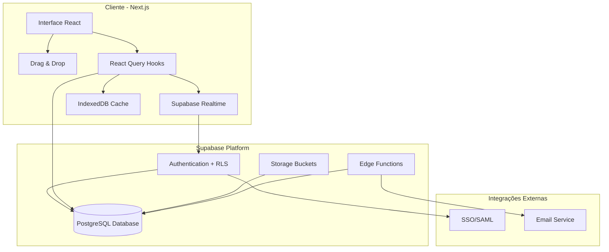
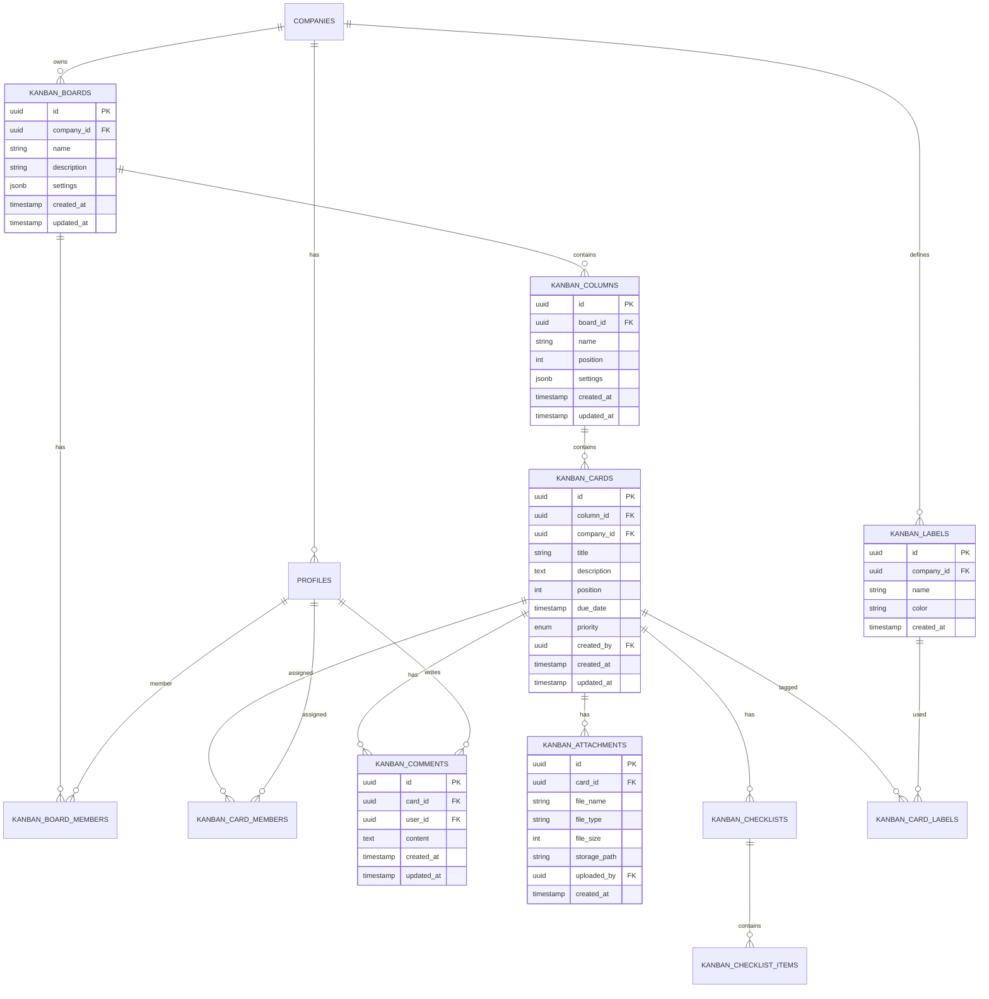

# Plano de Implementação - Kanban Enterprise

## Visão Geral

Desenvolvimento de uma aplicação Kanban enterprise completa integrada ao Supabase, com arquitetura multi-tenant, autenticação robusta, permissões granulares e sincronização em tempo real.

## Arquitetura do Sistema



## Schema do Banco de Dados

### Tabelas Principais



## Estrutura de Permissões (RBAC)

### Papéis de Acesso

| Papel | Permissões |
|-------|------------|
| **Admin** | Criar/editar/excluir boards, colunas, cards; gerenciar membros; ver relatórios |
| **Gerente** | Criar/editar boards e cards; atribuir membros; mover cards entre colunas |
| **Membro** | Criar/editar cards; adicionar comentários; fazer upload de anexos |
| **Visualizador** | Visualizar boards e cards; sem permissão de edição |

### Permissões Granulares (JSONB)

```typescript
interface KanbanPermissions {
  canCreateBoard: boolean;
  canDeleteBoard: boolean;
  canManageBoardMembers: boolean;
  canCreateColumn: boolean;
  canDeleteColumn: boolean;
  canCreateCard: boolean;
  canDeleteCard: boolean;
  canAssignMembers: boolean;
  canMoveCard: boolean;
  canAddComments: boolean;
  canUploadAttachments: boolean;
  canViewReports: boolean;
}
```

## Componentes Principais

### 1. KanbanBoard (`src/components/kanban/KanbanBoard.tsx`)
- Container principal do board
- Gerencia estado global de colunas e cards
- Integração com drag-and-drop
- Sincronização em tempo real

### 2. KanbanColumn (`src/components/kanban/KanbanColumn.tsx`)
- Renderiza coluna com título e contador
- Lista de cards com scroll virtualizado
- Drop zone para cards
- Ações de edição/exclusão

### 3. KanbanCard (`src/components/kanban/KanbanCard.tsx`)
- Visualização compacta do card
- Preview de etiquetas, membros, due date
- Drag handle
- Ação de click para abrir modal

### 4. CardDetailModal (`src/components/kanban/modals/CardDetailModal.tsx`)
- Abas: Detalhes, Comentários, Anexos, Checklist, Histórico
- Edição completa do card
- Gerenciamento de membros
- Upload de arquivos

### 5. BoardHeader (`src/components/kanban/BoardHeader.tsx`)
- Título do board e descrição
- Busca full-text
- Filtros avançados
- Ações de board (configurações, membros)

## Hooks Personalizados

### Gerenciamento de Dados
- `useBoards()` - Lista de boards da empresa
- `useBoard(id)` - Detalhes de um board específico
- `useColumns(boardId)` - Colunas de um board
- `useCards(columnId)` - Cards de uma coluna
- `useCard(cardId)` - Detalhes de um card

### Funcionalidades Avançadas
- `useComments(cardId)` - Comentários de um card
- `useAttachments(cardId)` - Anexos de um card
- `useChecklists(cardId)` - Checklists de um card
- `useLabels(companyId)` - Etiquetas da empresa

### Realtime e Offline
- `useKanbanRealtime(boardId)` - Sincronização em tempo real
- `useOfflineSync()` - Cache offline com IndexedDB

## Instalação de Dependências

```bash
# Drag and drop
npm install @hello-pangea/dnd

# Date picker e manipulação de datas
npm install @radix-ui/react-popover date-fns

# Editor rich text para comentários
npm install react-quilljs quill

# Virtualização para listas longas
npm install react-window

# Criptografia para dados sensíveis
npm install crypto-js

# Validação de schemas
npm install zod
```

## Políticas RLS (Row Level Security)

```sql
-- Boards: Usuários só veem boards da sua empresa
CREATE POLICY "Users can view boards in their company" ON kanban_boards
  FOR SELECT USING (
    EXISTS (
      SELECT 1 FROM profiles 
      WHERE profiles.user_id = auth.uid() 
      AND profiles.company_id = kanban_boards.company_id
    )
  );

-- Cards: Isolamento por company_id com verificação de permissão
CREATE POLICY "Users can view cards in their company" ON kanban_cards
  FOR SELECT USING (
    EXISTS (
      SELECT 1 FROM profiles 
      WHERE profiles.user_id = auth.uid() 
      AND profiles.company_id = kanban_cards.company_id
    )
  );
```

## Sincronização em Tempo Real

```typescript
// Exemplo de uso do Supabase Realtime
const useKanbanRealtime = (boardId: string) => {
  useEffect(() => {
    const subscription = supabase
      .channel(`board:${boardId}`)
      .on('postgres_changes', 
        { event: '*', schema: 'public', table: 'kanban_cards' },
        (payload) => {
          // Atualizar estado local
          queryClient.invalidateQueries(['cards', boardId]);
        }
      )
      .subscribe();
      
    return () => subscription.unsubscribe();
  }, [boardId]);
};
```

## Suporte Offline

- IndexedDB para cache local de boards, colunas e cards
- Fila de operações pendentes quando offline
- Sincronização automática ao reconectar
- Detecção de conflitos e resolução

## Dashboard Administrativo

### Métricas de Produtividade
- Throughput (cards concluídos por período)
- Lead Time (tempo médio de conclusão)
- Cycle Time (tempo em cada coluna)
- WIP (trabalho em progresso)
- Burndown chart

### Relatórios
- Atividade por membro
- Distribuição por etiqueta
- Cards atrasados
- Performance de boards

## Segurança e Compliance

### LGPD/GDPR
- Criptografia de dados pessoais em repouso
- Anonimização de dados de usuários excluídos
- Exportação de dados do usuário
- Consentimento explícito para processamento

### Auditoria
- Tabela `kanban_audit_logs` registra todas as ações
- Dados: quem, o quê, quando, de qual company
- Retenção configurável

## Checklist de Implementação

1. [ ] Configurar bucket de storage para anexos
2. [ ] Criar todas as migrations do banco
3. [ ] Implementar hooks de dados
4. [ ] Criar componentes base (Board, Column, Card)
5. [ ] Implementar drag-and-drop
6. [ ] Adicionar sincronização em tempo real
7. [ ] Criar modais de detalhe
8. [ ] Implementar filtros e busca
9. [ ] Adicionar suporte offline
10. [ ] Criar dashboard administrativo
11. [ ] Implementar testes E2E
12. [ ] Documentar API e componentes

## Próximos Passos

Após aprovação deste plano, a implementação deve seguir as fases definidas no todo list, começando pela criação do schema do banco de dados e políticas RLS.
