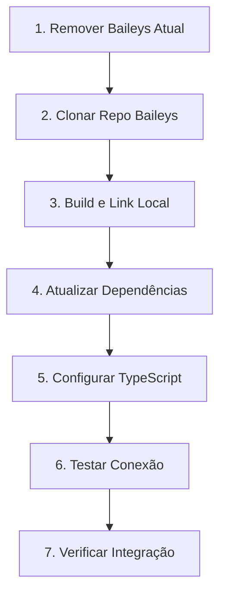

# Plano de Migração da Baileys para Versão GitHub

## Objetivo
Remover as versões atuais da Baileys e instalar diretamente do repositório GitHub https://github.com/WhiskeySockets/Baileys.git, configurando-a corretamente para funcionar com o banco de dados Supabase e todo o sistema.

## Análise Atual
- **Versão Atual:** `@whiskeysockets/baileys` ^7.0.0-rc.9 (npm) + `baileys` ^6.7.21 (antiga)
- **Arquivo Principal:** `src/lib/whatsapp/baileys-service.ts`
- **Banco de Dados:** Supabase com tabelas `whatsapp_sessions`, `whatsapp_qr_codes`, `whatsapp_contacts`, `whatsapp_messages`

## Fluxo de Trabalho



## Checklist de Tarefas

### 1. Preparação e Backup
- [ ] Fazer backup do `package.json` atual
- [ ] Fazer backup do `package-lock.json`
- [ ] Documentar versões atuais instaladas
- [ ] Verificar integrações existentes

### 2. Remover Versões Atuais
- [ ] Desinstalar `@whiskeysockets/baileys`
- [ ] Desinstalar `baileys` (versão antiga)
- [ ] Limpar cache do npm (`npm cache clean --force`)
- [ ] Remover entradas do `package.json`
- [ ] Limpar `node_modules` se necessário

### 3. Clonar e Buildar Baileys do GitHub
- [ ] Clonar repo `https://github.com/WhiskeySockets/Baileys.git` em pasta temporária
- [ ] Instalar dependências do Baileys (`npm install`)
- [ ] Buildar o projeto (`npm run build`)
- [ ] Verificar se o build foi bem-sucedido

### 4. Link Local ou Pack
- [ ] Criar link local do pacote (`npm link` no repo Baileys)
- [ ] OU empacotar (`npm pack`) e instalar o `.tgz`
- [ ] Linkar no projeto Lidia (`npm link @whiskeysockets/baileys`)
- [ ] Verificar instalação correta

### 5. Atualizar Dependências do Projeto
- [ ] Instalar `@hapi/boom` (dependência do Baileys)
- [ ] Verificar `uuid` já está instalado
- [ ] Verificar `qrcode` já está instalado
- [ ] Verificar `jimp` já está instalado
- [ ] Atualizar imports se necessário

### 6. Configuração TypeScript
- [ ] Verificar `tsconfig.json` paths se necessário
- [ ] Atualizar tipos do Baileys
- [ ] Verificar compatibilidade de tipos em `baileys-service.ts`
- [ ] Ajustar tipos personalizados em `src/types/whatsapp/index.ts`

### 7. Testes e Validação
- [ ] Executar `test-baileys.mjs` para verificar conexão
- [ ] Testar criação de sessão via API
- [ ] Testar geração de QR Code
- [ ] Testar envio de mensagens
- [ ] Testar recebimento de mensagens
- [ ] Testar sincronização de contatos

### 8. Ajustes na BaileysService (se necessário)
- [ ] Verificar compatibilidade da API do socket
- [ ] Ajustar `makeWASocket` configurações
- [ ] Verificar eventos (`connection.update`, `messages.upsert`, etc.)
- [ ] Ajustar `useMultiFileAuthState`
- [ ] Verificar `makeCacheableSignalKeyStore`

## Arquivos a Modificar

### `package.json`
```json
{
  "dependencies": {
    "@whiskeysockets/baileys": "file:./vendor/Baileys/whiskeysockets-baileys-7.0.0.tgz"
    // ou via git+ssh
  }
}
```

### `src/lib/whatsapp/baileys-service.ts`
- Manter estrutura atual (já usa @whiskeysockets/baileys)
- Ajustar apenas se houver breaking changes na nova versão

### Scripts Úteis

```bash
# 1. Remover versões atuais
npm uninstall @whiskeysockets/baileys baileys

# 2. Clonar e buildar
git clone https://github.com/WhiskeySockets/Baileys.git vendor/Baileys
cd vendor/Baileys
npm install
npm run build
npm pack

# 3. Instalar no projeto
cd ../..
npm install ./vendor/Baileys/whiskeysockets-baileys-*.tgz

# OU via npm link
cd vendor/Baileys
npm link
cd ../..
npm link @whiskeysockets/baileys
```

## Estrutura de Pastas Proposta

```
lidia2.0/
├── src/
│   └── lib/
│       └── whatsapp/
│           └── baileys-service.ts
├── vendor/
│   └── Baileys/          # Clone do repo
│       ├── src/
│       ├── lib/
│       └── whiskeysockets-baileys-*.tgz
├── package.json
└── ...
```

## Validações Importantes

1. **Conexão WhatsApp Web:** Verificar se conecta corretamente
2. **QR Code:** Geração e escaneamento funcionando
3. **Mensagens:** Enviar e receber mensagens de texto
4. **Mídia:** Suporte a imagens, vídeos, áudio
5. **Contatos:** Sincronização automática
6. **Reconexão:** Comportamento em caso de queda
7. **Multi-sessão:** Suporte a múltiplas sessões simultâneas

## Rollback Plan

Se algo der errado:
1. Restaurar backup do `package.json`
2. Restaurar backup do `package-lock.json`
3. Executar `npm install` para restaurar versões anteriores
4. Verificar se aplicação volta a funcionar

## Notas

- A versão do GitHub pode ter breaking changes em relação à v7.0.0-rc.9
- É importante testar todas as funcionalidades após a migração
- Manter o `test-baileys.mjs` para testes rápidos
- Documentar qualquer alteração necessária na API
