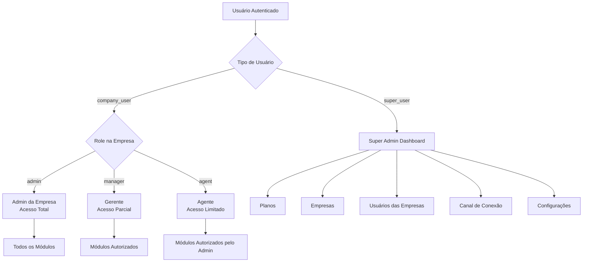
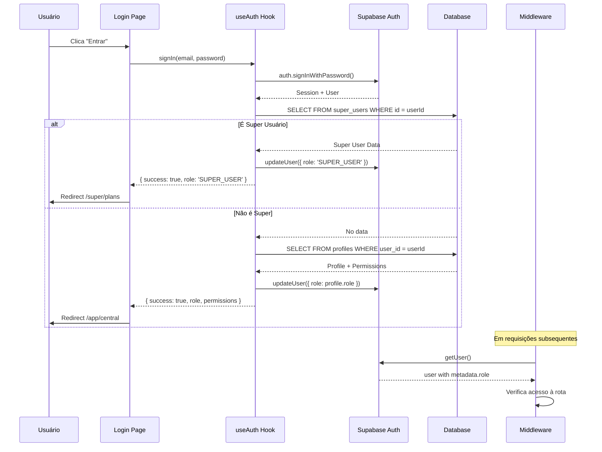

# Plano de Implementação: Sistema de Autenticação Baseado em Roles

## Resumo Executivo

Este plano detalha a implementação de um sistema de autenticação baseado em roles para o LIDIA 2.0, corrigindo o erro atual onde superusuários são redirecionados incorretamente e implementando hierarquia de permissões granular para empresas.

## Problemas Identificados

### 1. Inconsistência de Tipos
- **TypeScript**: `"super_user" | "admin" | "manager" | "agent"`
- **PostgreSQL**: `'SUPER_USER' | 'CLIENT_ADMIN' | 'CLIENT_AGENT' | 'CLIENT_VIEWER'`

### 2. Falha no Redirecionamento
O middleware usa `user.user_metadata?.role` que não é atualizado automaticamente no login, causando redirecionamento incorreto.

### 3. Falta de Permissões Granulares
Não existe estrutura para controlar acessos individuais de funcionários dentro de uma empresa.

### 4. Sidebars sem Filtro de Permissões
Os componentes de sidebar não filtram itens baseado nas permissões do usuário logado.

## Arquitetura Proposta

### Estrutura de Roles



### Estrutura do Banco de Dados

#### Tabela `profiles` (existente - modificar)
```sql
-- Adicionar coluna permissions
ALTER TABLE profiles ADD COLUMN permissions JSONB DEFAULT '{
  "canViewCentral": true,
  "canViewAttendances": true,
  "canViewContacts": true,
  "canSendBulk": false,
  "canViewKanban": false,
  "canManageConnection": false,
  "canManageUsers": false,
  "canViewSettings": true
}'::jsonb;
```

#### Tabela `super_users` (existente)
Mantida separada para isolamento completo de superusuários.

### Estrutura de Permissões

```typescript
// Para usuários de empresa (CLIENT_ADMIN, CLIENT_MANAGER, CLIENT_AGENT)
interface UserPermissions {
  canViewCentral: boolean;        // Página Central
  canViewAttendances: boolean;    // Atendimentos
  canViewContacts: boolean;       // Contatos
  canSendBulk: boolean;           // Disparo em Bulk
  canViewKanban: boolean;         // Kanban
  canManageConnection: boolean;   // Canal de Conexão
  canManageUsers: boolean;        // Usuários (apenas admin pode conceder)
  canViewSettings: boolean;       // Configurações
}

// Valores padrão por role
const DEFAULT_PERMISSIONS = {
  CLIENT_ADMIN: { /* todos true */ },
  CLIENT_MANAGER: { /* bulk, kanban, users = false */ },
  CLIENT_AGENT: { /* apenas central, attendances, contacts, settings = true */ }
};
```

## Alterações Necessárias

### 1. Tipos TypeScript (`src/types/index.ts`)

```typescript
// Unificar roles com PostgreSQL
export type UserRole = 
  | "SUPER_USER" 
  | "CLIENT_ADMIN" 
  | "CLIENT_MANAGER" 
  | "CLIENT_AGENT";

// Interface de permissões
export interface UserPermissions {
  canViewCentral: boolean;
  canViewAttendances: boolean;
  canViewContacts: boolean;
  canSendBulk: boolean;
  canViewKanban: boolean;
  canManageConnection: boolean;
  canManageUsers: boolean;
  canViewSettings: boolean;
}

// Navigation item com permissão
export interface NavItem {
  href: string;
  label: string;
  icon: string;
  requiredPermission?: keyof UserPermissions;
  requiredRoles?: UserRole[];
}
```

### 2. Hook useAuth (`src/hooks/use-auth.ts`)

Modificações:
- Buscar papel do usuário de `profiles.role` ou `super_users`
- Carregar permissões do campo `profiles.permissions`
- Atualizar `user_metadata` no Supabase após login para manter sessão

```typescript
const fetchUserProfile = async (userId: string) => {
  // 1. Verificar super_users primeiro
  // 2. Se não for, buscar em profiles com permissões
  // 3. Retornar objeto User completo com permissions
};

const signIn = async (email: string, password: string) => {
  // ... login ...
  // Atualizar user_metadata com role para middleware
  await supabase.auth.updateUser({
    data: { role: profile.role }
  });
};
```

### 3. Middleware (`src/middleware.ts`)

```typescript
export async function middleware(request: NextRequest) {
  const { supabaseResponse, user } = await updateSession(request);
  
  // Se não tem usuário e rota é protegida → /login
  // Se tem usuário e rota é pública → redirecionar baseado no role
  
  // Buscar role atualizado do banco se necessário
  if (user && isPublicRoute) {
    const role = await fetchUserRole(user.id);
    if (role === 'SUPER_USER') {
      return redirect('/super/plans');
    } else {
      return redirect('/app/central');
    }
  }
  
  // Proteger rotas /super/* apenas para SUPER_USER
  // Proteger rotas /app/* apenas para usuários de empresa
}
```

### 4. Sidebar do Super Usuário (`src/components/super-sidebar.tsx`)

Itens conforme especificação:
- **Planos** → `/super/plans` (label: "Planos")
- **Empresas** → `/super/companies` (label: "Empresas")
- **Usuários Cadastrados das Empresas** → `/super/company-users` (label: "Usuários Cadastrados das Empresas")
- **Canal de Conexão** → `/super/api-waba` (label: "Canal de Conexão")
- **Configurações** → `/super/settings` (label: "Configurações")

### 5. Sidebar do Cliente (`src/components/sidebar.tsx`)

Itens conforme especificação:
- **Página Central** → `/app/central`
- **Atendimento** → `/app/attendances` (label: "Atendimentos")
- **Contatos** → `/app/contacts`
- **Disparo em Bulk** → `/app/bulk` (label: "Disparo em Bulk")
- **Kanban** → `/app/kanban`
- **Canal de Conexão** → `/app/connection`
- **Usuários** → `/app/users`
- **Configurações** → `/app/settings`

Filtrar itens baseado em `user.permissions`.

### 6. Hook usePermissions (`src/hooks/use-permissions.ts`)

Novo hook para verificar permissões:

```typescript
export function usePermissions() {
  const { user } = useAuth();
  
  const canAccess = (permission: keyof UserPermissions) => {
    if (user?.role === 'SUPER_USER') return true;
    if (user?.role === 'CLIENT_ADMIN') return true;
    return user?.permissions?.[permission] ?? false;
  };
  
  const canManageUsers = () => {
    return user?.role === 'CLIENT_ADMIN' || 
           (user?.role === 'CLIENT_MANAGER' && user?.permissions?.canManageUsers);
  };
  
  return { canAccess, canManageUsers, userRole: user?.role };
}
```

### 7. Página de Gerenciamento de Permissões (`src/app/(dashboard)/app/users/page.tsx`)

Atualizar para permitir que ADMIN selecione permissões granulares por usuário:

```typescript
// Interface para edição de permissões
interface PermissionEditorProps {
  userId: string;
  currentPermissions: UserPermissions;
  onSave: (permissions: UserPermissions) => void;
}

// Lista de permissões editáveis
const PERMISSIONS_CONFIG = [
  { key: 'canViewCentral', label: 'Visualizar Página Central', icon: LayoutDashboard },
  { key: 'canViewAttendances', label: 'Visualizar Atendimentos', icon: MessageSquare },
  // ... etc
];
```

### 8. Atualização do Schema SQL

```sql
-- Adicionar coluna permissions à tabela profiles
ALTER TABLE profiles 
ADD COLUMN IF NOT EXISTS permissions JSONB DEFAULT '{
  "canViewCentral": true,
  "canViewAttendances": true,
  "canViewContacts": true,
  "canSendBulk": false,
  "canViewKanban": false,
  "canManageConnection": false,
  "canManageUsers": false,
  "canViewSettings": true
}'::jsonb;

-- Função para atualizar permissões (apenas ADMIN)
CREATE OR REPLACE FUNCTION update_user_permissions(
  p_user_id UUID,
  p_permissions JSONB
)
RETURNS BOOLEAN AS $$
DECLARE
  v_admin_company_id UUID;
  v_target_user_company_id UUID;
BEGIN
  -- Verificar se o usuário atual é ADMIN da mesma empresa
  SELECT company_id INTO v_admin_company_id 
  FROM profiles WHERE user_id = auth.uid();
  
  SELECT company_id INTO v_target_user_company_id 
  FROM profiles WHERE id = p_user_id;
  
  IF v_admin_company_id = v_target_user_company_id THEN
    UPDATE profiles SET permissions = p_permissions WHERE id = p_user_id;
    RETURN true;
  END IF;
  
  RETURN false;
END;
$$ LANGUAGE plpgsql SECURITY DEFINER;
```

## Fluxo de Autenticação



## Checklist de Implementação

- [ ] 1. Atualizar tipos TypeScript para alinhar com PostgreSQL
- [ ] 2. Criar migration SQL para adicionar coluna permissions
- [ ] 3. Atualizar hook useAuth com lógica correta de identificação
- [ ] 4. Atualizar middleware com redirecionamento correto
- [ ] 5. Atualizar labels do super-sidebar conforme especificação
- [ ] 6. Atualizar sidebar do cliente com filtro de permissões
- [ ] 7. Criar hook usePermissions
- [ ] 8. Atualizar página de gerenciamento de usuários
- [ ] 9. Adicionar RLS policies para permissões
- [ ] 10. Testar fluxo de login para cada tipo de usuário

## Isolamento de Dados

### Super Usuário
- Visibilidade global de todas as empresas
- Visibilidade global de todos os usuários
- Acesso a todas as tabelas via RLS policies

### Usuário de Empresa (Admin/Manager/Agent)
- Visibilidade apenas de dados da própria empresa
- RLS policies filtram por `company_id`
- Permissões granulares controlam acesso a funcionalidades

## Considerações de Segurança

1. **Sem triggers de banco**: Todas as validações de permissão são feitas na aplicação
2. **RLS obrigatório**: Todas as tabelas devem ter Row Level Security ativo
3. **Validação dupla**: Middleware + Componente para proteção de rotas
4. **Auditoria**: Log de alterações de permissões em audit_logs

## Próximos Passos

1. Revisar e aprovar este plano
2. Switch para modo Code para implementação
3. Executar migrations SQL
4. Implementar alterações em TypeScript
5. Testar fluxos de autenticação
