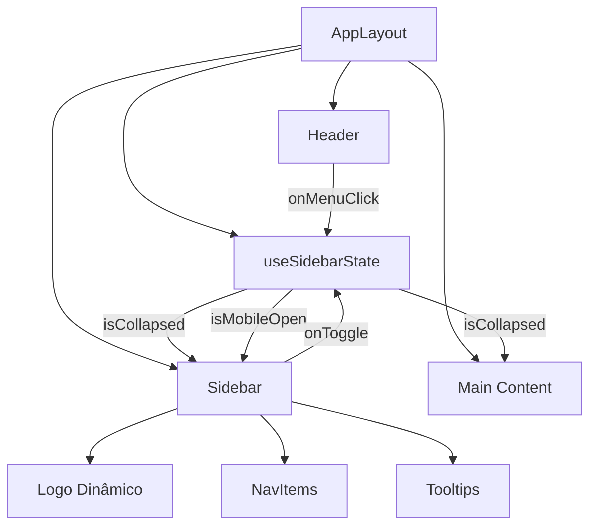

# Plano de Implementação: Correção do Toggle da Sidebar

## Problemas Identificados

1. **A sidebar desktop não colapsa**: A prop `isOpen` é usada apenas para o drawer mobile, não afeta a sidebar desktop (`hidden lg:block`)
2. **Logo estático**: O logo `/3.png` é sempre exibido, sem troca dinâmica quando colapsado
3. **Sem animação de largura**: A transição de 256px para 80px (colapsado) não tem animação suave
4. **Layout shift**: A área de conteúdo ajusta margem, mas a sidebar não acompanha
5. **Estado não persistente**: A preferência do usuário não é salva entre sessões

## Solução Proposta

### 1. Novo Hook: `useSidebarState`

Criar um hook customizado que gerencia o estado da sidebar com persistência em `localStorage`:

```typescript
// src/hooks/use-sidebar-state.ts
export function useSidebarState() {
  const [isCollapsed, setIsCollapsed] = useState(false);
  const [isMobileOpen, setIsMobileOpen] = useState(false);
  
  // Persistência em localStorage
  // Hidratação segura para SSR
  // Toggle handlers
}
```

### 2. Componente Sidebar Atualizado

A sidebar terá dois modos:
- **Desktop**: Colapsável entre `256px` (aberta) e `80px` (fechada)
- **Mobile**: Drawer deslizante (comportamento atual)

**Features:**
- Logo dinâmico: `/1.png` quando colapsado, `/3.png` quando aberto
- Tooltips nos itens quando colapsado
- Animação suave de 300ms para transições de largura
- Estado ativo visual mantido em ambos os estados

### 3. Layout Atualizado

```typescript
// Larguras constantes
const SIDEBAR_WIDTH_EXPANDED = 256;  // 16rem / w-64
const SIDEBAR_WIDTH_COLLAPSED = 80;  // 5rem / w-20
```

A área de conteúdo usa `margin-left` dinâmico baseado no estado.

### 4. Estilos CSS Adicionais

```css
/* Transições suaves */
.sidebar-transition {
  transition: width 300ms cubic-bezier(0.4, 0, 0.2, 1);
}

/* Prevenir layout shift */
.sidebar-content {
  overflow-x: hidden;
  white-space: nowrap;
}

/* Z-index management */
.sidebar-container {
  z-index: 50;
}
```

## Arquitetura de Componentes



## Especificações Técnicas

### Dimensões

| Estado | Largura | Logo | Texto |
|--------|---------|------|-------|
| Expandido | 256px (w-64) | `/3.png` (120x48) | Visível |
| Colapsado | 80px (w-20) | `/1.png` (48x48) | Oculto |

### Animações

- **Transição de largura**: `300ms cubic-bezier(0.4, 0, 0.2, 1)`
- **Fade de conteúdo**: `200ms ease-out`
- **Logo swap**: Crossfade de `150ms`

### Persistência

- **Chave**: `lidia-sidebar-collapsed`
- **Valor**: `"true"` | `"false"`
- **Hidratação**: Segura para SSR com verificação de `typeof window`

### Responsividade

- **Mobile (< 1024px)**: Drawer sobreposto, toggle no header
- **Desktop (≥ 1024px)**: Sidebar colapsável, toggle no header

## Arquivos Modificados

1. `src/hooks/use-sidebar-state.ts` (novo)
2. `src/components/sidebar.tsx` (atualizado)
3. `src/components/header.tsx` (atualizado)
4. `src/app/(dashboard)/app/layout.tsx` (atualizado)
5. `src/app/globals.css` (adições)

## Critérios de Aceitação

- [ ] Sidebar colapsa/expande suavemente no desktop
- [ ] Logo muda para `/1.png` quando colapsado
- [ ] Estado é persistido no localStorage
- [ ] Layout não tem glitches visuais durante transição
- [ ] Z-index correto: sidebar acima de overlays, abaixo de modais
- [ ] Mobile continua funcionando como drawer
- [ ] Tooltips aparecem nos itens quando colapsado
