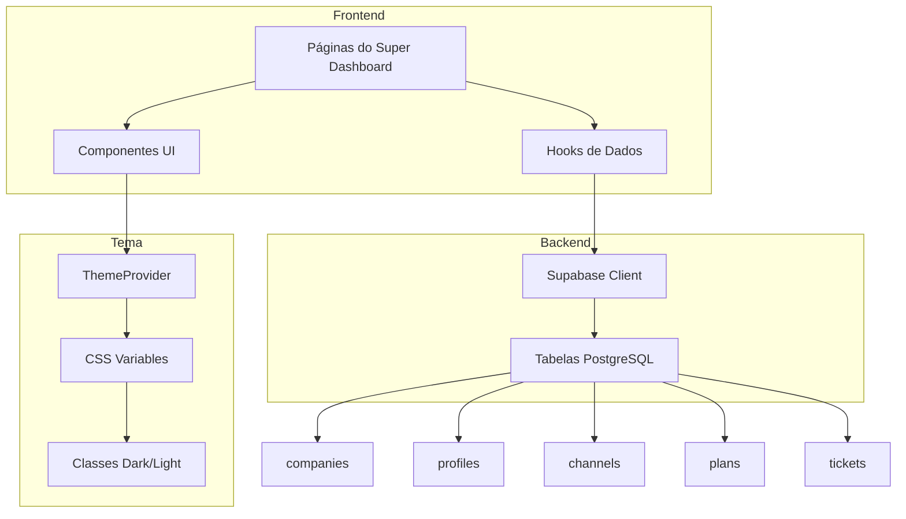

# Plano de Implementação: Super Dashboard - Correções Visuais e Integração com Supabase

## Resumo Executivo

Este plano detalha as correções necessárias para:
1. **Bugs visuais do modo claro** em componentes glassmorphism
2. **Substituição de dados mockados** por queries reais do Supabase
3. **Adição da logo LIDIA** em todo o site

---

## 1. Análise de Dados Mockados Identificados

### 1.1 Página de Empresas (`src/app/(dashboard)/super/companies/page.tsx`)
**Problema:** Dados mockados nas linhas 15-21
```typescript
const companies = [
  { id: 1, name: "Empresa ABC Ltda", cnpj: "12.345.678/0001-90", ... },
  // ... mais dados mockados
];
```
**Solução:** Utilizar o hook `useCompanies` já existente em `src/hooks/use-companies.ts`

### 1.2 Página de Usuários das Empresas (`src/app/(dashboard)/super/company-users/page.tsx`)
**Problema:** Dados mockados nas linhas 15-22
```typescript
const companyUsers = [
  { id: 1, name: "Ana Silva", email: "ana.silva@empresaabc.com", ... },
  // ... mais dados mockados
];
```
**Solução:** Utilizar o hook `useCompanyUsers` já existente em `src/hooks/use-company-users.ts`

### 1.3 Página de Conexões (`src/app/(dashboard)/app/connection/page.tsx`)
**Problema:** Dados mockados nas linhas 25-50
```typescript
const connections = [
  { id: 1, name: "WhatsApp Business", type: "whatsapp", ... },
  // ... mais dados mockados
];
```
**Solução:** Criar novo hook `useChannels` para buscar dados da tabela `channels`

### 1.4 Página de Configurações (`src/app/(dashboard)/super/settings/page.tsx`)
**Problema:** Placeholders estáticos em todo o arquivo
- Valores hardcoded como "LIDIA CRM", "https://api.lidia.com", etc.
- Configurações de notificação estáticas

**Solução:** Criar hook `useSystemSettings` para buscar configurações do banco

---

## 2. Bugs Visuais do Modo Claro

### 2.1 GlassCard (`src/components/ui/glass-card.tsx`)
**Problemas identificados:**
- Linha 26: `bg-[#0a0a0a]/80` - Fundo escuro hardcoded
- Linha 27: `border border-[#10b981]/10` - Borda com cor fixa
- Linha 28: `shadow-[0_4px_30px_rgba(0,0,0,0.5)]` - Sombra escura fixa

**Solução:** Adicionar variantes para modo claro usando CSS variables:
```css
/* Modo Escuro (atual) */
bg-[#0a0a0a]/80

/* Modo Claro (proposto) */
.light bg-white/80
```

### 2.2 GlowBadge (`src/components/ui/glow-badge.tsx`)
**Problemas identificados:**
- Linhas 22-56: Cores com opacidade fixa que podem não contrastar bem no modo claro
- `bg-emerald-500/10` pode ficar invisível em fundo claro

**Solução:** Ajustar opacidades e adicionar variantes para modo claro

### 2.3 NeonButton (`src/components/ui/neon-button.tsx`)
**Necessita verificação para modo claro**

### 2.4 AnimatedInput (`src/components/ui/animated-input.tsx`)
**Necessita verificação para modo claro**

### 2.5 CSS Global (`src/app/globals.css`)
**Problemas:**
- Linhas 129-151: Classes `.glass` com cores hardcoded para modo escuro
- Necessita variantes para modo claro

---

## 3. Localizações para Logo LIDIA

### 3.1 Logos Disponíveis
- `public/1.png` - Logo principal (1744 KB) - **Recomendado para: Login, Headers**
- `public/2.png` - Logo secundária (1548 KB) - **Recomendado para: Sidebars expandidas**
- `public/3.png` - Logo compacta (618 KB) - **Recomendado para: Sidebars colapsadas, Favicon**

### 3.2 Localizações Identificadas

| Localização | Arquivo | Logo Recomendada | Prioridade |
|-------------|---------|------------------|------------|
| Login Page | `src/app/login/page.tsx` | 1.png | Alta |
| Super Sidebar (expandida) | `src/components/super-sidebar.tsx` | 2.png | Alta |
| Super Sidebar (colapsada) | `src/components/super-sidebar.tsx` | 3.png | Alta |
| Super Header (mobile) | `src/components/super-header.tsx` | 3.png | Média |
| App Sidebar | `src/components/sidebar.tsx` | 2.png | Alta |
| App Header | `src/components/header.tsx` | 3.png | Média |
| Favicon | `src/app/favicon.ico` | 3.png (converter) | Alta |

---

## 4. Plano de Implementação Detalhado

### Fase 1: Correções do Modo Claro

#### 4.1.1 Atualizar GlassCard
```typescript
// Adicionar suporte ao tema
className={cn(
  "relative rounded-xl overflow-hidden",
  "backdrop-blur-xl",
  "border transition-all duration-300",
  // Dark mode
  "dark:bg-[#0a0a0a]/80 dark:border-[#10b981]/10",
  "dark:shadow-[0_4px_30px_rgba(0,0,0,0.5)]",
  // Light mode
  "bg-white/80 border-slate-200/50",
  "shadow-[0_4px_30px_rgba(0,0,0,0.1)]",
  // Glow effects
  glow === "green" && "dark:hover:shadow-[0_0_30px_rgba(16,185,129,0.15)] hover:shadow-[0_0_30px_rgba(16,185,129,0.3)]",
  className
)}
```

#### 4.1.2 Atualizar GlowBadge
```typescript
// Ajustar opacidades para modo claro
const variantStyles = {
  green: {
    bg: "dark:bg-emerald-500/10 bg-emerald-500/20",
    border: "dark:border-emerald-500/30 border-emerald-500/40",
    text: "dark:text-emerald-400 text-emerald-600",
    glow: "dark:shadow-[0_0_10px_rgba(16,185,129,0.3)] shadow-[0_0_10px_rgba(16,185,129,0.4)]",
  },
  // ... outras variantes
};
```

#### 4.1.3 Atualizar CSS Global
Adicionar em `globals.css`:
```css
/* Light mode glassmorphism */
.light .glass {
  background: rgba(255, 255, 255, 0.7);
  border: 1px solid rgba(16, 185, 129, 0.2);
  box-shadow: 
    0 4px 30px rgba(0, 0, 0, 0.1),
    inset 0 1px 0 rgba(16, 185, 129, 0.1);
}

.light .glass-strong {
  background: rgba(255, 255, 255, 0.85);
  border: 1px solid rgba(16, 185, 129, 0.25);
}
```

### Fase 2: Integração com Supabase

#### 4.2.1 Página de Empresas
**Arquivo:** `src/app/(dashboard)/super/companies/page.tsx`

**Alterações:**
1. Importar hook `useCompanies`
2. Remover dados mockados
3. Adicionar estados de loading/error
4. Conectar estatísticas aos dados reais

```typescript
import { useCompanies } from "@/hooks/use-companies";

export default function SuperCompaniesPage() {
  const { companies, loading, error, totalCount } = useCompanies();
  
  // Calcular estatísticas reais
  const stats = {
    total: totalCount,
    active: companies.filter(c => c.is_active).length,
    inactive: companies.filter(c => !c.is_active).length,
    totalUsers: companies.reduce((sum, c) => sum + (c.user_count || 0), 0),
  };
  
  if (loading) return <LoadingState />;
  if (error) return <ErrorState error={error} />;
  
  // ... renderizar com dados reais
}
```

#### 4.2.2 Página de Usuários das Empresas
**Arquivo:** `src/app/(dashboard)/super/company-users/page.tsx`

**Alterações:**
1. Importar hook `useCompanyUsers`
2. Remover dados mockados
3. Adicionar estados de loading/error

```typescript
import { useCompanyUsers } from "@/hooks/use-company-users";

export default function SuperCompanyUsersPage() {
  const { users, loading, error, totalCount } = useCompanyUsers();
  
  // Calcular estatísticas reais
  const stats = {
    total: totalCount,
    active: users.filter(u => u.is_active).length,
    inactive: users.filter(u => !u.is_active).length,
    companies: new Set(users.map(u => u.company_id)).size,
  };
  
  if (loading) return <LoadingState />;
  if (error) return <ErrorState error={error} />;
  
  // ... renderizar com dados reais
}
```

#### 4.2.3 Página de Conexões
**Arquivo:** `src/app/(dashboard)/app/connection/page.tsx`

**Alterações:**
1. Criar novo hook `useChannels`
2. Remover dados mockados
3. Buscar dados da tabela `channels`

**Novo Hook:** `src/hooks/use-channels.ts`
```typescript
export function useChannels() {
  const [state, setState] = useState<ChannelsState>({
    channels: [],
    loading: true,
    error: null,
  });

  const fetchChannels = useCallback(async () => {
    const { data, error } = await supabase
      .from("channels")
      .select(`
        *,
        company:company_id (id, name)
      `)
      .order("created_at", { ascending: false });
    
    // ... processar dados
  }, []);

  // ... resto do hook
}
```

#### 4.2.4 Página de Configurações
**Arquivo:** `src/app/(dashboard)/super/settings/page.tsx`

**Alterações:**
1. Criar hook `useSystemSettings`
2. Buscar configurações de uma tabela `system_settings` (criar se necessário)
3. Implementar salvamento de configurações

**Opção alternativa:** Usar localStorage para configurações do usuário + tabela `companies` para configurações do sistema

### Fase 3: Adição da Logo LIDIA

#### 4.3.1 Componente de Logo
Criar componente reutilizável: `src/components/ui/logo.tsx`

```typescript
interface LogoProps {
  variant?: "full" | "compact" | "icon";
  size?: "sm" | "md" | "lg";
  className?: string;
}

export function Logo({ variant = "full", size = "md", className }: LogoProps) {
  const src = {
    full: "/1.png",
    compact: "/2.png", 
    icon: "/3.png",
  }[variant];
  
  const sizes = {
    sm: "h-6",
    md: "h-8",
    lg: "h-12",
  };
  
  return (
    <Image
      src={src}
      alt="LIDIA"
      className={cn(sizes[size], "w-auto", className)}
      width={variant === "icon" ? 32 : 120}
      height={variant === "icon" ? 32 : 40}
    />
  );
}
```

#### 4.3.2 Locais de Implementação

1. **Login Page** - Substituir ícone Sparkles pela logo
2. **Super Sidebar** - Substituir ícone Crown pela logo
3. **App Sidebar** - Adicionar logo no header da sidebar
4. **Favicon** - Converter 3.png para .ico e substituir

---

## 5. Diagrama de Arquitetura



---

## 6. Estrutura de Arquivos a Modificar

```
src/
├── app/
│   ├── (dashboard)/
│   │   ├── app/
│   │   │   └── connection/
│   │   │       └── page.tsx          # Remover mock, usar useChannels
│   │   └── super/
│   │       ├── companies/
│   │       │   └── page.tsx          # Remover mock, usar useCompanies
│   │       ├── company-users/
│   │       │   └── page.tsx          # Remover mock, usar useCompanyUsers
│   │       └── settings/
│   │           └── page.tsx          # Remover placeholders, usar useSystemSettings
│   ├── login/
│   │   └── page.tsx                  # Adicionar logo
│   └── globals.css                   # Adicionar estilos light mode
├── components/
│   ├── ui/
│   │   ├── glass-card.tsx            # Corrigir modo claro
│   │   ├── glow-badge.tsx            # Corrigir modo claro
│   │   ├── neon-button.tsx           # Verificar modo claro
│   │   ├── animated-input.tsx        # Verificar modo claro
│   │   └── logo.tsx                  # NOVO: Componente de logo
│   ├── sidebar.tsx                   # Adicionar logo
│   ├── super-sidebar.tsx             # Adicionar logo
│   ├── header.tsx                    # Adicionar logo (mobile)
│   └── super-header.tsx              # Adicionar logo (mobile)
└── hooks/
    ├── use-channels.ts               # NOVO: Hook para channels
    └── use-system-settings.ts        # NOVO: Hook para configurações
```

---

## 7. Checklist de Implementação

### Fase 1: Modo Claro
- [ ] Atualizar GlassCard com suporte a light mode
- [ ] Atualizar GlowBadge com suporte a light mode
- [ ] Atualizar NeonButton com suporte a light mode
- [ ] Atualizar AnimatedInput com suporte a light mode
- [ ] Adicionar classes CSS para light mode no globals.css
- [ ] Testar todos os componentes em ambos os temas

### Fase 2: Dados Reais
- [ ] Integrar useCompanies na página de Empresas
- [ ] Integrar useCompanyUsers na página de Usuários
- [ ] Criar e integrar useChannels na página de Conexões
- [ ] Criar e integrar useSystemSettings na página de Configurações
- [ ] Adicionar estados de loading em todas as páginas
- [ ] Adicionar estados de error em todas as páginas
- [ ] Testar todas as integrações

### Fase 3: Logo LIDIA
- [ ] Criar componente Logo
- [ ] Adicionar logo na página de Login
- [ ] Adicionar logo na Super Sidebar
- [ ] Adicionar logo na App Sidebar
- [ ] Adicionar logo nos Headers (mobile)
- [ ] Atualizar favicon
- [ ] Testar logo em ambos os temas

---

## 8. Considerações Técnicas

### 8.1 Performance
- Usar React Query para cache de dados (já implementado parcialmente)
- Implementar prefetching para navegação mais fluida
- Otimizar imagens da logo com next/image

### 8.2 Acessibilidade
- Garantir contraste adequado em ambos os temas
- Adicionar alt text apropriado para logos
- Manter focus states visíveis em ambos os temas

### 8.3 Compatibilidade
- Testar em Chrome, Firefox, Safari, Edge
- Testar em dispositivos móveis
- Verificar backdrop-filter em navegadores mais antigos

---

## 9. Próximos Passos

1. **Aprovar este plano** com o usuário
2. **Implementar Fase 1** (Correções do modo claro)
3. **Implementar Fase 2** (Integração com Supabase)
4. **Implementar Fase 3** (Adição da logo)
5. **Testar e validar** todas as alterações
