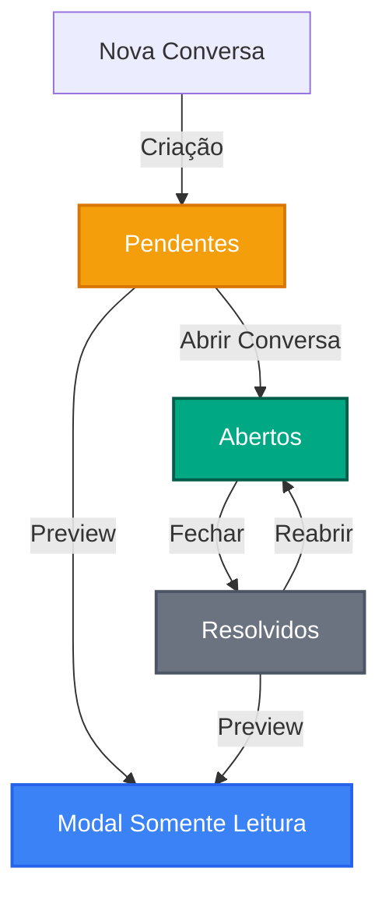
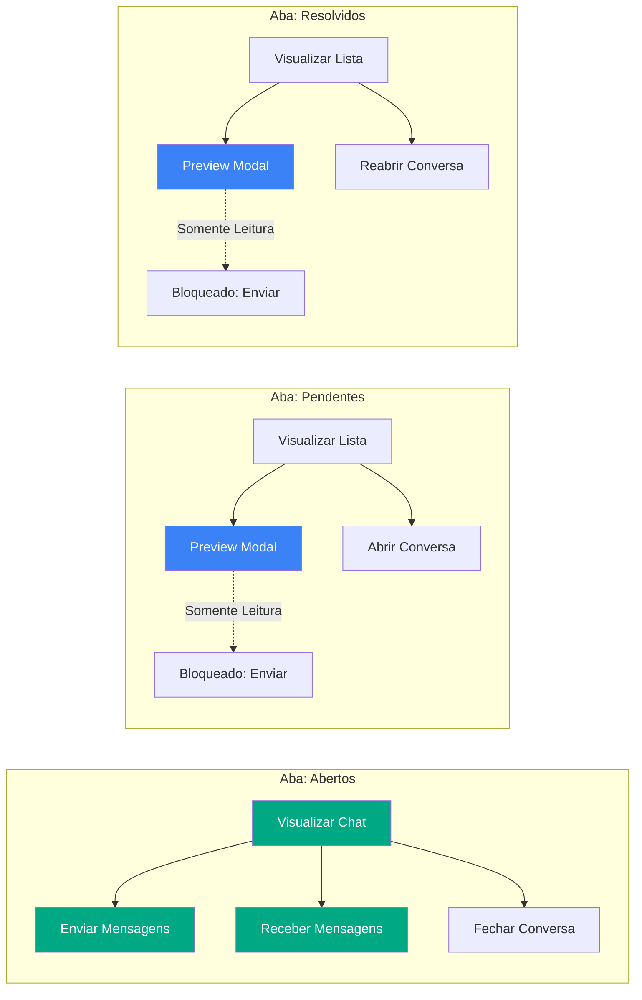
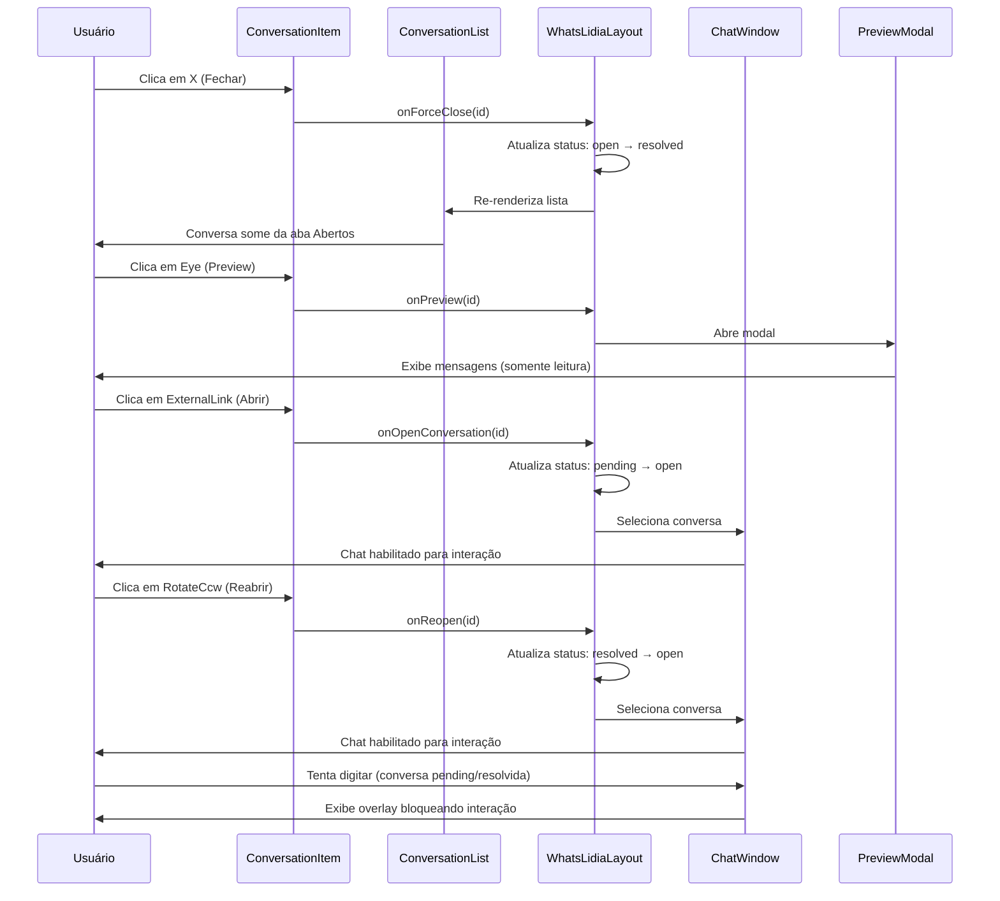

# Plano de Implementação: Sistema de Controle de Acesso por Abas

## Visão Geral

Este documento detalha a implementação do sistema de controle de acesso por abas para gerenciamento de conversas no WhatsLídia, garantindo que apenas conversas na aba "Abertos" permitam interação ativa.

## Arquitetura do Sistema

### Fluxo de Estados das Conversas



### Diagrama de Permissões por Aba



## Estrutura de Componentes

### 1. ConversationItem (`src/components/whatslidia/ConversationItem.tsx`)

**Responsabilidade:** Renderizar controles específicos por aba

#### Props Adicionais Necessárias:
```typescript
interface ConversationItemProps {
  // ... props existentes
  onReopen?: (id: string) => void;  // NOVO: Para aba Resolvidos
}
```

#### Controles por Aba:

| Aba | Controles | Ícones | Ação |
|-----|-----------|--------|------|
| Abertos | Fechar | XCircle | Move para Resolvidos |
| Pendentes | Preview + Abrir | Eye + ExternalLink | Preview modal / Move para Abertos |
| Resolvidos | Reabrir | RotateCcw | Move para Abertos |

### 2. ConversationList (`src/components/whatslidia/ConversationList.tsx`)

**Responsabilidade:** Gerenciar estado da aba ativa e passar para componentes filhos

#### Alterações:
- Expor `activeTab` no retorno ou via callback para componentes pai
- Passar `onReopen` para `ConversationItem`

### 3. WhatsLidiaLayout (`src/components/whatslidia/WhatsLidiaLayout.tsx`)

**Responsabilidade:** Orquestrar handlers e estado global

#### Handlers a Implementar:
```typescript
// JÁ EXISTE
const handleForceClose = (id: string) => // Move: open → resolved
const handleOpenConversation = (id: string) => // Move: pending → open
const handlePreview = (id: string) => // Abre modal preview

// NOVO - PRECISA IMPLEMENTAR
const handleReopenConversation = (id: string) => // Move: resolved → open
```

#### Estado Necessário:
```typescript
const [activeTab, setActiveTab] = useState<'open' | 'pending' | 'resolved'>('open');
```

### 4. ChatWindow (`src/components/whatslidia/ChatWindow.tsx`)

**Responsabilidade:** Renderizar interface de chat com restrições baseadas no status

#### Props Adicionais:
```typescript
interface ChatWindowProps {
  // ... props existentes
  isReadOnly?: boolean;  // NOVO: Bloqueia interação quando true
  onReopen?: () => void; // NOVO: Callback para reabrir conversa resolvida
}
```

#### Comportamento por Status:

| Status | Input | Quick Replies | Visualização |
|--------|-------|---------------|--------------|
| open | ✅ Habilitado | ✅ Habilitado | Normal |
| pending | ❌ Desabilitado | ❌ Oculto | Overlay informativo |
| resolved | ❌ Desabilitado | ❌ Oculto | Botão "Reabrir" |

### 5. PreviewConversationModal (`src/components/whatslidia/PreviewConversationModal.tsx`)

**Responsabilidade:** Exibir histórico em modo somente leitura

#### Já Implementado ✅:
- Visualização de mensagens
- Indicador "Modo Preview"
- Botão "Abrir Conversa" (para pendentes)

#### Ajustes Necessários:
- Condicionar botão "Abrir Conversa" baseado no status da conversa
- Mostrar "Reabrir" quando vier de conversa resolvida

## Implementação Detalhada

### Fase 1: Adicionar Botão de Reabrir na Aba Resolvidos

**Arquivo:** `ConversationItem.tsx`

```typescript
// Adicionar import
import { RotateCcw } from "lucide-react";

// Adicionar prop
onReopen?: (id: string) => void;

// Adicionar handler
const handleReopen = (e: React.MouseEvent) => {
  e.stopPropagation();
  onReopen?.(conversation.id);
};

// Adicionar JSX na seção de action icons
{activeTab === 'resolved' && onReopen && (
  <motion.button
    initial={{ opacity: 0, scale: 0.8 }}
    whileHover={{ scale: 1.1 }}
    onClick={handleReopen}
    className={cn(
      "p-1 rounded-full transition-all opacity-0 group-hover:opacity-100",
      "hover:bg-emerald-500/20 text-emerald-500"
    )}
    title="Reabrir conversa"
  >
    <RotateCcw className="w-4 h-4" />
  </motion.button>
)}
```

### Fase 2: Implementar Handler de Reabrir

**Arquivo:** `WhatsLidiaLayout.tsx`

```typescript
const handleReopenConversation = (id: string) => {
  setConversations((prev) =>
    prev.map((c) =>
      c.id === id
        ? { ...c, status: 'open' as const, updatedAt: new Date() }
        : c
    )
  );
  // Opcional: Selecionar automaticamente a conversa reaberta
  setSelectedConversationId(id);
  if (isMobile) {
    setShowChat(true);
  }
};
```

### Fase 3: Implementar Restrições no ChatWindow

**Arquivo:** `ChatWindow.tsx`

```typescript
// Props atualizadas
interface ChatWindowProps {
  conversation: Conversation | null;
  onBack?: () => void;
  showBackButton?: boolean;
  isDarkMode?: boolean;
  isReadOnly?: boolean;  // NOVO
  onReopen?: () => void; // NOVO
}

// Componente de overlay para conversas bloqueadas
const ReadOnlyOverlay = () => (
  <div className="absolute inset-0 z-10 flex flex-col items-center justify-center bg-black/50 backdrop-blur-sm">
    <div className={cn(
      "px-6 py-4 rounded-xl text-center max-w-md mx-4",
      isDarkMode ? "bg-[#1f2c33]" : "bg-white"
    )}>
      <Lock className="w-8 h-8 mx-auto mb-3 text-[#00a884]" />
      <h3 className={cn(
        "font-medium mb-2",
        isDarkMode ? "text-[#e9edef]" : "text-gray-900"
      )}>
        Conversa {conversation?.status === 'pending' ? 'Pendente' : 'Resolvida'}
      </h3>
      <p className={cn(
        "text-sm mb-4",
        isDarkMode ? "text-[#8696a0]" : "text-gray-500"
      )}>
        {conversation?.status === 'pending'
          ? 'Esta conversa está na fila de pendentes. Clique em "Abrir Conversa" para habilitar a interação.'
          : 'Esta conversa foi resolvida. Clique em "Reabrir" para retomar o atendimento.'}
      </p>
      {conversation?.status === 'resolved' && onReopen && (
        <button
          onClick={onReopen}
          className="px-4 py-2 bg-[#00a884] text-white rounded-lg hover:bg-[#00a884]/90 transition-colors"
        >
          Reabrir Conversa
        </button>
      )}
    </div>
  </div>
);

// Condicional para renderizar input
{!isReadOnly && (
  <>
    {/* Quick Replies */}
    <div className={...}>
      {/* ... quick replies ... */}
    </div>
    {/* Input Area */}
    <MessageInput onSend={handleSendMessage} isDarkMode={isDarkMode} />
  </>
)}
```

### Fase 4: Integrar no WhatsLidiaLayout

**Arquivo:** `WhatsLidiaLayout.tsx`

```typescript
// Estado para rastrear aba ativa
const [activeTab, setActiveTab] = useState<'open' | 'pending' | 'resolved'>('open');

// Callback para receber mudança de aba do ConversationList
const handleTabChange = (tab: 'open' | 'pending' | 'resolved') => {
  setActiveTab(tab);
  // Desselecionar conversa ao mudar de aba
  setSelectedConversationId(null);
  if (isMobile) {
    setShowChat(false);
  }
};

// Determinar se chat está em modo somente leitura
const isChatReadOnly = useMemo(() => {
  if (!selectedConversation) return true;
  return selectedConversation.status !== 'open';
}, [selectedConversation]);

// Passar para ChatWindow
<ChatWindow
  conversation={selectedConversation}
  isDarkMode={isDarkMode}
  isReadOnly={isChatReadOnly}
  onReopen={() => selectedConversationId && handleReopenConversation(selectedConversationId)}
/>
```

### Fase 5: Atualizar ConversationList para Gerenciar Aba Ativa

**Arquivo:** `ConversationList.tsx`

```typescript
interface ConversationListProps {
  // ... props existentes
  onTabChange?: (tab: 'open' | 'pending' | 'resolved') => void; // NOVO
  onReopen?: (id: string) => void; // NOVO
}

// Ao mudar de aba
const handleTabClick = (tab: FilterTab) => {
  setActiveTab(tab);
  onTabChange?.(tab);
};

// Passar onReopen para ConversationItem
<ConversationItem
  // ... props
  onReopen={onReopen}
/>
```

## Fluxo de Dados



## Checklist de Implementação

- [ ] Adicionar ícone `RotateCcw` no ConversationItem para aba Resolvidos
- [ ] Implementar handler `handleReopen` no ConversationItem
- [ ] Adicionar prop `onReopen` em ConversationItemProps
- [ ] Implementar `handleReopenConversation` no WhatsLidiaLayout
- [ ] Passar `onReopen` do WhatsLidiaLayout para ConversationList
- [ ] Passar `onReopen` do ConversationList para ConversationItem
- [ ] Adicionar prop `isReadOnly` no ChatWindow
- [ ] Adicionar prop `onReopen` no ChatWindow
- [ ] Criar componente visual de overlay para chat bloqueado
- [ ] Condicionar renderização do MessageInput baseado em `isReadOnly`
- [ ] Implementar callback `onTabChange` no ConversationList
- [ ] Rastrear `activeTab` no WhatsLidiaLayout
- [ ] Desselecionar conversa ao mudar de aba
- [ ] Bloquear seleção de conversas não-abertas (opcional)
- [ ] Testar fluxo completo em desktop
- [ ] Testar comportamento mobile
- [ ] Verificar temas dark/light

## Notas Técnicas

### Transições de Status Permitidas

| De | Para | Ação | Permissão |
|----|------|------|-----------|
| open | resolved | Fechar | ✅ Permitido |
| pending | open | Abrir | ✅ Permitido |
| resolved | open | Reabrir | ✅ Permitido |
| resolved | pending | - | ❌ Não permitido |
| open | pending | - | ❌ Não permitido (use fechar + reabrir) |

### Estados de UI por Aba

#### Aba Abertos
- Lista: Mostra badge de não lidas, indicador de digitação
- Ações: X para fechar
- Chat: Totalmente interativo

#### Aba Pendentes
- Lista: Preview (olho) + Abrir (seta)
- Ações: Preview abre modal somente leitura
- Chat: Se selecionado, mostra overlay bloqueando

#### Aba Resolvidas
- Lista: Preview (olho) + Reabrir (rotate-ccw)
- Ações: Reabrir move para abertos
- Chat: Se selecionado, mostra overlay com botão reabrir

### Considerações de UX

1. **Feedback Visual:** Sempre que uma ação de mudança de status ocorrer, a conversa deve desaparecer da lista atual (animação suave) e reaparecer na aba destino

2. **Confirmação:** Ações irreversíveis (como fechar conversa) devem ter confirmação via modal ou tooltip de confirmação

3. **Mobile:** Em telas mobile, ao reabrir uma conversa, deve-se navegar automaticamente para a aba "Abertos"

4. **Acessibilidade:** Todos os botões devem ter `title` descritivo e suporte a navegação por teclado
