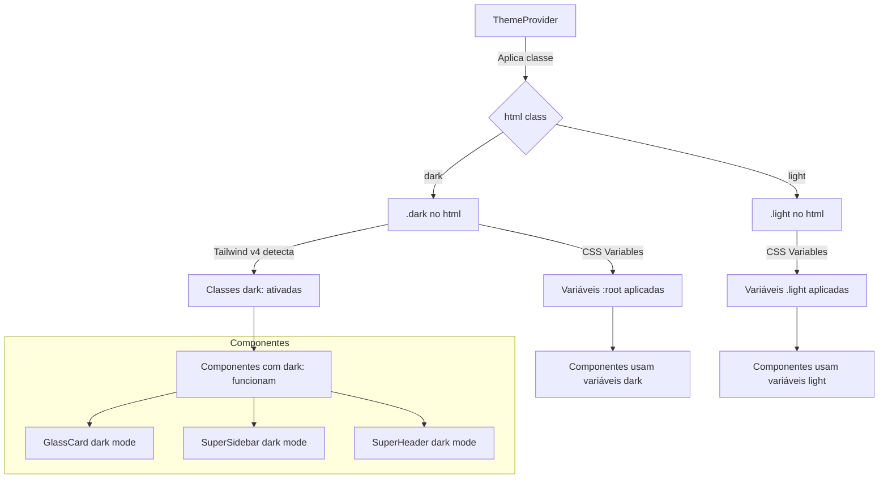

# Plano de Correção: Bug de Tema Dark Mode

## Análise do Problema

### Sintomas Identificados
1. **Cards internos** (Total de Empresas, Usuários Ativos, MRR, Planos Ativos) ficam com fundo branco no modo escuro
2. **Gráficos** não respondem ao tema escuro
3. **Seção de Resumo do sistema** permanece com fundo claro
4. **Sidebar** não responde ao tema escuro
5. **Logo** não fica branca no modo escuro

### Causa Raiz Identificada

O projeto usa **Tailwind CSS v4** (via `@tailwindcss/postcss`), que tem um comportamento diferente para dark mode comparado às versões anteriores.

#### Problema 1: Tailwind v4 Dark Mode não configurado
No Tailwind v4, o dark mode por padrão usa `prefers-color-scheme: dark` (media query do sistema). O projeto usa uma abordagem baseada em classe (`.dark` no `<html>`), mas **não configurou o Tailwind v4 para reconhecer essa classe**.

**Resultado:** Classes como `dark:bg-[#0f0f0f]/95` e `dark:text-slate-400` não funcionam porque o Tailwind não sabe que deve usar a classe `.dark` como seletor.

#### Problema 2: CSS Variables corretas, mas não aplicadas
O [`globals.css`](src/app/globals.css:46) define corretamente:
- `:root` → variáveis do tema DARK (padrão)
- `.light` → variáveis do tema LIGHT

O [`theme-provider.tsx`](src/components/theme-provider.tsx:45) aplica corretamente a classe `.dark` ou `.light` no `<html>`.

**Porém**, como o Tailwind v4 não está configurado para usar a classe `.dark`, as classes utilitárias `dark:` não funcionam.

#### Problema 3: Componentes usando classes `dark:` inline
Vários componentes usam classes `dark:` do Tailwind que não funcionam:
- [`glass-card.tsx`](src/components/ui/glass-card.tsx:29): `dark:bg-[#0f0f0f]/95`
- [`super-sidebar.tsx`](src/components/super-sidebar.tsx:88): `dark:border-emerald-500/15`, `dark:bg-gradient-to-b`
- [`super-header.tsx`](src/components/super-header.tsx:38): `dark:border-emerald-500/15`, `dark:bg-black/80`

#### Problema 4: Logo não responde ao tema
A logo usa imagens PNG estáticas que não têm variação de cor para o tema escuro.

---

## Solução Proposta

### Passo 1: Configurar Tailwind v4 Dark Mode

Adicionar no início do [`globals.css`](src/app/globals.css), dentro do bloco `@theme inline`:

```css
@custom-variant dark (&:where(.dark, .dark *));
```

Isso configura o Tailwind v4 para usar a classe `.dark` como seletor para as variantes `dark:`.

**Localização:** [`src/app/globals.css`](src/app/globals.css) - adicionar após a linha 44 (fechamento do `@theme inline`)

### Passo 2: Adicionar seletor `.dark` no CSS

Adicionar um seletor `.dark` que espelhe o `:root` para garantir compatibilidade:

```css
.dark {
  /* Mesmas variáveis de :root para garantir compatibilidade */
  --background: #000000;
  --foreground: #f8fafc;
  /* ... resto das variáveis dark ... */
}
```

**Localização:** [`src/app/globals.css`](src/app/globals.css) - adicionar após o bloco `:root`

### Passo 3: Corrigir a Logo para modo escuro

Existem duas opções:

**Opção A: Usar CSS Filter (Recomendada - mais simples)**
Adicionar uma classe CSS que inverte a cor da logo no modo escuro:

```css
/* No globals.css */
.dark .logo-image {
  filter: brightness(0) invert(1);
}
```

E adicionar a classe `logo-image` ao componente Logo.

**Opção B: Usar versão SVG da logo**
Converter a logo para SVG e usar `fill="currentColor"` para que ela herde a cor do texto.

**Localização:** [`src/components/ui/logo.tsx`](src/components/ui/logo.tsx:36) e [`src/components/super-sidebar.tsx`](src/components/super-sidebar.tsx:105)

### Passo 4: Verificar componentes com classes `dark:` inline

Após a configuração do Tailwind v4, os seguintes componentes devem funcionar corretamente:
- [`glass-card.tsx`](src/components/ui/glass-card.tsx)
- [`super-sidebar.tsx`](src/components/super-sidebar.tsx)
- [`super-header.tsx`](src/components/super-header.tsx)

---

## Arquivos a Modificar

| Arquivo | Mudança |
|---------|---------|
| [`src/app/globals.css`](src/app/globals.css) | Adicionar `@custom-variant dark` e seletor `.dark` |
| [`src/components/ui/logo.tsx`](src/components/ui/logo.tsx) | Adicionar suporte a filtro para modo escuro |
| [`src/components/super-sidebar.tsx`](src/components/super-sidebar.tsx) | Adicionar classe na logo para filtro dark |

---

## Diagrama de Fluxo do Tema



---

## Ordem de Execução

1. **Configurar Tailwind v4** - Adicionar `@custom-variant dark` no globals.css
2. **Adicionar seletor .dark** - Garantir compatibilidade total
3. **Corrigir Logo** - Adicionar filtro CSS para modo escuro
4. **Testar** - Verificar todos os componentes respondendo ao tema

---

## Notas Técnicas

### Tailwind CSS v4 Dark Mode
O Tailwind v4 mudou a forma de configurar dark mode. Em vez de usar `tailwind.config.js` com `darkMode: 'class'`, agora usa-se:

```css
@custom-variant dark (&:where(.dark, .dark *));
```

Isso cria uma variante personalizada que seleciona elementos quando eles ou seus ancestrais têm a classe `.dark`.

### CSS Variables vs Classes Tailwind
O projeto usa uma abordagem híbrida:
- **CSS Variables** para cores semânticas (`--background`, `--foreground`, etc.)
- **Classes Tailwind** para estilos específicos (`dark:bg-[#0f0f0f]/95`)

Ambas precisam funcionar em conjunto para o tema ser consistente.
