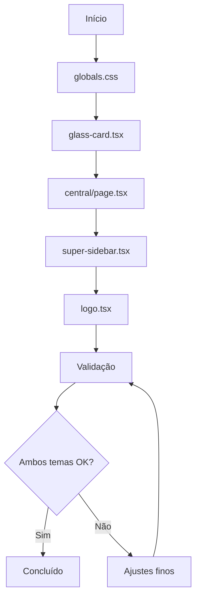

# Plano de Correções Visuais - LIDIA 2.0

## Resumo das Alterações

Este plano detalha as correções necessárias para resolver problemas de paleta de cores, contraste e consistência visual nos modos claro e escuro, além de substituir o texto "Super Admin" por uma logo ampliada na sidebar.

---

## 1. Problemas Identificados

### Modo Claro
| Elemento | Problema | Impacto |
|----------|----------|---------|
| Título "Dashboard Central" | Usa `text-white` hardcoded | Texto invisível sobre fundo claro |
| Subtítulos | Usam `text-slate-400` | Contraste insuficiente |
| Cards de estatísticas | Fundo pode estar com transparência inadequada | Baixa legibilidade |
| Textos em KPICard | Usam `text-white` para valores | Invisível no modo claro |

### Modo Escuro
| Elemento | Problema | Impacto |
|----------|----------|---------|
| Cards | Aparecem com fundo cinza claro em vez de escuro | Quebra a identidade visual escura |
| Gradientes e bordas | Podem estar sobrepondo cores incorretamente | Inconsistência visual |

### Sidebar
| Elemento | Problema | Impacto |
|----------|----------|---------|
| Texto "Super Admin" | Elemento textual redundante | Poluição visual |
| Logo atual | Tamanho pequeno (28x28) | Marca pouco visível |

---

## 2. Arquivos a Serem Modificados

### 2.1 src/app/globals.css
**Alterações:**
- Ajustar variável `--card` no modo claro para melhor contraste
- Adicionar variáveis auxiliares para textos em cards
- Garantir transições suaves entre temas

```css
/* Modo Claro - Ajustes */
.light {
  --card: rgba(255, 255, 255, 0.95);
  --card-foreground: #0f172a;
  --card-subtle: #f1f5f9;
}
```

### 2.2 src/components/ui/glass-card.tsx
**Alterações:**
- Substituir cores hardcoded por variáveis CSS
- Corrigir ordem de classes Tailwind para priorizar dark:
- Ajustar fundo do card no modo escuro para `#111111` ou `bg-[#0f0f0f]`

**Mudanças específicas:**
```tsx
// Linha 29-33: Ajustar para usar variáveis
dark:bg-[#0f0f0f]/90 dark:border-emerald-500/20
bg-white/90 border-slate-200/60
```

### 2.3 src/app/(dashboard)/super/central/page.tsx
**Alterações em KPICard (linha 61-67):**
```tsx
// Antes:
<p className="text-2xl md:text-3xl font-bold text-white tracking-tight">

// Depois:
<p className="text-2xl md:text-3xl font-bold text-foreground tracking-tight">
```

**Alterações em KPICard subtitle (linha 66):**
```tsx
// Antes:
<p className="text-xs text-emerald-400/80 mt-1">

// Depois:
<p className="text-xs text-emerald-600 dark:text-emerald-400 mt-1">
```

**Alterações nos títulos das seções (linhas 268, 328, 358):**
```tsx
// Antes:
<h1 className="text-2xl md:text-4xl font-bold text-white">
<h3 className="text-lg font-semibold text-white">

// Depois:
<h1 className="text-2xl md:text-4xl font-bold text-foreground">
<h3 className="text-lg font-semibold text-foreground">
```

**Alterações em StatRow (linha 196-198):**
```tsx
// Antes:
<span className="text-sm text-slate-400">{label}</span>
<span className="text-sm font-semibold text-white">{value}</span>

// Depois:
<span className="text-sm text-muted-foreground">{label}</span>
<span className="text-sm font-semibold text-foreground">{value}</span>
```

### 2.4 src/components/super-sidebar.tsx
**Alterações na seção do logo (linhas 95-133):**

Remover completamente o texto "Super Admin" e ampliar a logo:

```tsx
// Estrutura atual mantém LIDIA + Super Admin
// Nova estrutura: apenas logo ampliada

<motion.div
  className="w-12 h-12 rounded-xl flex items-center justify-center shrink-0 overflow-hidden"
  style={{
    background: "linear-gradient(135deg, rgba(16,185,129,0.3), rgba(5,150,105,0.3))",
    border: "1px solid rgba(16,185,129,0.4)",
    boxShadow: "0 0 20px rgba(16,185,129,0.15)",
  }}
>
  <Image
    src="/2.png"  // Usar logo maior (/2.png)
    alt="LIDIA"
    width={40}
    height={40}
    className="object-contain"
    priority
  />
</motion.div>
```

### 2.5 src/components/ui/logo.tsx
**Alterações em SidebarLogo:**
- Remover texto "Super Admin" completamente
- Aumentar dimensões da imagem quando não colapsado
- Usar `/2.png` (logo compacta maior) em vez de `/3.png`

```tsx
export function SidebarLogo({ collapsed = false }: { collapsed?: boolean }) {
  if (collapsed) {
    return (
      <div className="w-10 h-10 rounded-xl flex items-center justify-center shrink-0 overflow-hidden">
        <Image
          src="/3.png"
          alt="LIDIA"
          width={36}
          height={36}
          className="object-contain"
          priority
        />
      </div>
    );
  }

  return (
    <div className="flex items-center gap-3">
      <div className="w-12 h-12 rounded-xl flex items-center justify-center shrink-0 overflow-hidden">
        <Image
          src="/2.png"
          alt="LIDIA"
          width={44}
          height={44}
          className="object-contain"
          priority
        />
      </div>
      {/* Texto "Super Admin" REMOVIDO */}
    </div>
  );
}
```

### 2.6 src/components/super-header.tsx
**Ajustes de cores (linhas 75-80):**
```tsx
// Antes:
<h1 className="text-lg font-semibold dark:text-white text-slate-900">
<p className="text-xs dark:text-slate-500 text-slate-400 hidden sm:block">

// Manter como está - já está correto
```

**Verificar consistência do fundo (linha 40):**
Manter backdrop-blur e transparência atual.

---

## 3. Especificações de Cores

### Modo Escuro (Dark)
| Uso | Cor | Variável CSS |
|-----|-----|--------------|
| Fundo principal | #000000 | `--background` |
| Fundo de cards | #0f0f0f | `--card` |
| Texto principal | #f8fafc | `--foreground` |
| Texto secundário | #94a3b8 | `--muted-foreground` |
| Bordas | rgba(16,185,129,0.15) | `--border` |
| Destaque | #10b981 | `--primary` |

### Modo Claro (Light)
| Uso | Cor | Variável CSS |
|-----|-----|--------------|
| Fundo principal | #f8fafc | `--background` |
| Fundo de cards | rgba(255,255,255,0.95) | `--card` |
| Texto principal | #0f172a | `--foreground` |
| Texto secundário | #64748b | `--muted-foreground` |
| Bordas | rgba(0,0,0,0.08) | `--border` |
| Destaque | #059669 | `--primary` |

---

## 4. Checklist de Implementação

### Fase 1: Variáveis Globais
- [ ] Atualizar `src/app/globals.css` com ajustes de contraste
- [ ] Verificar transições suaves entre temas

### Fase 2: Componentes de UI
- [ ] Corrigir `src/components/ui/glass-card.tsx`
- [ ] Verificar `src/components/ui/glow-badge.tsx` (já usa dark: correto)
- [ ] Verificar `src/components/ui/neon-button.tsx`

### Fase 3: Páginas
- [ ] Corrigir todas as cores hardcoded em `src/app/(dashboard)/super/central/page.tsx`
- [ ] Verificar outras páginas do super admin

### Fase 4: Navegação
- [ ] Atualizar `src/components/super-sidebar.tsx` - remover "Super Admin"
- [ ] Ampliar logo na sidebar
- [ ] Atualizar componente `src/components/ui/logo.tsx`
- [ ] Verificar `src/components/super-header.tsx`

### Fase 5: Validação
- [ ] Testar modo escuro
- [ ] Testar modo claro
- [ ] Verificar contraste em ambos os temas
- [ ] Validar legibilidade de todos os textos

---

## 5. Diagrama de Alterações



---

## 6. Critérios de Aceitação

1. **Modo Escuro:**
   - [ ] Cards têm fundo escuro (#0f0f0f) com boa separação do fundo
   - [ ] Todos os textos são legíveis com contraste WCAG AA
   - [ ] Elementos de destaque (emerald) mantêm brilho adequado

2. **Modo Claro:**
   - [ ] Título "Dashboard Central" está visível
   - [ ] Cards têm fundo branco/branco suave com boa separação
   - [ ] Todos os textos são legíveis com contraste WCAG AA
   - [ ] Não há textos brancos sobre fundos claros

3. **Sidebar:**
   - [ ] Texto "Super Admin" completamente removido
   - [ ] Logo ampliada proporcionalmente (mínimo 40x40px quando expandida)
   - [ ] Logo mantém qualidade visual

4. **Performance:**
   - [ ] Transições entre temas são suaves (300ms)
   - [ ] Não há flash de conteúdo ao trocar temas
   - [ ] CSS não causa repaints excessivos

---

## Próximos Passos

Aguardando aprovação deste plano para prosseguir com a implementação no modo Code.
