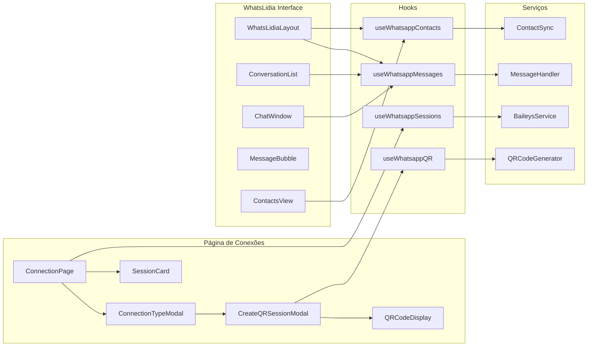
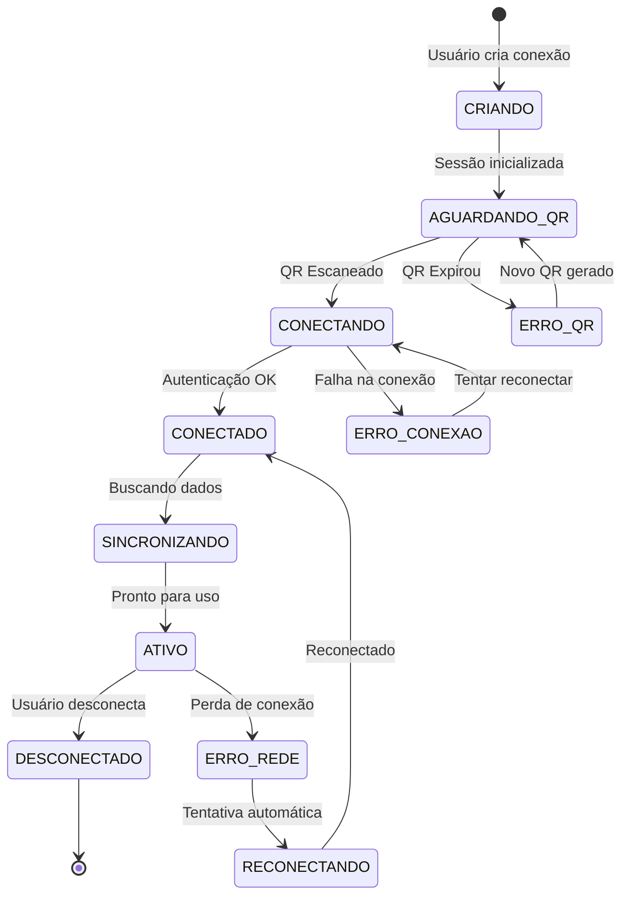
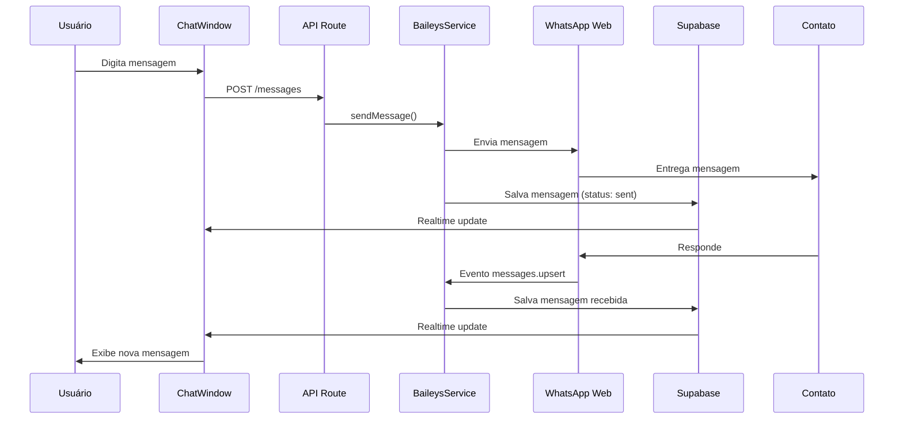

# Arquitetura do Sistema WhatsApp QR Code

## Visão Geral do Fluxo

```mermaid
flowchart TD
    subgraph "Frontend - Dashboard"
        A[Usuário clica em Nova Conexão]
        B[Modal: Escolher Tipo QR/Oficial]
        C[Modal: Nome da Conexão]
        D[Exibe QR Code]
        E[Página WhatsLidia QR]
    end

    subgraph "Backend - Next.js API"
        F[POST /api/whatsapp/sessions]
        G[Gera Token UUID]
        H[Baileys Service]
        I[GET /api/whatsapp/sessions/[id]/qr]
        J[POST /api/whatsapp/sessions/[id]/messages]
        K[GET /api/whatsapp/sessions/[id]/contacts]
    end

    subgraph "WhatsApp Web"
        L[WhatsApp App no Celular]
        M[Escaneia QR Code]
        N[Conexão Estabelecida]
    end

    subgraph "Supabase Database"
        O[(whatsapp_sessions)]
        P[(whatsapp_qr_codes)]
        Q[(whatsapp_messages)]
        R[(whatsapp_contacts)]
        S[Realtime Subscriptions]
    end

    A --> B
    B -->|Seleciona QR| C
    C -->|Salva| F
    F --> G
    G --> H
    H --> O
    H --> P
    D --> I
    I -->|SSE Stream| D
    D --> L
    L --> M
    M --> N
    N --> H
    H -->|Salva Contatos| R
    H -->|Salva Mensagens| Q
    E --> J
    E --> K
    Q --> S
    S -->|Atualiza em tempo real| E
```

## Estrutura de Componentes



## Diagrama de Estados da Conexão



## Fluxo de Mensagens



## Modelo de Dados

### whatsapp_sessions
| Campo | Tipo | Descrição |
|-------|------|-----------|
| id | UUID | Identificador único |
| company_id | UUID | Empresa dona da sessão |
| name | String | Nome da conexão |
| token | UUID | Token de autenticação |
| status | Enum | CRIANDO, AGUARDANDO_QR, CONECTANDO, CONECTADO, ATIVO, DESCONECTADO, ERRO |
| phone_number | String | Número do WhatsApp conectado |
| push_name | String | Nome no WhatsApp |
| profile_picture | Text | URL da foto de perfil |
| credentials | JSON | Credenciais criptografadas |
| created_at | Timestamp | Data de criação |
| updated_at | Timestamp | Última atualização |

### whatsapp_messages
| Campo | Tipo | Descrição |
|-------|------|-----------|
| id | UUID | Identificador único |
| session_id | UUID | Referência à sessão |
| message_id | String | ID da mensagem no WhatsApp |
| contact_phone | String | Número do contato |
| contact_name | String | Nome do contato |
| content | Text | Conteúdo da mensagem |
| type | Enum | text, image, video, audio, document |
| direction | Enum | incoming, outgoing |
| status | Enum | pending, sent, delivered, read, failed |
| media_url | Text | URL do arquivo (se houver) |
| timestamp | Timestamp | Horário da mensagem |
| created_at | Timestamp | Data de criação no sistema |

### whatsapp_contacts
| Campo | Tipo | Descrição |
|-------|------|-----------|
| id | UUID | Identificador único |
| session_id | UUID | Referência à sessão |
| phone | String | Número do telefone |
| name | String | Nome do contato |
| profile_picture | Text | URL da foto |
| status | String | Status no WhatsApp |
| last_message_at | Timestamp | Última mensagem |
| is_group | Boolean | É grupo? |
| created_at | Timestamp | Data de criação |
| updated_at | Timestamp | Última atualização |

## Segurança

- Credenciais do WhatsApp criptografadas no banco (AES-256)
- Políticas RLS no Supabase garantem isolamento por empresa
- Tokens UUID únicos por sessão
- Rate limiting nas APIs de envio de mensagem
- Webhook verification para callbacks

## Performance

- Server-Sent Events para atualização do QR code em tempo real
- Supabase Realtime para mensagens instantâneas
- Lazy loading de histórico de conversas
- Cache de contatos no frontend
- Reconexão automática com backoff exponencial
