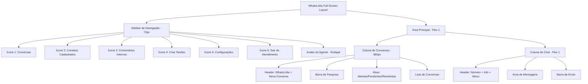

# Arquitetura da Interface WhatsLídia

## Visão Geral

A interface WhatsLídia é uma experiência de atendimento empresarial inspirada no WhatsApp Web, projetada para ocupar a tela inteira quando acessada, removendo a sidebar tradicional do dashboard.

## Estrutura do Layout



## Componentes Principais

### 1. Layout de Tela Cheia
- **Arquivo**: `src/app/(dashboard)/app/attendances/page.tsx` (reescrito)
- Remove a sidebar do dashboard quando na página de atendimentos
- Usa `position: fixed` para ocupar todo o viewport
- Altura: 100vh, Largura: 100vw

### 2. Sidebar WhatsLídia (72px de largura)
| # | Ícone | Label | Funcionalidade |
|---|-------|-------|----------------|
| 1 | MessageSquare | Conversas | Tela principal de atendimento |
| 2 | Users | Contatos Cadastrados | Lista de contatos do sistema |
| 3 | StickyNote | Comentários Internos | Anotações visíveis apenas para equipe |
| 4 | ClipboardCheck | Criar Tarefas | Gerenciamento de tarefas |
| 5 | Settings | Configurações | Configurações do atendimento |
| 6 | LogOut | Sair do Atendimento | Voltar ao dashboard |

**Avatar do Agente**: Localizado no rodapé da sidebar, exibe foto/nome do agente logado.

### 3. Coluna de Conversas (380px de largura)
- **Header**: Título "WhatsLídia" + botão de nova conversa (+)
- **Pesquisa**: Campo de busca por nome/número
- **Abas**: 
  - Abertas ( badge com contagem )
  - Pendentes ( badge com contagem )
  - Resolvidas
- **Lista de Conversas**: Cada item exibe:
  - Foto de perfil (avatar)
  - Nome do contato
  - Prévia da última mensagem
  - Horário
  - Badge com mensagens não lidas

### 4. Coluna de Chat (área flexível)
- **Header**:
  - Foto de perfil do contato
  - Número formatado: +55 XX XXXXX-XXXX
  - Botão de informações do contato
  - Menu de opções (3 pontos)
- **Área de Mensagens**:
  - Bolhas de mensagens estilo WhatsApp
  - Status WABA: enviado ✓, entregue ✓✓, lido ✓✓ (azul)
  - Suporte a mídia: imagem, vídeo, documento, áudio
- **Barra de Envio**:
  - Botão de anexos (+)
  - Ícone de emoji
  - Campo "Digite uma mensagem"
  - Botão de áudio/microfone

## Cores e Tema

### Modo Escuro (Padrão)
- Fundo geral: `#0a0a0a`
- Sidebar: `#111111`
- Coluna conversas: `#1a1a1a`
- Área de chat: `#0f0f0f`
- Mensagens enviadas: `#005c4b` (verde escuro)
- Mensagens recebidas: `#202c33` (cinza escuro)
- Texto primário: `#ffffff`
- Texto secundário: `#8696a0`
- Destaque: `#00a884` (verde WhatsApp)

### Modo Claro
- Fundo geral: `#f0f2f5`
- Sidebar: `#ffffff`
- Coluna conversas: `#ffffff`
- Área de chat: `#e5ddd5` (padrão whatsapp) ou `#f8f9fa`
- Mensagens enviadas: `#d9fdd3`
- Mensagens recebidas: `#ffffff`
- Texto primário: `#111111`
- Texto secundário: `#667781`
- Destaque: `#008069`

## Tipos de Dados

```typescript
// src/types/chat.ts

interface Conversation {
  id: string;
  contact: {
    id: string;
    name: string;
    phone: string;
    avatar?: string;
    isRegistered: boolean;
  };
  status: 'open' | 'pending' | 'resolved';
  lastMessage: {
    content: string;
    timestamp: Date;
    type: 'text' | 'image' | 'video' | 'document' | 'audio';
    isFromMe: boolean;
  };
  unreadCount: number;
  assignedTo?: string;
  tags: string[];
  createdAt: Date;
  updatedAt: Date;
}

interface Message {
  id: string;
  conversationId: string;
  content: string;
  type: 'text' | 'image' | 'video' | 'document' | 'audio' | 'template';
  status: 'sent' | 'delivered' | 'read' | 'failed';
  isFromMe: boolean;
  timestamp: Date;
  metadata?: {
    fileName?: string;
    fileSize?: number;
    mimeType?: string;
    caption?: string;
  };
}

interface WABAStatus {
  messageId: string;
  status: 'sent' | 'delivered' | 'read';
  timestamp: Date;
}
```

## Funcionalidades WABA Suportadas

1. **Templates de Mensagem**: Para contatos fora da janela de 24h
2. **Respostas Rápidas**: Atalhos para mensagens comuns
3. **Mídia**: Envio/recebimento de imagem, vídeo, documento, áudio
4. **Marcadores**: Organização por status/cor
5. **Status de Entrega**: Enviado, Entregue, Lido
6. **Comentários Internos**: Anotações não visíveis ao cliente

## Estrutura de Arquivos

```
src/
├── app/(dashboard)/app/attendances/
│   ├── page.tsx                    # Página principal (tela cheia)
│   └── layout.tsx                  # Layout específico (sem sidebar dashboard)
├── components/whatslidia/
│   ├── WhatsLidiaLayout.tsx        # Layout base 3 colunas
│   ├── Sidebar.tsx                 # Sidebar de navegação
│   ├── ConversationList.tsx        # Lista de conversas
│   ├── ChatWindow.tsx              # Janela de chat
│   ├── MessageBubble.tsx           # Bolha de mensagem
│   ├── MessageInput.tsx            # Barra de envio
│   ├── ConversationItem.tsx        # Item da lista
│   ├── SearchBar.tsx               # Barra de pesquisa
│   ├── StatusIndicator.tsx         # Indicador WABA
│   └── ContactInfo.tsx             # Info do contato
├── types/chat.ts                   # Tipos TypeScript
└── hooks/
    ├── use-conversations.ts        # Hook de conversas
    ├── use-messages.ts             # Hook de mensagens
    └── use-chat.ts                 # Hook principal do chat
```

## Fluxo de Navegação

1. Usuário clica em "Atendimentos" no dashboard
2. Página carrega em modo tela cheia (sem sidebar do dashboard)
3. Sidebar do WhatsLídia é exibida à esquerda
4. Coluna de conversas carrega lista atualizada
5. Usuário pode:
   - Selecionar uma conversa para visualizar
   - Buscar conversas
   - Filtrar por status
   - Acessar outras funcionalidades via sidebar
   - Sair para voltar ao dashboard

## Considerações de UX

- Transições suaves entre conversas (150ms)
- Scroll automático para última mensagem
- Indicador de "digitando..."
- Preview de mídia ao clicar
- Confirmação antes de sair do atendimento
- Atalhos de teclado (Ctrl+K para busca, Esc para fechar)
