# Plano Completo: WhatsLidia QR Funcional

## 🎯 Objetivos

1. **Carregamento Rápido** - Otimizar queries e implementar cache
2. **Receber Mensagens** - Garantir que mensagens recebidas sejam salvas e exibidas em tempo real
3. **Enviar Mensagens** - Suporte completo para: texto, áudio, imagens, vídeos, figurinhas, documentos
4. **Sincronização de Contatos** - Buscar e sincronizar contatos corretamente
5. **Real-time Updates** - Atualizações instantâneas na interface

## 📊 Problemas Identificados

### 1. Carregamento Lento
- Não há cache de conversas
- Queries ao banco sem limites otimizados
- Falta de paginação eficiente
- Não há Realtime subscriptions

### 2. Não Recebe Mensagens
- Baileys pode não estar processando `messages.upsert`
- Mensagens podem não estar sendo salvas no banco
- Falta de Realtime para atualizar a UI

### 3. Não Envia Mensagens
- `sendMessage` só suporta texto
- Falta suporte para mídia
- Sessão pode não estar ativa ao enviar

## 🔧 Plano de Correção

### Fase 1: Corrigir Recebimento de Mensagens
- [ ] Verificar evento `messages.upsert` no BaileysService
- [ ] Garantir que mensagens recebidas sejam salvas no Supabase
- [ ] Implementar Realtime subscription para mensagens novas
- [ ] Atualizar UI automaticamente quando receber mensagem

### Fase 2: Otimizar Carregamento
- [ ] Implementar cache local (React Query ou SWR)
- [ ] Adicionar paginação nas queries de mensagens
- [ ] Limitar número de conversas carregadas inicialmente
- [ ] Implementar lazy loading de mensagens antigas
- [ ] Adicionar índices no banco para queries mais rápidas

### Fase 3: Suporte a Múltiplos Tipos de Mensagens
- [ ] Implementar `sendMediaMessage` no BaileysService
- [ ] Suporte a imagens (upload + envio)
- [ ] Suporte a áudio (gravação + envio)
- [ ] Suporte a vídeos
- [ ] Suporte a figurinhas/stickers
- [ ] Suporte a documentos
- [ ] Atualizar UI para mostrar diferentes tipos de mídia

### Fase 4: Sincronização de Contatos
- [ ] Implementar busca de contatos do WhatsApp
- [ ] Salvar contatos no Supabase
- [ ] Sincronizar foto de perfil
- [ ] Atualizar status dos contatos

### Fase 5: Melhorias na UI/UX
- [ ] Adicionar indicador de "digitando"
- [ ] Mostrar status das mensagens (enviado, entregue, lido)
- [ ] Adicionar preview de mídia
- [ ] Implementar drag-and-drop para arquivos
- [ ] Adicionar gravação de áudio

## 📁 Arquivos a Modificar

### Backend (API Routes)
1. `src/lib/whatsapp/baileys-service.ts`
   - Corrigir `handleIncomingMessage`
   - Adicionar `sendMediaMessage`
   - Implementar `syncContacts`

2. `src/app/api/whatsapp/sessions/[id]/messages/route.ts`
   - Suporte a envio de mídia
   - Paginação de mensagens

3. `src/app/api/whatsapp/sessions/[id]/contacts/route.ts`
   - Sincronização de contatos
   - Cache de contatos

### Frontend (Hooks e Componentes)
4. `src/hooks/use-whatsapp-messages.ts`
   - Implementar Realtime
   - Adicionar cache
   - Suporte a paginação

5. `src/hooks/use-whatsapp-contacts.ts`
   - Sincronização automática
   - Cache de contatos

6. `src/components/whatslidia/ChatWindow.tsx`
   - Suporte a diferentes tipos de mensagens
   - Preview de mídia

7. `src/components/whatslidia/MessageInput.tsx`
   - Envio de mídia
   - Gravação de áudio
   - Seleção de figurinhas

## 🗄️ Banco de Dados (Migrações)

```sql
-- Adicionar colunas para cache e metadados
ALTER TABLE whatsapp_messages ADD COLUMN IF NOT EXISTS media_type VARCHAR(50);
ALTER TABLE whatsapp_messages ADD COLUMN IF NOT EXISTS file_name VARCHAR(255);
ALTER TABLE whatsapp_messages ADD COLUMN IF NOT EXISTS file_size INTEGER;
ALTER TABLE whatsapp_messages ADD COLUMN IF NOT EXISTS mime_type VARCHAR(100);

-- Índices para performance
CREATE INDEX IF NOT EXISTS idx_whatsapp_messages_session_contact ON whatsapp_messages(session_id, contact_phone, timestamp DESC);
CREATE INDEX IF NOT EXISTS idx_whatsapp_contacts_session_lastmsg ON whatsapp_contacts(session_id, last_message_at DESC);
```

## 📋 Checklist de Implementação

- [ ] Corrigir recebimento de mensagens
- [ ] Implementar Realtime para mensagens
- [ ] Otimizar queries com cache
- [ ] Adicionar paginação
- [ ] Implementar envio de imagens
- [ ] Implementar envio de áudio
- [ ] Implementar envio de vídeos
- [ ] Implementar envio de figurinhas
- [ ] Implementar envio de documentos
- [ ] Sincronizar contatos
- [ ] Atualizar UI para suportar todos os tipos
- [ ] Testar todas as funcionalidades

## 🚀 Fluxo Esperado Após Correções

```mermaid
flowchart TD
    subgraph "Receber Mensagem"
        A[WhatsApp envia mensagem] --> B[Baileys: messages.upsert]
        B --> C[Salvar no Supabase]
        C --> D[Realtime notifica frontend]
        D --> E[UI atualiza automaticamente]
    end

    subgraph "Enviar Mensagem"
        F[Usuário envia mensagem] --> G{Qual tipo?}
        G -->|Texto| H[sendMessage]
        G -->|Mídia| I[Upload arquivo]
        I --> J[sendMediaMessage]
        H --> K[Salvar no Supabase]
        J --> K
        K --> L[UI atualiza]
    end

    subgraph "Carregar Conversas"
        M[Abrir WhatsLidia] --> N[Cache local]
        N --> O{Cache válido?}
        O -->|Sim| P[Mostrar cache]
        O -->|Não| Q[Buscar do Supabase]
        Q --> R[Salvar no cache]
        R --> S[Mostrar conversas]
    end
```


